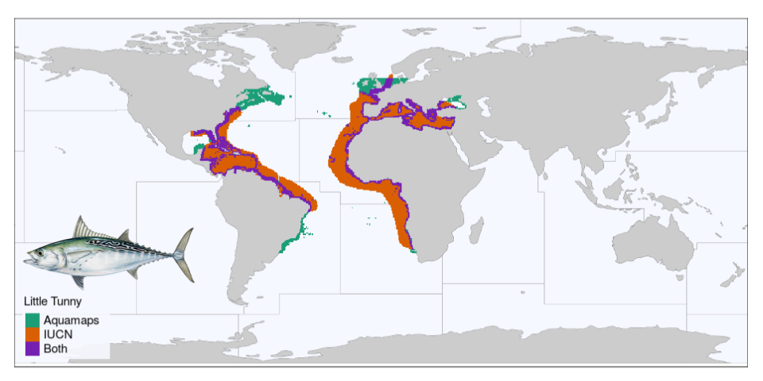

We are excited to have a paper published in PLOS ONE today: *“Aligning marine species range data to better serve science and conservation”*. In it we examine global maps of nearly 25,000 marine species ranges that are available publicly from the [International Union for the Conservation of Nature (IUCN)](www.iucnredlist.org) and [AquaMaps](www.aquamaps.org). You can read the paper [here](http://journals.plos.org/plosone/article?id=10.1371/journal.pone.0175739), or check out our [interactive web application](http://ohi-science.nceas.ucsb.edu/plos_marine_rangemaps) where you can explore our results and compare range maps of more than 250 different species.

<a href="http://ohi-science.nceas.ucsb.edu/plos_marine_rangemaps">

</a>

Global Ocean Health Index (OHI) assessments require over a hundred global-scale datasets.  We have now completed [five annual global assessments](http://ohi-science.org/ohi-global), and each time we improve our past work in part by challenging our own assumptions about the data and models we use in our calculations.  Our new paper is a direct result of such a challenge, as we probed our methods for combining the two species range map datasets to calculate the Species component of the [OHI Biodiversity goal](http://ohi-science.org/goals/#biodiversity).

Estimating biodiversity is a challenge: many species have not been identified, others are rare or difficult to find, still others may shift from place to place in response to seasonal or climatic changes in their environment.  While this is difficult on land, estimating marine biodiversity is vastly tougher — the ocean is bigger, darker, and more protective of her secrets than the densest rainforest.  But a solid picture of marine biodiversity is critical if we hope to create effective protections for important marine life and understand the potential impacts of climate change on fragile ecosystems.

The IUCN publishes maps created by marine experts, who use their knowledge to outline the places where a species is likely to be found.  The AquaMaps team uses an algorithm to model species ranges, using data about each species’ preferences for depth, salinity, temperature, and such.  By combining the two sets of maps, we greatly extend the number of species we can include in our OHI model of [biodiversity](http://ohi-science.org/goals/#biodiversity).  However, the two datasets are crafted in very different ways, and we wondered how closely the predictions line up — and whether our method of combining the two could be improved.

My coauthor Jamie Afflerbach kicked off the exploration by creating an interactive web application that would lay a species map from IUCN on top of the AquaMaps map of the same species (let’s be honest, she really just wanted to mess around with Shiny Apps in R, and this was a great excuse!).  Examining the paired maps for dozens of species, we started to notice interesting patterns that arose due to the differences in how the two map sets were created.  We came up with metrics to quantify “alignment” between the maps, and dug into hypotheses of why certain species were well-aligned and others were not.  Since then, we’ve greatly improved that first shiny app and invite you to [explore the data!](http://ohi-science.nceas.ucsb.edu/plos_marine_rangemaps)

It’s important to realize that it is impossible to create a perfect species range map, but we can make informed decisions based on the best data available.  We hope that our investigation will help encourage closer collaboration among species experts and computer modelers to increase the quantity and quality of marine species range maps, and help other researchers use these two datasets more effectively to promote and preserve the health of our marine ecosystems.

 

**See also**: 

- [OHI scientific publications](http://ohi-science.org/resources/publications/)
- [Global OHI assessments](http://ohi-science.org/ohi-global)  

**Related posts:** 

- [Five years of global Ocean Health Index scores](http://ohi-science.org/news/Global-2016-Scores)