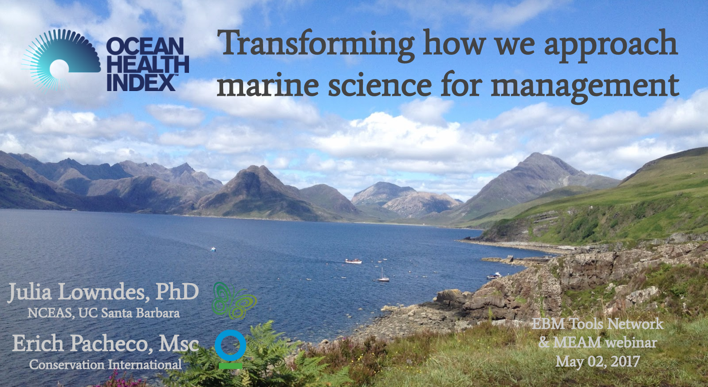

More news from the OHI team — we have been busy!  

**We have restructured [ohi-science.org](http://ohi-science.org)** a bit, now that it's been over a year since its first launch. We now have Global assessments, the OHI process, and all OHI assessments under the [Projects](/projects) page. We've also added new features on the [Resources](/resources) page, including the [Data](/data) we use in global assessments, and [Training](/training) materials that are available even as they are developed. You can also navigate to the [Forum](/forum) from the Resources tab. Check it out!  

**Steve Katona led a paper** that has been published by OpenChannels: [Navigating the seascape of ocean management: waypoints on the voyage toward sustainable use](https://www.openchannels.org/literature/16817). OpenChannels also published a short article about it: [EBM Toolbox: A new, short, and free primer on modern ocean management](https://meam.openchannels.org/news/meam/ebm-toolbox-new-short-and-free-primer-modern-ocean-management). Full citation: [*Katona, S.K., J. Polsenberg, J.S.S. Lowndes et al. 2017. Navigating the seascape of ocean management: waypoints on the voyage toward sustainable use. OpenChannels: Forum for Ocean Planning and Management. 44 pp.*](https://www.openchannels.org/literature/16817).

**Casey O'Hara led a paper** published in PLOS One: *“Aligning marine species range data to better serve science and conservation”*. You can read the paper [here](http://journals.plos.org/plosone/article?id=10.1371/journal.pone.0175739), or check out our [interactive web application](http://ohi-science.nceas.ucsb.edu/plos_marine_rangemaps) where you can explore our results and compare range maps of more than 250 different species.  Full citation:[*O'Hara CC, Afflerbach JC, Scarborough C, Kaschner K, Halpern BS (2017) Aligning marine species range data to better serve science and conservation. PLoS ONE 12(5): e0175739. doi:10.1371/journal.pone.0175739*](http://journals.plos.org/plosone/article?id=10.1371/journal.pone.0175739). 

**We gave a webinar on Open Channels: Transforming how we approach marine science for management**. Julie Lowndes and Erich Pacheco focused on how using open data science practices and tools have played a huge role in the OHI project growing into what it is today, with 20 countries around the world building directly off our science and our code. [*Watch the recorded webinar!*](https://www.openchannels.org/webinars/2017/using-ocean-health-index-integrated-tool-implementing-ebm-and-coastal-management)  

 

**See also**: 

- [OHI scientific publications](http://ohi-science.org/resources/publications/)
- [OHI-Science projects](http://ohi-science.org/projects/)  

**Related posts:** 

- [Comparing marine species ranges for OHI global assessments](http://ohi-science.org/news/comparing-marine-species-ranges)
- [Recent and upcoming events](http://ohi-science.org/news/recent-and-upcoming-events)