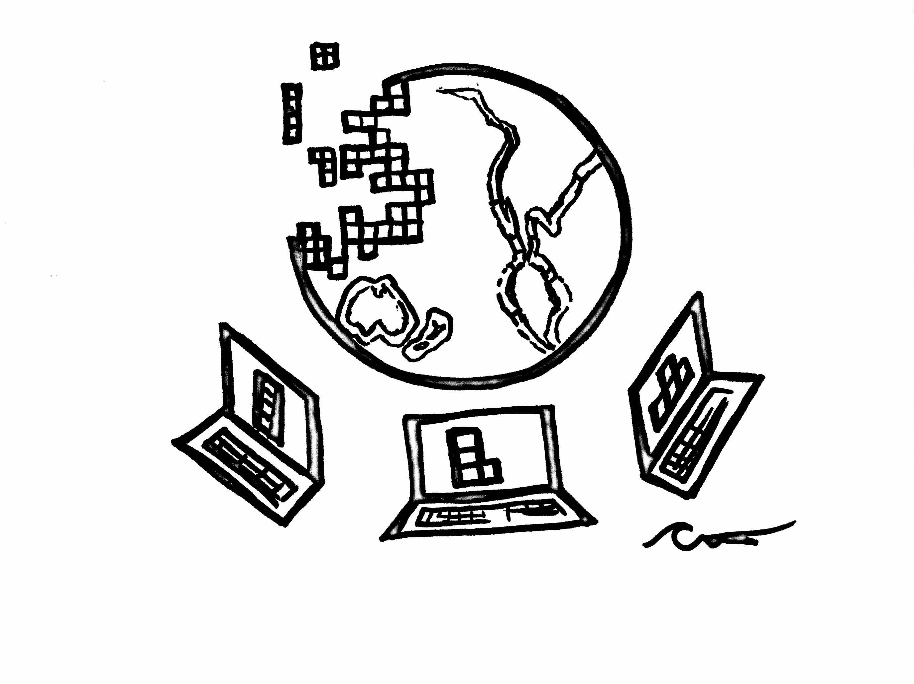

We have a Perspective published today in [*Nature Ecology & Evolution*](https://www.nature.com/natecolevol/) that we're really excited about! It's not a typical research manuscript; we took a step back and wrote about *how* we have been working as we've developed the Ocean Health Index program over the past four years, and we realized that it's a really powerful story to share.

>We are working in a way that has been game-changing for how we do science — and how our science is used for management around the world. 

The paper is called [***"Our path to better science in less time using open data science tools"***](https://www.nature.com/articles/s41559-017-0160). It's about how we learned the hard way that our homegrown data methods weren't enough, and that we needed to be using software built specifically for working and collaborating with data in a deliberate way. We’re sharing our story in hopes of inspiring others, because we are living proof that it's never too late to get on board and learn to code — or encourage such a culture within your lab or institution. We think open data science is key for us to more efficiently counter environmental problems, and it all starts with better science in less time. 

Open data science tools are critical for efficiency and being able to reproduce and build off of past work. And it's hard to articulate how powerful they are for communication too: they enable you to emphasize communication by weaving it throughout the entire scientific process. For example, we built a website for our paper using the same free tools we use for our analyses. It has resources for how you can get started too! Check it out: [**ohi-science.org/betterscienceinlesstime**](http://ohi-science.org/betterscienceinlesstime). 

### Citation

**[Lowndes JSS, Best BD, Scarborough C, Afflerbach JC, Frazier MR, O'Hara CC, Jiang N, Halpern BS (2017). Our path to better science in less time using open data science tools. *Nature Ecology & Evolution*, 1 Article number: 0160.](https://www.nature.com/articles/s41559-017-0160)**  

### Abstract

Reproducibility has long been a tenet of science but has been challenging to achieve — we learned this the hard way when our old approaches proved inadequate to efficiently reproduce our own work. Here we describe how several free software tools have fundamentally upgraded our approach to collaborative research, making our entire workflow more transparent and streamlined. By describing specific tools and how we incrementally began using them for the Ocean Health Index project, we hope to encourage others in the scientific community to do the same — so we can all produce better science in less time.

 

**See also**: 

- [Better science in less time website](http://ohi-science.org/betterscienceinlesstime)  
- [OHI scientific publications](http://ohi-science.org/resources/publications/)

**Related posts:** 

- [The importance of open data science tools in science: a list of references](http://ohi-science.org/news/importance-of-open-data-science-tools)
