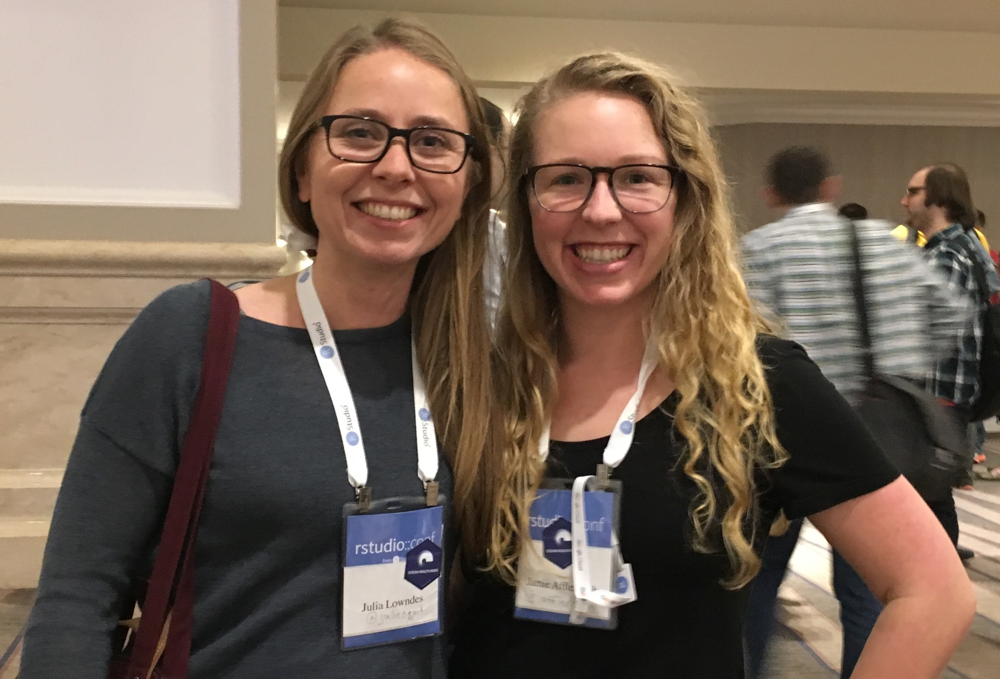
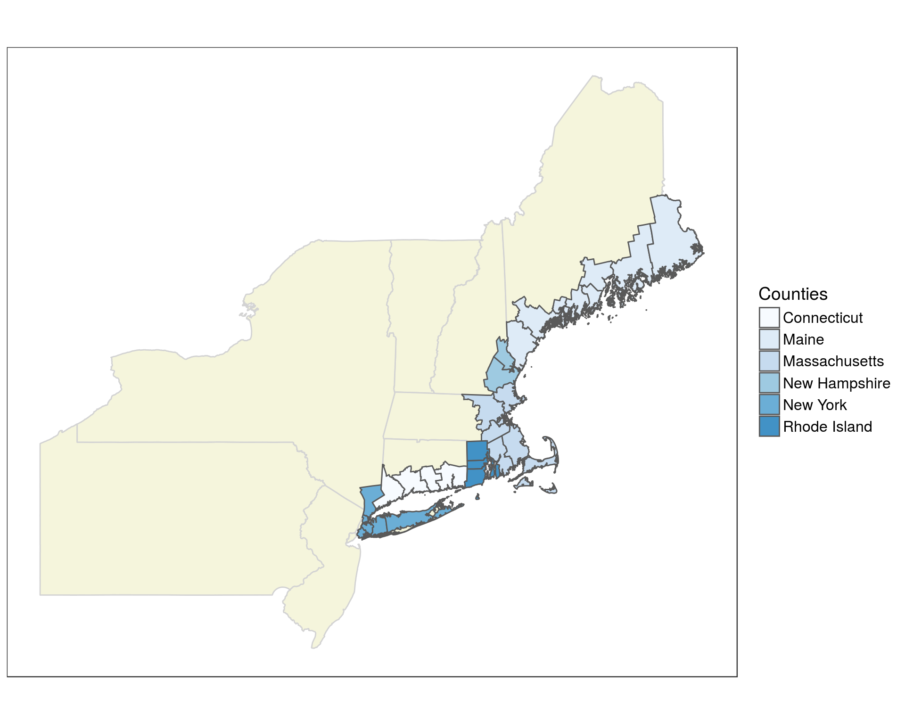
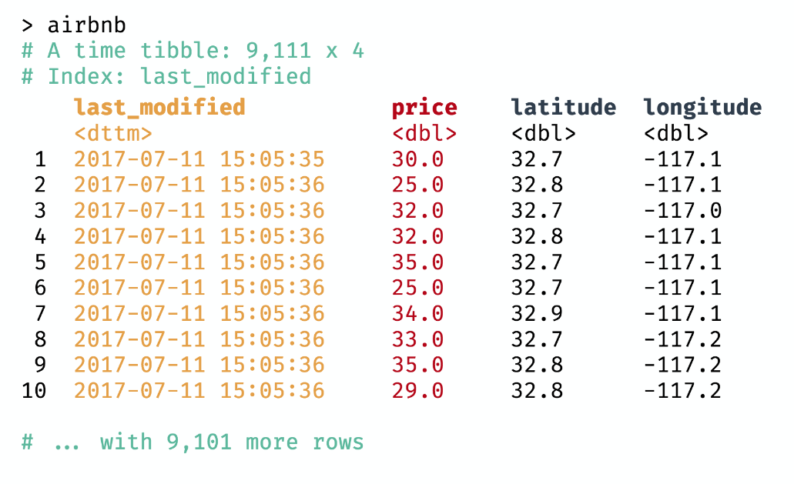
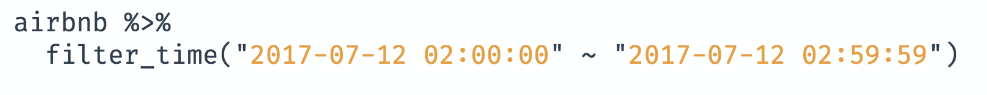
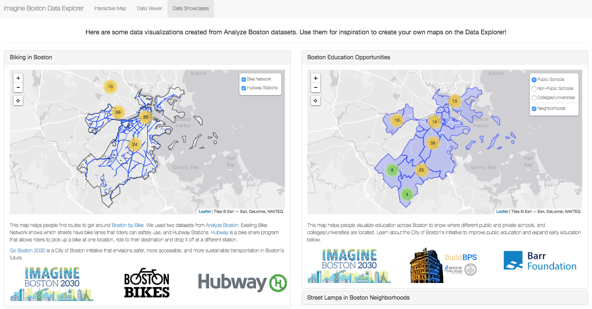
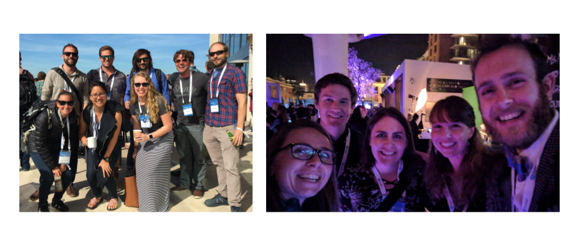
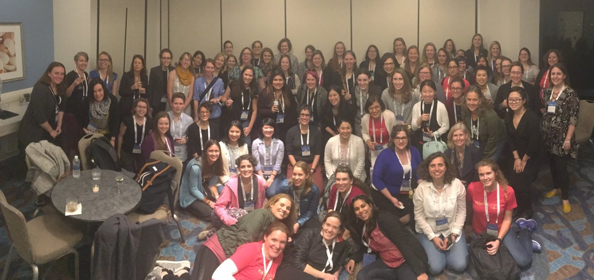
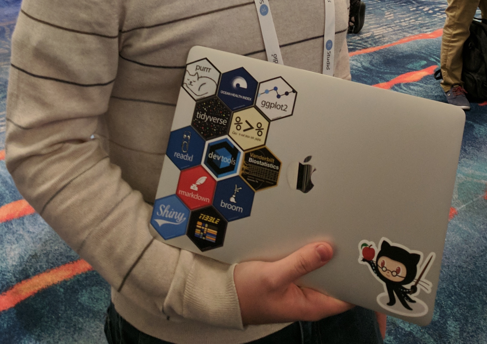

Last week our team members Jamie and Julie went to the [RStudio Conference 2018](https://www.rstudio.com/conference/) in San Diego to represent the Ocean Health Index (OHI) and learn from this innovative open data science community. Today they share their thoughts with us on the conference.

<center></center>
<br>

We met and reconnected with fantastic members of the R community, and learned so much through the talks we attended and conversations we had. The talks covered a really wide range of topics, from specific R packages to beautiful examples of R “in the wild” for analytics and reporting. A common thread throughout many of the talks was the underlying theme of empathy in data science: empathy in teaching, empathy through storytelling, and empathy when interacting with stakeholders and partners. 

There are too many great ideas to summarize here, and so many talks that we didn’t see because there were concurrent sessions and difficult choices to make! Thankfully, in the spirit of openness, all speakers [shared their slides](https://github.com/rstudio/rstudio-conf/tree/master/2018) and all talks were filmed.  We will update this blog with more links to these resources as they become available. 

Here are just a sliver of the talks that stood out to us that are also directly relevant to the OHI community.


## `sf`: simplifying spatial analysis in R

[`sf`](https://r-spatial.github.io/sf/) - [Edzer Pebesma](http://www.uni-muenster.de/Geoinformatics/en/institute/staff/index.php/119/Edzer_Pebesma) talked about his revolutionary “Simple Features for R” package, which continues to significantly enhance how we work with spatial data in the OHI. 

The package is meant to reduce the struggle of working with vector data by holding spatial objects as simple features within a dataframe. This lends itself to playing nicely with the [tidyverse](https://www.tidyverse.org/), allowing you to filter, mutate, and perform group analysis all within the simple feature without losing its association with geometries. 

One of our favorite things about the development of `sf` is its integration with `ggplot2` through `geom_sf()`. This makes it *super* easy to make beautiful maps in `ggplot2`. We can’t stress how fantastic this is. Here’s an example from our OHI Northeast project: 


```r
library(sf) #install.packages('sf')
library(tidyverse) #install.packages('tidyverse')

## plot our 'states' spatial object and fill by county
ggplot() +
  geom_sf(data = states, colour = "lightgray", fill = "beige") +
  geom_sf(data = counties, aes(fill = NAME_1)) +
  theme_bw() + 
  labs(fill = 'Counties') +
scale_fill_manual(values = blues9) +
  theme(legend.text=element_text(size=12),
        legend.title = element_text(size = 14)) + 
  coord_sf(crs = st_crs(states), datum = NA)
```

<center></center>

There is still work to be done in the R spatial community to get rasters to play nicely with sf objects, but we look forward to seeing what comes of the [`stars`](https://github.com/r-spatial/stars) package!

See Edzer's slides [here](https://edzer.github.io/rstudio_conf/#1).


## Stop. Tibbletime. Wrangling time series data made easy

If you’ve ever had dates and/or times as a variable in your dataframe, you’ve probably suffered through meticulous cleaning and separation of those dates and times to look at your data at different temporal scales. Davis Vaughn's `tibbletime` is here to save the day. This package is able to perform *time-based manipulations on tibbles*. Here is an example from Davis’s slides (which you can [find here](https://github.com/business-science/presentations/blob/master/2018_02_02_rstudio-conf-2018/presentation/rstudio-conf-2018-presentation.pdf)):

Let’s take a simple tibble (or dataframe) that lists times and dates for San Diego AirBnB bookings.

<center></center>

If you wanted to only look at bookings during the 2:00 pm hour on July 12, you’d normally have to spend a lot of time separating out the date, hour, minute, second. But now with `tibbletime` you can use the `filter_time()` function and it takes the full date and time stamp and gives you back what you want:

<center></center>

If you do any sort of time series analysis definitely check out this great `tibbletime` package!

## Imagine Boston 2030 Dashboard

One of our favorite talks was given by [Kayla Patel](https://paylakatel.github.io/), a Data and Performance Analyst for the City of Boston. Kayla shared her work on developing a dashboard for the City of Boston’s [Imagine Boston 2030](https://imagine.boston.gov/), the city’s first long-term plan in over 50 years. The plan lays out where the city of Boston wants to be by 2030 across five different goals based on local residents input. 
These goals, and their corresponding metrics, are stored within an interactive dashboard where goal progress will be tracked over time.

By now, you might be thinking this sounds familiar. Goals, metrics, trends. We had the same thought during her presentation, “wow, this sounds an awful lot like the Ocean Health Index.” It was inspiring to learn how another group uses a similar framework that involves stakeholder engagement, goal development, metric analysis, and data visualization and communication. 

What really piqued our interest was how Kayla used RStudio’s [Shiny](https://shiny.rstudio.com/) to develop the dashboard. Rather than putting in all the bells and whistles, she kept the user in mind and prioritized accessibility and transparency. The final figures are clean, simple, and easy to understand and interact with. All of this has us thinking that whenever possible, an Ocean Health Index assessment could benefit from an accompanying dashboard for data visualization and communication.

<center></center>
<br>

Her slides from the RStudio conference can be found [here](https://docs.google.com/presentation/d/1T5I5cnK1uBmAxZ-ZIHELJdv1grDRwERmjVu57EN99Jw/edit#slide=id.g2cc389491b_0_12). We will add the recorded video when it is released.


## Community

We had the opportunity to meet (and karaoke with) some really incredible people and communities. 

In addition to the OHI community, we are proud members of [rOpenSci](https://ropensci.org/), a group who is transforming science through open data and software, and [RLadies](https://rladies.org/), who promote gender diversity in the R community. We are also founding members of the [eco-data-science](http://eco-data-science.github.io/) group at the University of California at Santa Barbara and starting an RLadies chapter in Santa Barbara! Our [first meeting is April 10](https://www.meetup.com/rladies-santa-barbara/), join us! 

Here are a few photos of us with these great communities:

<center></center>
<center></center>

## Now, what you've all been waiting for: Hex stickers

If you’ve clicked on any of the links above or had a peek at the [#rstudioconf](https://twitter.com/search?q=%23rstudioconf&src=typd) hashtag on Twitter, you would probably notice a lot of hexagon-shaped stickers. These stickers mostly represent specific R packages and communities. They are like data science badges of honor and a fun way to be visible to each other when we stick them on our laptops. And who doesn’t love stickers? We have Ocean Health Index hex stickers and it was cool to see a few of them in the wild! See if you can spot the OHI sticker here on [Sean Kross](https://twitter.com/seankross)’s computer!

<center></center>

## Other cool stuff

1. Make a quick (free!) website and blog using [Yihui Xie](https://twitter.com/xieyihui)’s  [Blogdown](https://slides.yihui.name/2018-blogdown-rstudio-conf-Yihui-Xie.html#1)!

2. The British Columbia government uses R, RStudio, and GitHub to support free and open source projects – how cool is that!? Check out their [bcgov GitHub organization](https://github.com/bcgov) to see all of their work, including [bcmaps](https://github.com/bcgov/bcmaps), an R package that hosts a variety of spatial map layers for the province.

3. [“Data rectangling”](https://speakerdeck.com/jennybc/data-rectangling-1) is part of the wrangling involved to make your data tidy. [Jenny Bryan](https://twitter.com/JennyBryan) says that it’s important that we “distribute the glory” to these data rectangling and wrangling tasks, which are a huge part of data science. We totally agree!


