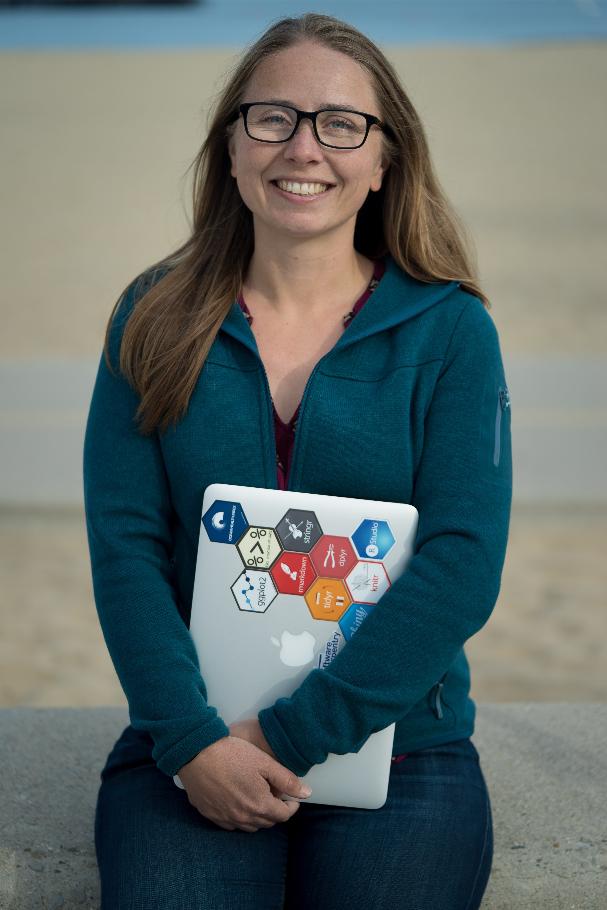

Dr. Julie Stewart Lowndes is the Science Program Lead for the Ocean Health Index.

## Work

**Describe your role or involvement with OHI.** 
I lead the OHI+ science program, which means I spend a lot of time writing software and developing easy to use training materials to help OHI+ groups lead their own OHI assessments.

**Give us a one-word description of how you work.** 
Collaboratively

**What are your essential apps, software, or tools?** 
R/RStudio and git/GitHub let me do everything collaboratively, from analyses to communication.

**What is your personal story behind why you do what you do?** 
I got into marine science because I love the ocean and I wanted to contribute to policy-driven science. However, I really struggled on the analysis side, because, like most marine scientists, I was never trained to work effectively with data. But through OHI, I’ve discovered how powerful and empowering open data science tools are for data analysis and science. That’s why I love spreading the word and teaching these skills to OHI+ teams and other scientific groups. 

**What aspect of your work are you most proud of?** 
I am so impressed by the OHI+ teams. OHI assessments take a lot of coordination, scientific and management expertise, and flexibility when learning the OHI framework and data science tools that underlie it. But OHI+ teams are doing it all, and I think we are going to see some real change in ocean health because of it.

**How have you seen OHI make a positive impact?** 
There are a lot of cool examples, but since the Main Hawaiian Islands assessment is wrapping up, it immediately comes to mind. The Hawaii assessment used OHI to reframe conversations about marine management in Hawaii and incorporated conversations and data from local stakeholders in the assessment. 

Eva Schemmel, lead of the Hawaii assessment, is focusing on transparently communicating the process, decisions, and data involved, in part through the [assessment dashboard](http://ohi-science.org/mhi/) – which are important concepts for reproducible and open science.  Also, this is an aside, but the dashboard is made with the same tools that we use to conduct OHI assessments, so by being a data scientist, Eva is also a web developer and can communicate about all the data and models directly through the dashboard.

## International Women's Day

**What is the importance of women in science/data science?** 
Women add important perspective and skills to science and data science (and pretty much everything else!). I think this is an incredibly exciting time to be a woman in science and data science.

**What inspired you to co-found a R Ladies chapter in Santa Barbara?**  
I have found the [#rstats](https://twitter.com/search?q=%23rstats&src=typd) data science community to be incredibly welcoming to women, and [RLadies](https://rladies.org/) is a big part of that. Their mission is to promote gender diversity in the R community, and they have chapters all over the world. Our OHI team has created inclusive learning communities here in Santa Barbara through [eco-data-science](http://eco-data-science.github.io/) and [Software Carpentry](http://remi-daigle.github.io/2016-04-15-UCSB/overview/), and we are excited to represent Santa Barbara as RLadies!

## Life 

**Where are you originally from and where do you live now?** 
I’m from California: I grew up near San Francisco and now live in Santa Barbara.

**What could you present about for 40-minutes with absolutely no preparation?**  
Introduction to data science or the Ocean Health Index, the behavior of the awesome meter-long Humboldt squid, swing dancing for beginners

**What are 5 things you can’t live without?** 
Friends and family, nature, good food, good books, open data science tools

**How do you recharge?** 
Getting outside, especially at the beach or in the mountains

**What is one of the most inspiring places you’ve been?** 
Slovenia, it’s a beautiful mix of wild nature, community, and amazing food.

**What are some of your favorite hobbies when you’re not traveling or working?** 
Hiking, swimming, swing dancing, cooking/baking, and sewing/knitting 

**What’s the most interesting thing you have read or watched this week?** 
[Yihui Xie’s blog about his early career crisis](https://yihui.name/en/2018/02/career-crisis/). He is a really important and generous person in the #rstats community and was really honest about mistakes he’s made and how he’s learning from them – super relevant beyond the context of coding.

**What is the best meal you have ever cooked?** 
Probably a suite of curries from [Madhur Jaffrey’s World Vegetarian](https://www.amazon.com/Madhur-Jaffreys-World-Vegetarian-Meatless/dp/0609809237/ref=asap_bc?ie=UTF8) cookbook.
