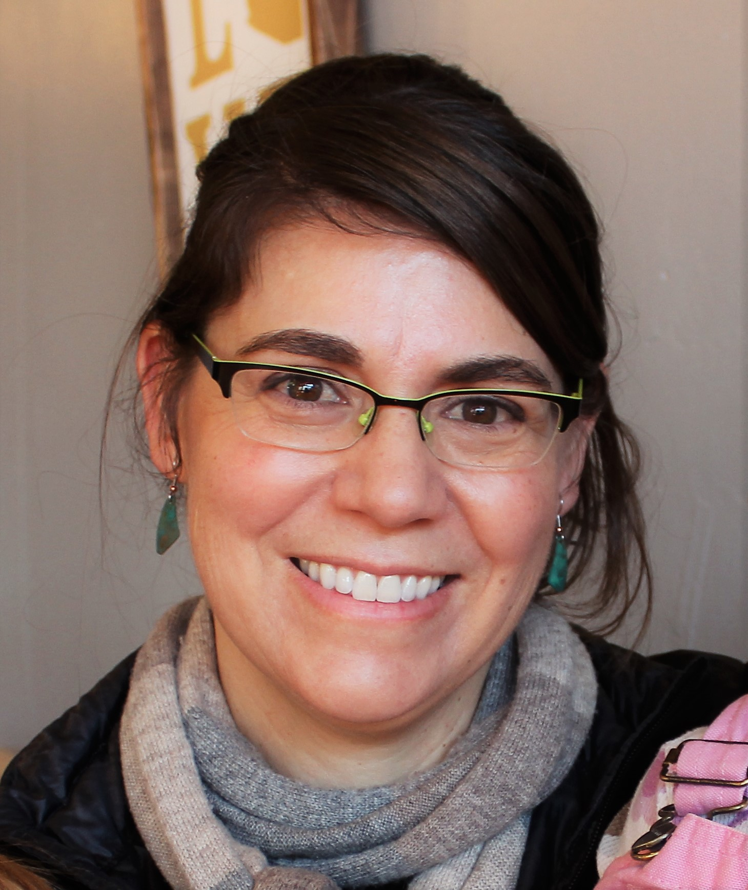

Dr. Melanie Frazier is a Project Analyst for the Ocean Health Index.

## Work

**Describe your role or involvement with OHI.** 
I help calculate the global Ocean Health Index which describes how well countries are sustainably managing the marine resources that we value.

**Give us a one-word description of how you work.** 
Troubleshooting-galore

**What are your essential apps, software, or tools?** 
My life would not be complete without R, RStudio, Git, and GitHub. 

I hate taking my hands off the keyboard, so I like a program called [Launchy](https://www.launchy.net/) to launch programs. Because I work remotely I take a lot of screenshots to explain what I am talking about, and I think [Snagit](https://www.techsmith.com/screen-capture.html) is great for this. I also like paper calendars/planners because I think they help me stay focused.  Right now I am using the [Kokuyo Jibun Techno 3-in-1 Planner](https://www.jetpens.com/blog/kokuyo-jibun-techo-a-3-in-1-planner/pt/949), which I love. 

Good color palettes for figures can be difficult (I have a [cheatsheet](https://github.com/OHI-Science/ohi-science.github.io/raw/dev/assets/downloads/other/ColorDec82015.pdf) for this), but someone recently showed me “[Beyonce Palettes](https://github.com/dill/beyonce)” for R.  I haven’t had a chance to use them, but her figures looked great! 

**What is your personal story behind why you do what you do?**  
When I started doing research as an undergraduate I had no concept of why anyone would do “statistics,” or even what it was. Eventually, I began exploring the data I was collecting and thought I could see patterns, but I was paralyzed by the fact that I might be fooling myself. Since I was struggling with this, my advisor suggested I take a statistics class.

The class was quite terrible, but on the first day the instructor did something that basically changed my life. He flipped a coin, called it as heads, and asked if anyone was suspicious of this result. Of course, no one was. He did it again and again, each time calling heads and asking us if we were suspicious yet. He then explained that statistics provides a method of estimating the probability of flipping any sequence of head or tails, and that it also provides rigorous criteria for determining when to become suspicious of the coin because the results were unlikely to have occurred by random chance.  

I suddenly understood: I had been searching for statistics and hadn’t even realized it! 
 
Given how important I think statistics are, I hate it when people discount statistics with quotes such as: “there are three types of lies -- lies, damn lies, and statistics” and “I can prove anything by statistics except the truth.” Sure, statics can be manipulated and misinterpreted. But at the end of the day it’s much easier to lie or be misguided without statistics!

**What aspect of your work are you most proud of?** 
I find satisfaction in bringing order and clarity to things, and I believe I have improved this aspect of the Ocean Health Index. 

**How have you seen OHI make a positive impact?** 
I tell my daughter I am saving the world’s oceans and I hope this is true. But regardless, at least she is impressed.

## International Women's Day

**What is the importance of women in science?** 
Women bring diversity to the historically male-dominated field of science.  I am all about diversity because it can help us recognize our biases and avoid our natural tendency to devolve into group-think.

**What women inspired you to get where you are in your career today?** 
All of my mentors have been male.  I’m not knocking them for this because most of them have been awesome, but this pattern probably says something about diversity in science. 

As I have gotten older I realize how grateful I am for the women before me who managed to pursue their ambitions and dreams despite obstacles and criticism, creating more space in the world for me to achieve *my* ambitions and dreams. If they hadn’t pushed boundaries, the contours of my life would be very different, and not nearly as fulfilling. 

## Life

**Where are you originally from and where do you live now?** 
I am from Cottonwood, Arizona. I left Arizona for 15 years, and I never thought I would return; but here I am, living in Flagstaff, Arizona.

**5 things Mel is currently into** 
[Jasmine green tea](https://www.amazon.com/Numi-Organic-Tea-Jasmine-Flowering/dp/B000FFIL60/ref=sr_1_6_a_it?ie=UTF8&qid=1520282878&sr=8-6&keywords=jasmine+tea+pearls), [Digit app](https://digit.co/), [Instant Pot](https://www.amazon.com/Instant-Pot-Multi-Use-Programmable-Packaging/dp/B00FLYWNYQ/ref=sr_1_3?s=kitchen&ie=UTF8&qid=1520450698&sr=1-3&keywords=instant+pot), [Pebble smartwatch](https://www.amazon.com/Pebble-Steel-Smartwatch-Android-Devices/dp/B011VB21DU/ref=sr_1_8?ie=UTF8&qid=1520450726&sr=8-8&keywords=pebble+smartwatch), [Amazon Kindle](https://www.amazon.com/Amazon-Kindle-Paperwhite-6-Inch-4GB-eReader/dp/B00OQVZDJM/ref=sr_1_1?ie=UTF8&qid=1520450756&sr=8-1&keywords=kindle) (if you, like Mel, love reading articles about what people can’t live without, check out why she loves these products [here](https://github.com/OHI-Science/ohi-science.github.io/raw/master/assets/downloads/other/Mel_5_Things.pdf))

**How do you recharge?** 
Spending time with friends and family (particularly when it involves food). Reading almost anything fiction, but I have a particular weakness for mystery novels.

**What’s the most interesting thing you have read or watched this week?** 
I have been reading a [reboot of Sherlock Holmes](https://www.npr.org/2016/10/23/498562814/charlotte-holmes-is-on-the-case-in-a-study-in-scarlet-women) by Sherry Thomas that features Sherlock Holmes as a female. It is great! 

**What is the best meal you have ever cooked?** 
I have no love of cooking, even though I spend a lot of time doing it.  If I ever get obscenely rich the first thing I plan to do is hire a personal chef... and buy a private plane… and fund lots of cool science and art… and…..lots more things! 
