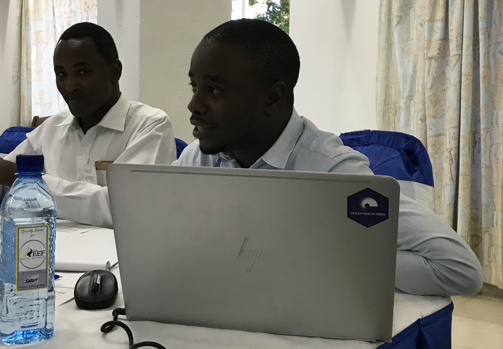
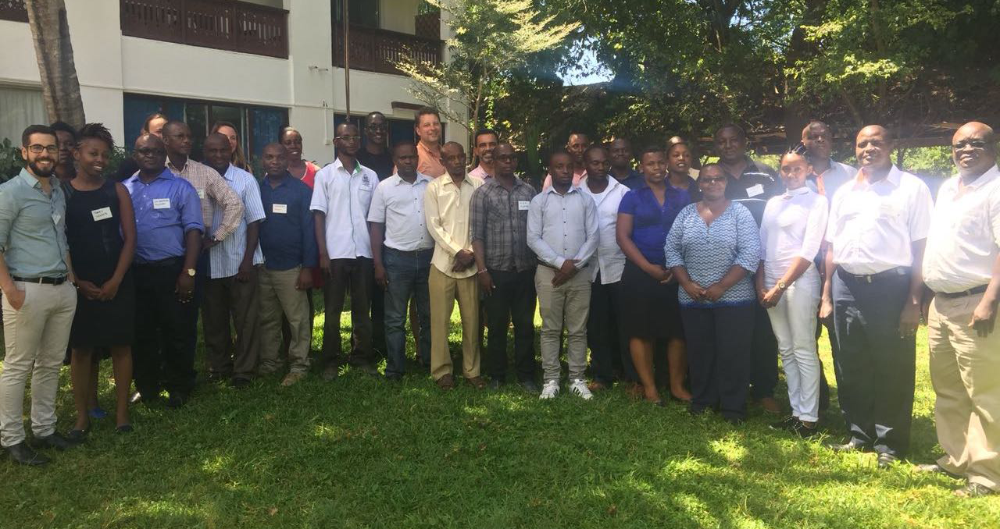
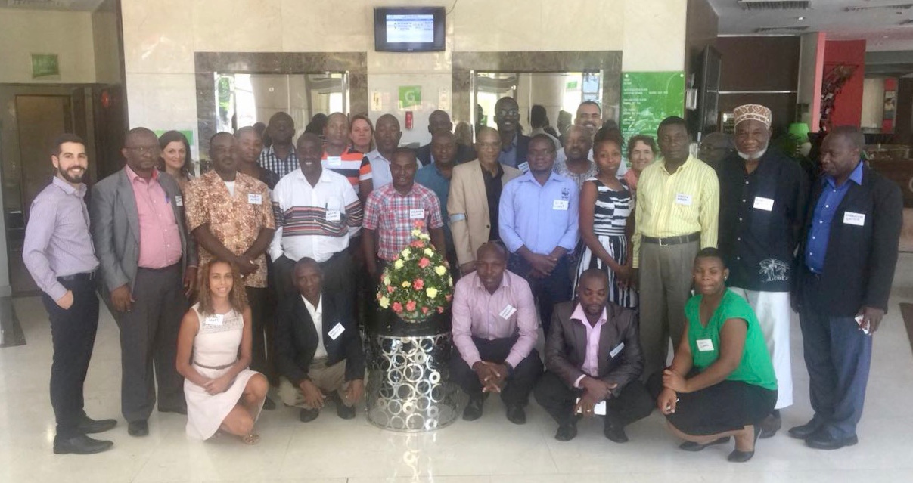
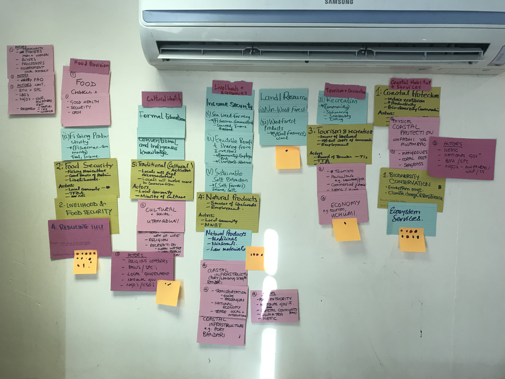

## Key highlights from the February 2018 workshops

Hearing the word Africa usually evokes mental images of safaris and exploring savannah ecosystems in the hope of seeing lions, elephants, giraffes, and cheetahs in the wild.
 
But what people often forget is that Africa has almost 20,000 miles of coastline and touches 4 major bodies of water – the Atlantic Ocean, Mediterranean Sea, Red Sea, and Indian Ocean. With this comes the need for sustainable ocean management so the ocean can continue to provide benefits now and into the future. 
 
The Ocean Health Index (OHI) provides a way to quantify these benefits and track how they change over time. Since its inception, OHI has evolved into both annual global and independent OHI+ assessments, which allow countries to conduct tailored analyses that incorporate local data and priorities.

The Indian Ocean Commission and EuropeAID provided funding for Kenya and Tanzania to conduct their own OHI+ assessments in projects titled “*Assessing the multisectorial context for biodiversity conservation in Kenya/Tanzania using the Ocean Health Index organizing framework and decision-making tool*.” To kick off these projects, OHI and local partners hosted workshops for each country last month aimed to identify management priorities, engage a diverse range of stakeholders, and establish a project implementation plan.
 
Here we share a couple of the insights learned in the workshops that can be applied broadly to integrated management projects.

## Engaging an interdisciplinary team

A common thread throughout the Ocean Health Index is a holistic view of ocean management that transcends traditional sector-based management. Social, ecological, and economic data lie at the core of OHI and is coupled with an interdisciplinary team to bring this effort together.

To comprehensively understand ocean management in Kenya and Tanzania, a broad range of stakeholders from government agencies, civil society organizations, research and academic institutions, and the private sector were engaged in workshop activities. While some of these organizations have previously worked together on project, these workshops represented the greatest number of them working together at once.

Stakeholders present at the meeting included Conservation International Africa Field Division, CORDIO East Africa, Kenya National Environmental Management Authority, Kenya Marine Fisheries Resource Institute, Kenya Tourism Federation, Kenya Maritime Authority, Tanzania Fisheries Education Training Agency, Tanzania Fisheries Research Institute, Tanzania Youth Partnership for Health and Environment, and Environmental Foundation for Development. 

 
<i>Kenya workshop participants (left) and Tanzania workshop participants (right)</i>.

For these countries, the need for collaboration is recognized, but it is often hard to find time for it in an already jam-packed schedule. OHI helps lower this barrier through facilitated workshops and the use of open source tools that make collaborating easier. 

To foster a collaborative atmosphere, the workshops began on a more personal level to better understand everyone else in the room and where they are coming from. Each member shared their story of why they do what they do, what problem they are trying to solve, and how connections made at these workshops can help provide solutions to the problems. 

## Setting integrated ocean management priorities

Once the stage was set for a collaborative workshop, it was time to dive in and identify priorities, obstacles, and solutions for sustainable ocean management. Priority setting is a crucial first step for focusing the effort of a large group while taking everyone’s individual feedback into account. It helps everyone get on the same page to work towards a common goal. 

This part of the workshop was developed based on innovative design principles for collaborative decision-making - empathize, define, ideate, solution, test, iterate - and carried out through facilitated exercises within small, multi-disciplinary groups. The groups discussed three major questions: (1) what are the priority needs in Kenya and Tanzania?; (2) are these needs being met? If not, what are the social, economic, or environmental barriers?; (3) what are potential management solutions?

 
<i>Design principles flow</i>

Answers to these questions were written on index cards that covered the wall with everyone’s thoughts and ideas. These cards were then used by stakeholders to vote on their top three priorities, with results reflecting the interests of a broad range of stakeholder groups. 

 
<i>Index cards with participants' priorities and obstacles identified. Orange post-its with dots represent votes for their top 3 priorities</i>.

This process is a vital key step to identify ocean benefits, establish obstacles, and determine management interventions, which is essential for integrating oceans into national sustainable development and climate agendas. 

In both Kenya and Tanzania, food provision was identified as the number one ocean priority for the country. For Kenya, this was followed by biodiversity, tourism and recreation, and coastal economies. For Tanzania, this was followed by biodiversity, coastal protection, and carbon storage; coastal livelihoods and economies, and natural products.

## Moving forward

These workshops increased literacy on and catalyzed momentum for integrated ocean management in Kenya and Tanzania. Now that priorities are set, next steps include incorporating stakeholders’ feedback into the assessment, gathering local data sources, and performing the technical analyses. 

This process will resort in scores tailored to Kenya’s and Tanzania’s specific ocean management needs and will provide a data-driven, scientifically-based way to track their progress in meeting their goals. The project is slated to finish at the end of 2018. 
