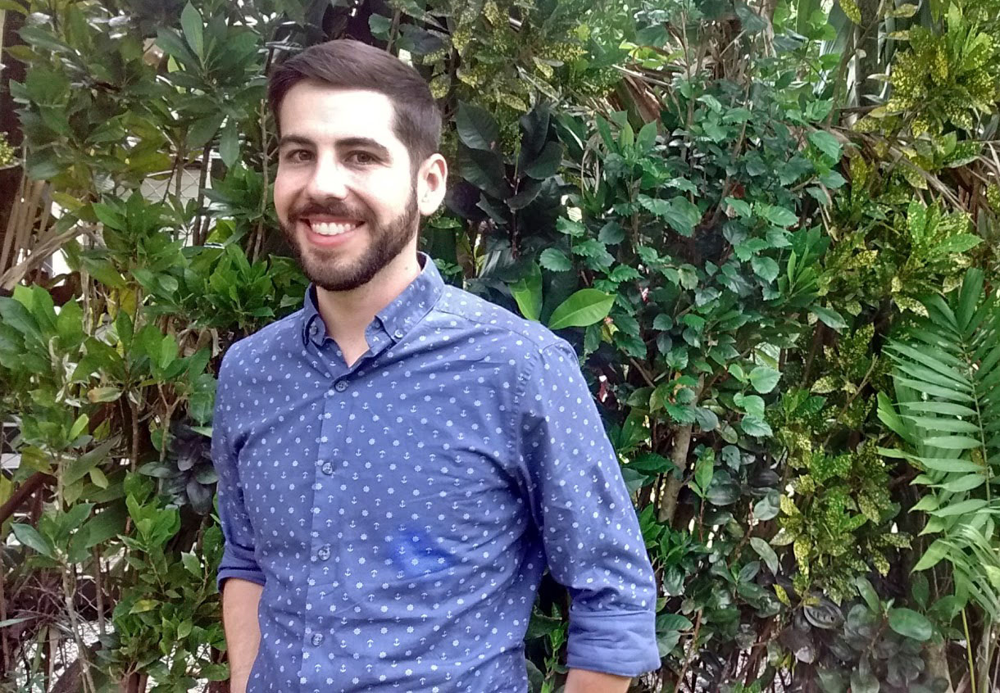

 
Erich Pacheco is the Director of the Ocean Health Index at Conservation International.

## Work

**Describe your role or involvement with OHI.**

I build and maintain relationships with key, often governmental, international stakeholders to incorporate data-driven decision-making on the sustainable use of ocean and coastal resources. 

**Give us a one-word description of how you work.**

Collaboratively

**What are your essential apps, software, or tools?**

Standing desk and mat, coffee, Skype, iCalendar, Outlook, Keynote, Google Flights, [TimeandDate Global Meeting Planner](https://www.timeanddate.com/worldclock/meeting.html)

**What is your personal story behind why you do what you do?**

Working on agricultural development in West Africa, I realized we were asking communities to sacrifice their environmental stability for short-term economic benefits. This seemed so short-sighted and a detriment to overall human well-being. I decided to dedicate my career to environmental management and focus on oceans given my affinity to the sea growing up in the Caribbean.

**What aspect of your work are you most proud of?**

I am really proud of the fact that in less than four years we established strong partnerships with countries on every inhabited continent on the planet to implement OHI+ as a mechanism to institutionalize data-driven decision-making for the ocean.

**How have you seen OHI make a positive impact?**

Since 2012, we have changed the conversation on ocean management towards an integrated and data-driven approach. By using open-source and freely available tools for analyzing and managing data, we have made ocean science more accessible to thousands of people around the world, while simultaneously fostering collaborative teams and institutional arrangements. This has led to better policies, such as  Mexico institutionalizing an Ocean Health working group in their Intersecretarial Commission for the Sustainable Management of Seas and Coasts, and improvements in planning, such as China integrating results from OHI in their 13th Five-Year Plan.

## Life

**Where are you originally from and where do you live now?**

I grew up on Venezuela’s Caribbean coast, in the town of Valencia. I now live in Portland, Oregon with my wife where I enjoy hiking, climbing, and going to the beach.

**What could you present about for 40-minutes with absolutely no preparation?**

Certainly on the science and management of OHI, but also on Village Savings and Loan Associations and making Venezuelan food.

**What are 5 things you can’t live without?**

Coffee, NPR, good food, my bicycle, good walking shoes

**What is one of the most inspiring places you’ve been?**

New Caledonia – it’s a place where you can see what conservation can look like when you get it right.

**What are some of your favorite hobbies when you’re not traveling or working?**

Rock climbing, yoga, hiking and backpacking, home improvement

**What’s the most interesting thing you have read or watched this week?**

My wife (who is from China) and I are expecting our first baby later this year, and we are reading about how to raise a trilingual child. We are learning that the languages we speak not only help us understand cultures and countries, but they shape the way we see and understand the world in very profound ways.

**What is the best meal you have ever cooked?**

Probably a traditional Venezuelan breakfast with arepas, black beans, fried plantains, fried pork, avocados, cheese, and perico (scrambled eggs with tomatoes and peppers).

 

**More People of OHI Profiles**

[Melanie Frazier](http://ohi-science.org/news/people-of-ohi-melanie-frazier) 
[Julie Lowndes](http://ohi-science.org/news/people-of-ohi-julie-lowndes)
