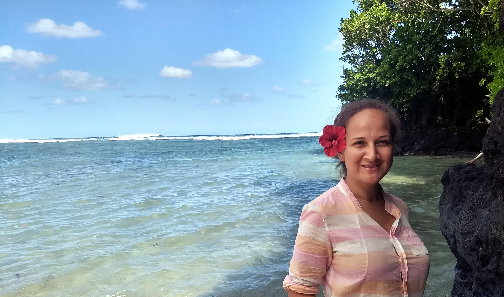

 
Lagipoiva Cherelle Jackson is the lead of our Samoa OHI+ independent assessment.

## Work

**Describe your role or involvement with the Ocean Health Index (OHI).**

I am the liaison between the OHI global programme and Samoan Government, and I assist in socializing the idea of OHI with the Government and major stakeholders in Samoa.

**Give us a one-word description of how you work.**

Practical

**What are your essential apps, software, or tools?**

Google Calendar, [Colour Note](https://www.colornote.com/), Slack, [Canva](https://www.canva.com/), Facebook

**What is your personal story behind why you do what you do? Is there a specific “a-ha” moment or experience to share?**

I grew up on the island of Savaii, nature was our playground, our source of sustenance, and the basis of our culture. Nature also had the ability to destroy and change our lives through intense cyclones. There was no “a-ha” moment, just a constant conviction that we have to do what we can to protect land, sea, and sky, because it is in those elements that has made us, Samoans and Polynesians, the strong proud cultural beings that we are today. I named my son Tagaloalagi because of my passion for the co-benefit of conservation with cultural preservation.

**What aspect of your work are you most proud of?**

Seeing our local counterparts get excited about open science, ocean data, and environmental indicators, and being able to offer capacity building opportunities to strengthen this aspect of their work. Also playing a small role in broadening oceans coordination within the environment sector under the leadership of the Ministry of Natural Resources and Environment (MNRE).

**How have you seen OHI make a positive impact?**

OHI is a tool that can help Pacific islands monitor progress on Sustainable Development Goals (SDG), especially SDG 14. OHI has assisted the Ministry of Natural Resources and Environment in strengthening integration of oceans in our national environment work. That’s super exciting for me.

**How do Samoan institutions and partners plan on using the OHI scores?**

It is our hope that our national counterparts will align OHI Scores with their respective reporting structures and indicators. For instance, it would be great if OHI could be useful in informing some of the reporting requirements under the Conservation for Biological Diversity (CBD), United Nations Framework Convention on Climate Change (UNFCCC), and United Nations Convention on the Law of the Sea (UNCLOS), or voluntary reporting on SDGs including SDG 14 on Life Below Water. With the endorsement of MNRE, we can also look at how this can assist Samoas State of Environment Report with the Secretariat of the Regional Environment Programme. 

## Life

**Where are you originally from and where do you live now?**

I am from Safua on the island of Savaii. I now live in Apaula, on the side of Mt. Vaea at Lalovaea on the island of Upolu in Samoa.

**What could you present about for 40-minutes with absolutely no preparation?**

Climate change communication

**What are 5 things you can’t live without?**

Family, taro, ocean, music, internet

**How do you recharge?**

Swimming and eating - that’s just how we roll on the islands.

**What is one of the most inspiring places you’ve been?**

Tulum, Mayan Ruins in the Yucatán Peninsula of Mexico. It was stunning and life changing, but also proof that science know-how came way before us in the form of traditional knowledge.

**What are some of your favorite hobbies when you’re not traveling or working?**

Dancing, diving, sketching, writing, and archery

**What’s the most interesting thing you have read or watched this week?**

Tuna Management and Development Plan for Samoa, seriously. I was given it by the Assistant Chief Executive Officer of Fisheries, Magele during a meeting and I had a good read through it, and found it extremely interesting. 

**What is the best meal you have ever cooked?**

My husband does all the cooking in my family, so the best meal he has ever cooked is a carbonara made with fresh crab and homemade pasta. 

 

**More People of OHI Profiles**

- [Melanie Frazier](http://ohi-science.org/news/people-of-ohi-melanie-frazier): OHI Project Analyst 
- [Julie Lowndes](http://ohi-science.org/news/people-of-ohi-julie-lowndes): OHI Science Program Lead 
- [Erich Pacheco](http://ohi-science.org/news/people-of-ohi-erich-pacheco): OHI Director at Conservation International 
- [Erin O'Reilly](http://ohi-science.org/news/people-of-ohi-erin-oreilly): OHI Communications Coordinator
