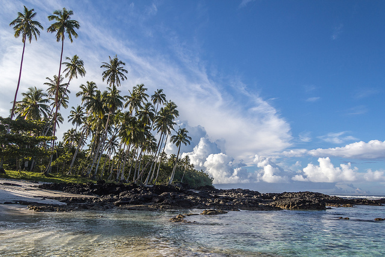

This week, Samoa will be localizing the Ocean Health Index (OHI) – a framework and tool for assessing the benefits people derive from the ocean – in partnership with Conservation International (CI), the National Center for Ecological Analysis and Synthesis, and the Ministry of Natural Resources and Environment.

 
Photo Credit: Andrew Moore/Flickr (CC by SA 2.0).

From May 23-25, 2018, OHI Lead Scientist [Dr. Julia Lowndes](http://ohi-science.org/news/people-of-ohi-julie-lowndes), together with technical officers from the Ministry of Natural Resources and Environment ([MNRE](https://www.mnre.gov.ws/)), Ministry of Agriculture and Fisheries ([MAF](http://www.maf.gov.ws/)), and the [Samoa Bureau of Statistics](http://www.sbs.gov.ws/), will identify Samoa’s opportunities for a localized OHI approach in a three-day workshop.

The Officers will take a deep dive into seven years of data used to calculate [Samoa’s global OHI score](http://ohi-science.org/ohi-global/scores.html#samoa) and learn how to interpret and tailor them for Samoa. Through data exploration, they will be able to identify data gaps, opportunities to add locally relevant data, and management priorities.

“This workshop builds on the work we have conducted with MNRE and MAF for the past two years on OHI, and provides some context to the value of oceans from a data perspective to Samoa,” said [Lagipoiva Cherelle Jackson](http://ohi-science.org/news/people-of-ohi-lagipoiva-cherelle-jackson), CI OHI lead for Samoa.

Dr. Lowndes is excited by the week long engagement with Samoan technical officers: “This is a great opportunity to work with Samoan counterparts, who are managing large amounts of environmental data. We will use OHI not only as a tool for ocean management, but as an example of open data science, which is powerful well beyond OHI.” 

“By exploring the data used to calculate Samoa’s OHI global score, we can determine where improvements can be made to make their assessment more locally relevant,” says Dr. Lowndes. “This process will lead to a deepened understanding and narrative of ocean health in Samoa.”

Since the first OHI workshop in October 2016, great steps have been taken to advance sustainable ocean management in Samoa. The Samoa Ocean Health Network was launched and local stakeholders were engaged in determining key ocean priorities in Samoa. The OHI was also integrated into [Samoa’s Voluntary Commitments](https://www.un.int/samoa/news/samoa-national-voluntary-commitments-during-ocean-conference-5-9-june-2017-unhq-new-york) at the United Nations Ocean Conference in the National Environment Sector Plan under MNRE.

The workshop will result in a nationally relevant OHI that will assist in monitoring progress on ocean targets over time. It is envisioned that OHI will be used as an ocean planning tool and indicator for tracking progress towards meeting global commitments. 

In addition to the three-day workshop, Dr. Lowndes will be hosting an Ocean Health Network seminar on May 21st, which will provide an update for the Ocean Health Network members on the progress of OHI globally and locally. This will be followed by a guest lecture at the National University of Samoa on May 22nd in a talk titled *The power of open science: Experience from the Ocean Health Index*.
