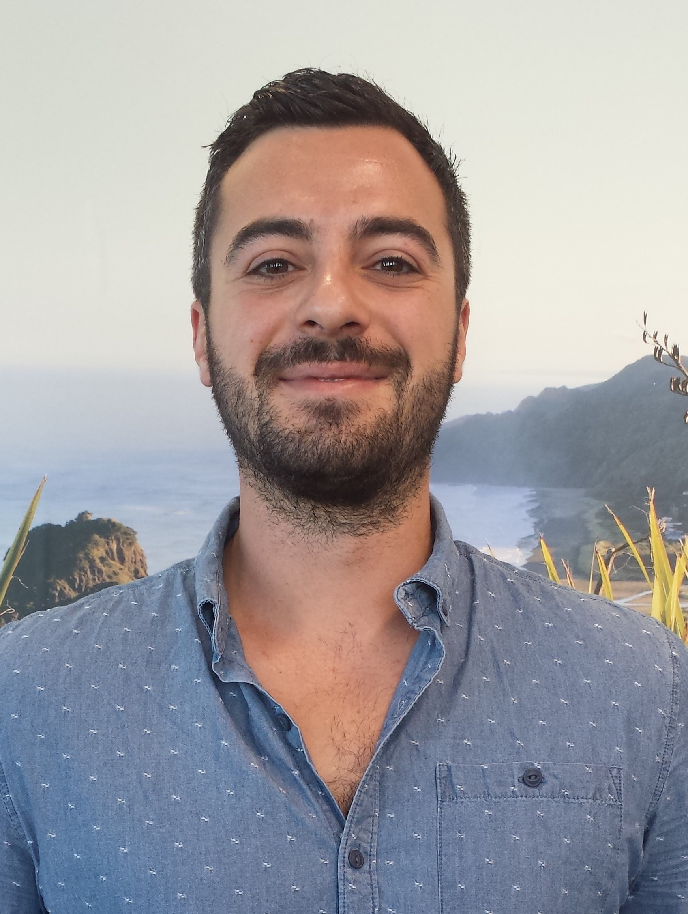

 
Luca Mori is the Conservation International (CI) Marine Programme Associate for the Pacific Oceanscape and technical support for the Samoa OHI+ assessment.

## Work

**Describe your role or involvement with OHI.**

I technically and scientifically support the work of OHI in the Pacific Oceanscape.

**Give us a one-word description of how you work.**

Supportively

**What are your essential apps, software, or tools?**

[Miradi](https://www.miradi.org/) (an adaptive management software for conservation projects), Skype, Powerpoint, and Word are essential for my work.

**What is your personal story behind why you do what you do?** 

I wanted to be a marine scientist since childhood. I fell in love with the marine environment when I started snorkeling and swimming in the Tyrrhenian Sea (specifically Elba Island), which is a gorgeous place full of beautiful natural features and ancient history, and where I spent every summer. 

I also grew up watching old VHS of Greenpeace campaigns against oil companies and whaling vessels, and I knew I wanted to be part of the action against the ones who are destroying our ocean and land. This love for the ocean and this need to change things brought me to work for an environmental NGO like Conservation International.

**What aspect of your work are you most proud of?**

The possibility of using data-driven science to make important changes in the way the ocean is managed and conserved.

**How have you seen OHI make a positive impact?**

OHI is a perfect tool to assess the status of the ocean to inform immediate and future actions for the safeguarding of the marine environment. I personally see incredible benefits in the use of OHI+ because it is a step-by-step standardized process with an adaptive capacity to meet local necessities and needs. This leads to the creation of effective integrated management approaches for the ocean and coastal ecosystems.

**How do Samoan institutions and partners plan on using the OHI scores?**

The OHI+ scores will be used to inform and support the creation of a National Ocean Strategy. It will also identify actions to progress the requirements of Samoa to meet the Sustainable Development Goals (SDGs).

## Life 

**Where are you originally from and where do you live now?**

I come from a little village in the North of Italy and now I live in New Zealand.

**What could you present about for 40-minutes with absolutely no preparation?**

CI Pacific Oceanscape work in our main Pacific Islands geographies

**What are 5 things you can’t live without?**

The sight of the ocean, a good bottle of natural wine, music, friends, and coffee

**What is one of the most inspiring places you’ve been?**

South Island of New Zealand is breathtaking. It is a place where you can really feel the power and immensity of nature.

**What are some of your favorite hobbies when you’re not traveling or working?**

I like playing rugby, watching movies and documentaries, surfing, and hiking.

**What’s the most interesting thing you have read or watched this week?**

A film-documentary called “Fuocoammare” (fire in the sea) which shows the struggle, pain, and suffering of the migrants who escaped war and poverty zones to cross the Mediterranean Sea in order to reach Italy for refuge.

**What is the best meal you have ever cooked?**

Well, as an Italian, my main speciality is pasta and risotto, but I am also good cooking meat and fish dishes.

 

**More People of OHI Profiles**

- [Lagipoiva Cherelle Jackson](http://ohi-science.org/news/people-of-ohi-lagipoiva-cherelle-jackson): Samoa OHI+ Lead 
- [Melanie Frazier](http://ohi-science.org/news/people-of-ohi-melanie-frazier): OHI Project Analyst 
- [Julie Lowndes](http://ohi-science.org/news/people-of-ohi-julie-lowndes): OHI Science Program Lead 
- [Erich Pacheco](http://ohi-science.org/news/people-of-ohi-erich-pacheco): OHI Director at Conservation International 
- [Erin O'Reilly](http://ohi-science.org/news/people-of-ohi-erin-oreilly): OHI Communications Coordinator
