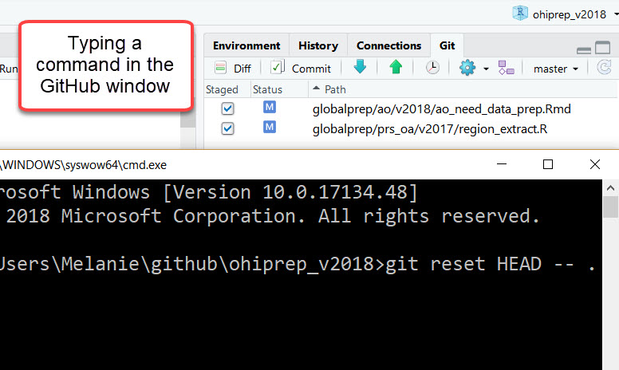
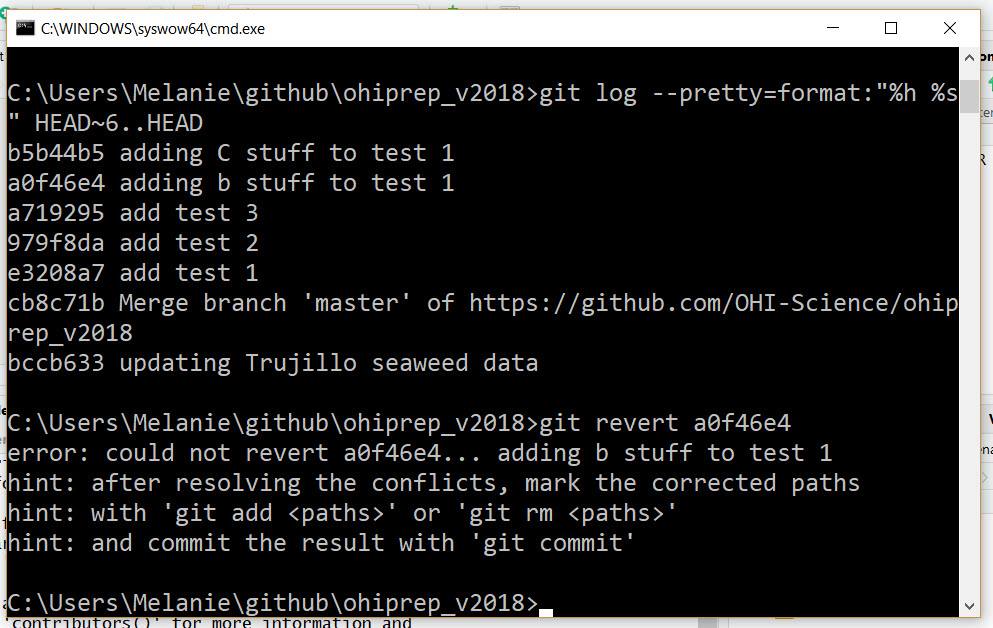

## Background

Git and GitHub are open source software programs we use for version control, or tracking files over time. Git and GitHub work together, with Git tracking and versioning your files, and GitHub storing them online. Through these programs, you can see different versions of a file with information about who contributed it when, line-by-line. This makes collaboration easier, and it allows you to rollback to different versions or contribute to others’ work. 

Version control also makes it possible to go back and fix mistakes you have made. The approach to fixing mistakes in Git/GitHub depends on where you are in the process of staging/committing/pushing your changes. Given that the nuances of Git terminology may not be super clear to a beginner, I first describe the Git/GitHub workflow and then describe how to use the Git Shell <!-- is this just it's name? could you add something in parentheses that helps explain what this is? --> to walk back changes.

I highly recommend practicing this Git super-power on a non-important repo to get practice and gain an understanding of what is going on. Speaking from experience, applying this information in a time sensitive situation on an important repository is... undesirable (to say the least).  

#### An aside

Often I find it easier (or at least less stressful) to use low tech solutions, such as rummaging through my history on GitHub to find the version of the file (or portion of the file) I want, and then copying/pasting this into my current working directory. I use Git every day, but our workflow rarely requires walking back changes, so this approach is often more intuitive and faster for me (but definitely less cool and authoritative looking). 

*NO SHAME!*

#### Cheatsheet

For future reference you can [download](https://GitHub.com/OHI-Science/ohi-science.GitHub.io/raw/master/assets/blog_images/GitHub_3x5cards_WalkBackChanges.pdf) a handy 3x5 card with these shell commands.

 

## Some terminology

The approach to reverting to previous versions of your Git files depends on knowing where you are in the Git workflow, which follows this sequence:

 

 

Below I provide more information about each step of this sequence. This information is specific to RStudio because I typically interact with Git through RStudio.

 

#### Working directory (*saved changes*)

When you make a change to a file and save, the file is added to the working directory. The Git tab in RStudio shows the files in the Git _Working Directory_.  

 

 

#### Staged

Prior to being committed, a file must be _staged_.  This is indicated by a check next to the file in RStudio's Git window.

 

 

#### Committed to history

Once a staged file is _committed_, it is incorporated into the Git history.

 

 

#### Pushed to GitHub

Once a local file is _pushed_ to the remote (i.e. GitHub), it becomes available to collaborators and/or the public.

<!-- for "to the remote" does to the remote server or remote site also make sense? I think it would help clarify what that means -->

 

 

## A beginner's guide to walking back changes!

The following commands are entered into Git Shell, which you can access in RStudio from here:

 

### Stage 1: Working directory 

#### Changes saved, but not yet staged, committed, or pushed

Delete unstaged changes in the working directory:

`git clean -df`

`git checkout -- .`

[WARNING: this will delete your saved changes and is not recoverable]

#### *Low tech solution*

The "Commit" button in the Git window in R provides the option to "Discard All" saved changes or more targeted regions ("Discard Chunk").

 

 

### Stage 2: Staged files

Staged files can be unstaged:

`git reset HEAD -- .`

 

 

#### *Low tech solution*

Files can also be unstaged by clicking on the check boxes in the Git tab, but this can be cumbersome if there are a lot of files.

 

### Stage 3: Committed files 

#### Changes saved, staged, committed, but NOT pushed to GitHub (or other remote)

*Fixing the most recent commit*

Uncommit files (but do not delete): `git reset --soft HEAD~1`

Alternatively, Delete most recent commit: `git reset --hard HEAD~1`

[WARNING: the "hard" reset will permanently delete the files!!!]

 

 

*Rolling back multiple commits*

I rarely have more than 1 unpushed local commit because I almost always push immediately after committing.  But, you can uncommit multiple commits. For example, the following would undo the most recent 3 commits:

`git reset --soft HEAD~3`

All the relevant files in these three commits will move to the Working Directory where they can be deleted, modified, etc.

#### Rebase

The `rebase` function can be used to rewrite history.  My advice: **Do NOT use rebase!!!** This just adds extra confusion because it is almost always easier to use `reset`.  And, it is safer to use `revert`. 

 

## Stage 4: Pushed commits to GitHub 

#### Revert
Once you have pushed your commits to GitHub, you will NOT want to rewrite history (which is what `reset` does).  Instead, you will want to use `revert`.

`revert` is the safest way to rollback changes because it does not destroy history.  It just adds updates to a new commit while keeping all the old commits. For example, if you currently have 6 commits and you want to rollback all the changes from your previous commit, a revert will leave you with 7 commits (vs. 5 commits, which is what we would expect if history was being rewritten), with the last commit including all the rollback revisions.

This is great because it is less risky, more honest, and will not mess up other people working on the repository. To use revert you will need to know the commit ID (i.e. SHA) you want to alter. This is available from the RStudio/Git history:

 

 

Or, if you prefer the Git Shell, you can use: 

`git log --pretty=format:"%h %s" HEAD~3..HEAD`

(this example will return the last 3 commits)

 

 

#### Delete an older commit while keeping subsequent commits
##### NOTE: This can cause merge issues, which will need to be fixed

The first step is to examine the commit history to identify the relevant commit(s): `git log --pretty=format:"%h %s" HEAD~3..HEAD`

In this case, I wanted to delete commit `a0f46e4 adding b stuff to test 1` , so: `git revert a0f46e4`

 

 

The message indicates that I have a merge conflict. The file with the merge conflict is moved to the working directory. From there, I can modify the merge conflict, save, and commit the file.

 

 

If there are no merge conflicts, you may be directed to the dreaded VIM window! When I did the following: `git revert 979f8da`, the VIM window popped up:

 

 
 
I recommend typing: `:q` as soon as possible to exit! And, your reverted files will be saved into a new commit with the message: "Revert 'add test 2'".  This is usually good enough for me.

<!-- the second sentence above doesn't make sense to me. exiting makes it seem like that screen doesn't run anything but then the next sentence says it saves the files. Maybe add: Even if you exit this window without making any changes, your reverted files will be saved... -->

But, if you insist, you can alter the commit message (currently in yellow: Revert "add test 2"). To do this enter "insert" mode by typing an "i". Modify the yellow text. Exit insert mode with Ctrl+C.  Now enter `:q`! (this should display in the bottom region of the VIM window) and return. 

#### Rollback to a previous state (i.e. delete multiple commits)

`git revert --no-commit 979f8da..HEAD`

`git commit`

This will rollback all the changes occurring *after* commit 979f8da.  The `--no-commit` is added to prevent having to deal with each commit.

 

## Summary

Within coding it is easy to make mistakes, but version control systems like Git and GitHub make it possible for us to go back in time and fix these mistakes. This workflow diagram summarizes what I covered in the blog and is a helpful reference for understanding how to move forwards and backwards in Git/GitHub. 

 

 

 

**Other Technical Blog Posts**

- [Cropping rasters down to size](http://ohi-science.org/news/cropping-rasters-down-to-size) 
- [How to build a successful OHI technical team](http://ohi-science.org/news/how-to-build-successful-technical-team)
