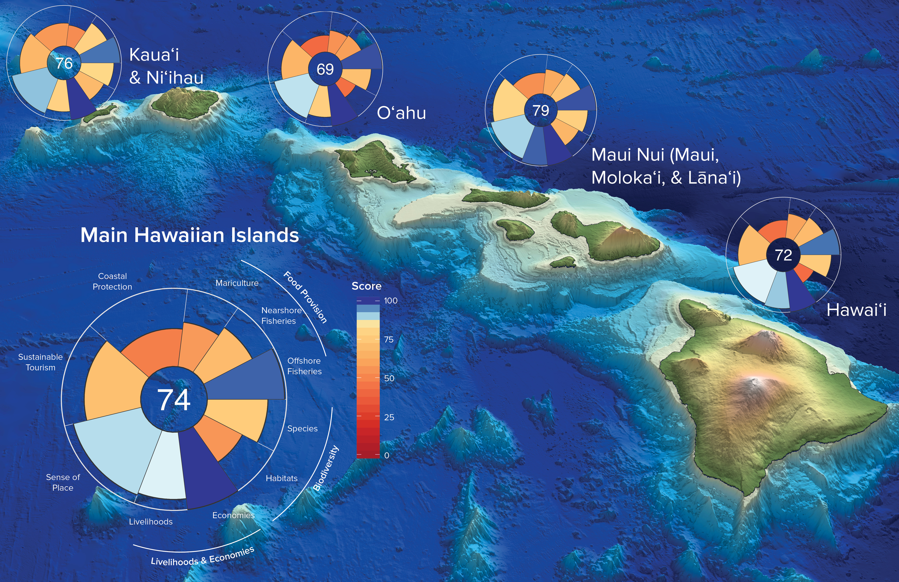
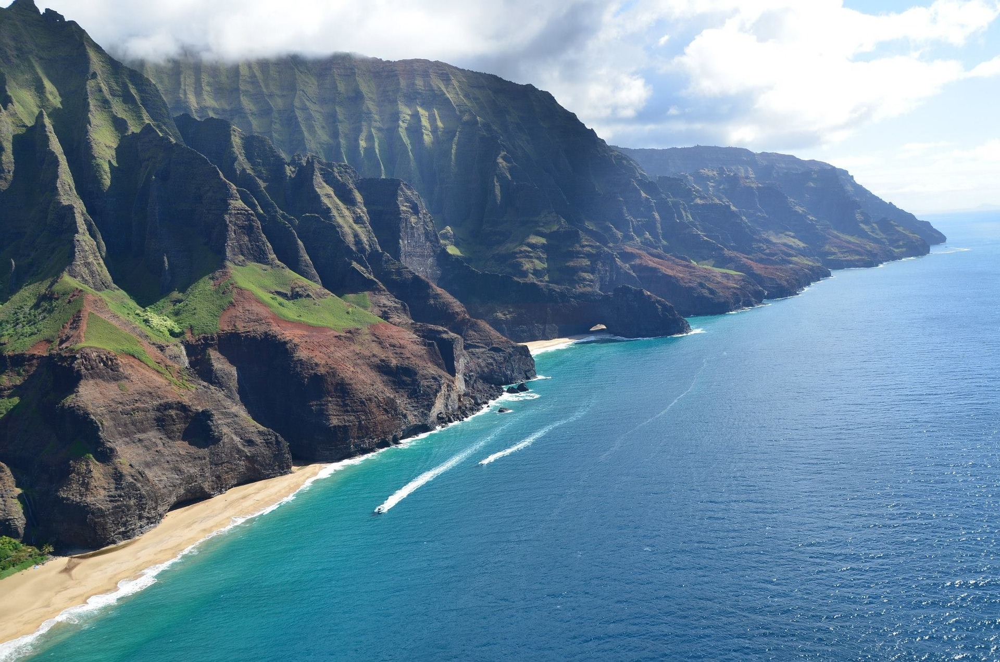

Mālama ʻāina, or care for the land and ocean, is a concept that resonates throughout Hawaiʻi. Rooted in a long history of sustainable resource use, residents of Hawaiʻi recognize the health of their island communities and environment is intertwined, and the ocean is embodied in the spirit of Hawaiʻi.

But how healthy are Hawaiʻi’s oceans, and are we doing enough to sustain ocean resources for the people of Hawaiʻi now and into the future? Today marks the release of the Hawaiʻi Ocean Health Index (OHI), an assessment used to measure the benefits our ocean and coastal resources. The Main Hawaiian Islands score 74 out of a possible 100, meaning there is room for improvement to achieve a healthy, sustainable ocean. 

 

 

As the first assessment of its kind for the Hawaiian Islands, the Hawaiʻi OHI establishes a baseline of information to measure progress against. Just like doctors look at diet, exercise, and blood samples to understand human health, OHI tracks the ocean’s vital signs and paints a more complete picture of ocean health by weaving together cultural, economic, and ecological data that can ultimately inform decisions to improve ocean health and ensure sustainability.

“Hawai‘i is the most remote island chain in the world and is surrounded by water for thousands of miles – maintaining a healthy ocean is absolutely critical for sustaining the needs and livelihoods of our island communities,” says Dr. Jamison Gove, research oceanographer at the National Oceanic and Atmospheric Administration’s Pacific Islands Fisheries Science Center. “An integrated assessment of our ocean ecosystems, such as the OHI, is key to tracking changes in ocean health and devising management strategies that promote sustainable use of the environment.” 

As a comprehensive framework, OHI can be applied at global, regional, and national scales, enabling tailored assessments with relevant results. For Hawaiʻi, Conservation International organized a hui, or working group, to gather cultural and local knowledge and scientific data on ocean health and management to develop the Hawaiʻi OHI. 

Local stakeholders – from state and federal managers to cultural leaders and representatives from the private sector – were involved throughout the entire process of adapting the global OHI assessment framework to Hawaiʻi so it would be truly representative of local values and priorities. 

“One thing that became clear through this process is that all stakeholders involved share the
same core values and attitudes towards the ocean,” says Dr. Eva Schemmel, Hawaiʻi OHI lead and Conservation International Hawaiʻi science advisor. “There is a need to maintain livelihoods as sustainably as possible to protect the marine environment that underpins Hawaiʻi’s economy and community health.”

 

 
<i>© Conservation International photo by Jhana Young</i>

 

The resulting Hawaiʻi OHI framework was transformed into six goals that reflect what local stakeholders believed to be important for maintaining healthy oceans: Food Provision, Coastal Protection, Biodiversity, Livelihoods & Economies, Sustainable Tourism, and Sense of Place. 

Using the best available science, these goals were scored on a 0-100 scale, reflecting how close Hawaiʻi is to reaching their targets for a healthy ocean. A score of 100 represents a healthy ocean that provides maximum benefits to people now and into the future.

Overall, Hawaiʻi’s ocean economies, sense of place, and offshore fisheries received high scores. However, the loss and degradation of coastal and ocean habitats such as beaches, coral reefs, and coastal wetlands threaten the ability of our oceans to provide resources and protection into the future. These habitats underlie many of the other goals, often leading to lower scores. 

For example, it is estimated that 72% of Hawaiʻi’s beaches are eroding, reducing the ability of our coastlines to protect against storms and large wave events. The Hawaiʻi Sea Level Rise Vulnerability and Adaptation Report shows that climate change will exacerbate the problem, with a future predicted 3.2 foot rise in sea level causing an estimated $19 billion in economic loss. One of the goals these habitat changes are reflected in is Coastal Protection, which scored 49 out of 100.

 

 

Not only does the Index incorporate local knowledge and data, it is also being used to track broader sustainability goals by providing an all-encompassing indicator that can be referred to for policy or metric development. Integrating social, ecological, and economic values into one index enables communities, local businesses, managers, policy makers, and scientists to more holistically understand, track, and communicate the status of Hawaiʻi’s ocean resources and creates a shared vision for the future of our oceans.

“This project will be essential for the Division of Aquatic Resources’ (DAR) Marine 30x30 Initiative, which aims to achieve effective management in 30% of Hawai‘i’s nearshore waters by 2030,” says Brian Neilson, acting DAR Administrator. “The Ocean Health Index will allow us to better understand the current conditions of nearshore resources and be able to track these metrics over time.”

The Hawaiʻi OHI is also part of the Aloha+ Challenge, Hawaiʻi’s statewide commitment to achieve six integrated sustainability goals by 2030 for clean energy, local food, natural resource management, solid waste, smart sustainable communities, and green education and workforce.

“Hawaiʻi truly embodies the philosophy that effective sustainable ocean management requires active participation and is the collective responsibility of all,” says Erich Pacheco, Director of the OHI program at Conservation International. “It has been impressive to see the multitude of stakeholders, many with differing interests, come together through the OHI process under one shared vision to ensure the ocean can continue to provide benefits to the residents of Hawaiʻi.”

 

*The Ocean Health Index is a partnership between the National Center for Ecological Analysis and Synthesis (NCEAS) and Conservation International. 

The Hawaiʻi OHI incorporated feedback and support from: Conservation International Hawai‘i, National Oceanic and Atmospheric Administration (NOAA) Integrated Ecosystem Assessment, Hawaiian Airlines, Department of Land and Natural Resources (DLNR) Division of Aquatic Resources, DLNR Division of Forestry and Wildlife, National Park Service, Office of Hawaiian Affairs, NOAA Pacific Islands Fisheries Science Center Ecosystem Sciences Division, NOAA Pacific Islands Fisheries Science Center Stock Assessment Program, Office of Planning Coastal Zone Management, NCEAS, Kua‘āina Ulu ‘Auamo, The Nature Conservancy, University of Hawai‘i Sea Grant, Hawai‘i Green Growth, Natural Energy Laboratory of Hawai‘i Authority, and Liquid Robotics.* 