## What we will cover

In this post I will describe how to walk back changes in Git/GitHub based on where you are in the Git workflow. 

 

## Background

Git and GitHub are open source software programs we use for version control, which means tracking how files change over time. Git and GitHub work together, with Git tracking and versioning your files, and GitHub making them available online and providing tools to collaborate with others. With this software, you can track a file over time including line by line changes, as well as who made them and when. 

Along with improving workflow, transparency, and collaboration efforts, version control makes it possible to go back and fix mistakes you have made. The approach to fixing mistakes in Git/GitHub depends on where you are in the process of staging/committing/pushing your changes. If you are not familiar with this Git terminology that is OK: I first describe the Git/GitHub workflow and then describe how to use Git from the command line (also called the Git Shell) to walk back changes.

I highly recommend practicing this Git super-power on a non-important repository to gain an understanding of what is going on. Speaking from experience, applying this information in a time sensitive situation on an important repository is... undesirable (to say the least). 

#### An aside

Often I find it easier (or at least less stressful) to use low tech solutions, such as rummaging through my history on GitHub to find the version of the file (or portion of the file) I want, and then copying/pasting this into my current working directory. Although I use Git every day, I rarely need to go back in time to fix changes, so this low tech approach is often more intuitive and faster for me (but definitely less cool and authoritative looking). *NO SHAME!*

#### Cheatsheet

For future reference you can [download](https://GitHub.com/OHI-Science/ohi-science.GitHub.io/raw/master/assets/blog_images/GitHub_3x5cards_WalkBackChanges.pdf) a handy 3x5 card with all the Git commands I describe below.

 

## Some terminology

The approach to reverting to previous versions of your files depends on knowing where you are in the Git workflow, which follows this sequence:

 

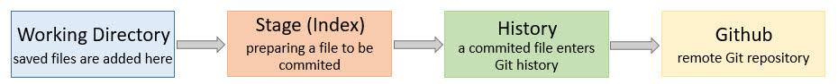

 

Below I provide more information about each step of this sequence. This information is specific to RStudio because I typically interact with Git through RStudio.

 

#### Working directory (*saved changes*)

When you make a change to a file and save, the file is added to the working directory. The Git tab in RStudio shows the files in the Git _Working Directory_.  

 

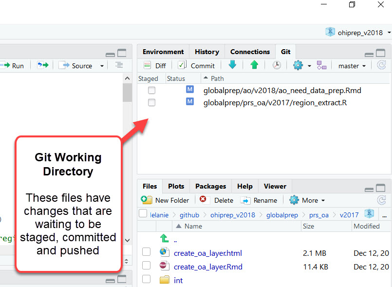

 

#### Staged

Prior to being committed, a file must be _staged_.  This is indicated by a check next to the file in RStudio's Git window.

 

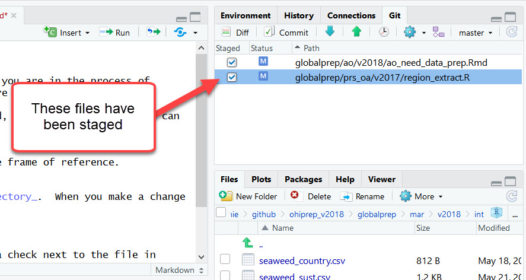

 

#### Committed to history

Once a staged file is _committed_, it is incorporated into Git history.

 

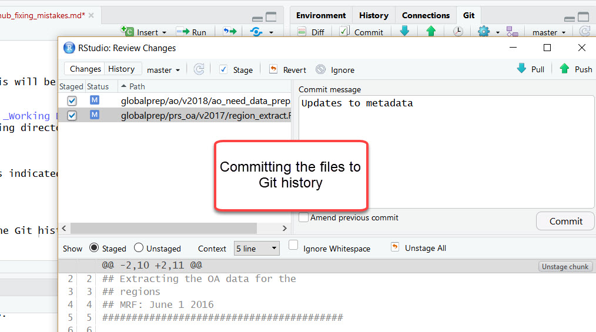

 

#### Pushed to GitHub

Once a local file is _pushed_ to the remote site (i.e., GitHub in this case), it becomes available to collaborators and/or the public.

 

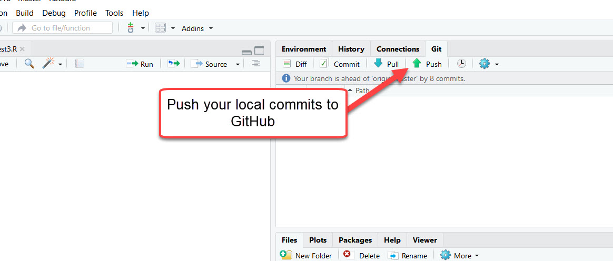

 
 
 

## A beginner's guide to walking back changes!

The following commands are entered into the Git Shell, which you can access in RStudio from here:

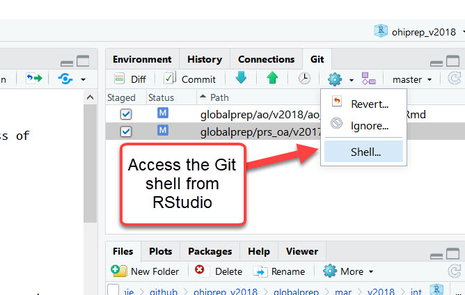

 

### Workflow step 1: Working directory 

#### Changes saved, but not yet staged, committed, or pushed

Delete unstaged changes in the working directory with `clean`:

`git clean -df`

`git checkout -- .`

[WARNING: this will delete your saved changes and is not recoverable]

 

#### *Low tech solution*

The "Commit" button in the Git window in R provides the option to "Discard All" saved changes or more targeted regions ("Discard Chunk").

 

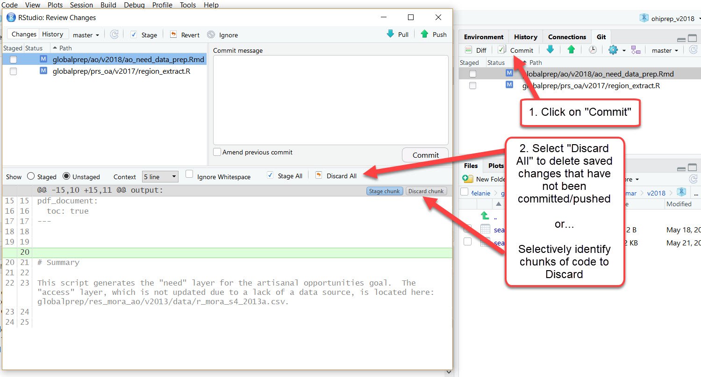

 

<!--Mel: I didn't know you could do this, and by chunk! So cool. I click on "revert" instead of "discard". Do you know if there is a difference? Is it worth mentioning "revert"?-->

### Workflow step 2: Staged files

Staged files can be unstaged with `reset`:

`git reset HEAD -- .`

 

#### *Low tech solution*

Files can also be unstaged by clicking on the check boxes in the Git tab, but this can be cumbersome if there are a lot of files. However, after you have highlighted one file, you can type Command-A (select all) to highlight all of them, and you can stage or unstage all that are highlighted.

 

### Workflow step 3: Committed files 

#### Changes saved, staged, committed, but NOT pushed to GitHub (or other remote)

*Fixing the most recent commit*

<!-- Mel: can you give a little more description here? I'm trying to think of what I would/not be deleting and where that would leave me? Is the first case "uncommit files but don't delete": does that take you back to staged? and does the "delete" case leave you where you started after your previous commit (ie before you started working right now)? or does it delete the actual file (and what is an example of why you would want that?) -->

There are two good options at this point: 

1. `reset`: This option rewrites history (i.e., deletes commits).  I never ever do this after the commits have been pushed to a remote website or server (i.e., GitHub); but prior to that, I often just want the commit to fully dissapear. I discuss this option below.
2. `revert`: This option preserves Git history.  This is super important after commits have been pushed, but can also be useful prior to pushing, especially if going back multiple commits.  I discuss this option in "Workflow step 4" below.

To uncommit files, use `reset --soft`. This will transfer the relevant files from Git History to the Git Working Directory (as staged files).  From there you can make revisions to the files and then stage and commit.  This is handy because nothing is automatically deleted.

`git reset --soft HEAD~1`

Alternatively, if you want to delete all the changes saved in the previous commit:

`git reset --hard HEAD~1`

[WARNING: the "hard" reset is permanent and all changes saved in the previous commit will be lost forever!]

 

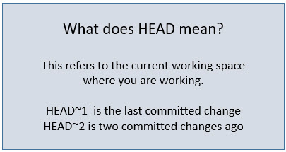

 

##### Another option
The `rebase` option can also be used to rewrite history.  My advice: **Do NOT use rebase!!!** I think it just adds extra confusion because it is almost always easier to use `reset` (as discussed above).  And, it is often safer to use `revert` (which we will discuss below).  But if you are already comfortable using `rebase` then, by all means, continue on (just do not use it after the commits have been pushed!). 

 

*Rolling back multiple commits*

I rarely have more than 1 unpushed local commit because I almost always push immediately after committing.  But, it is possible to uncommit multiple commits. For example, the following would undo the most recent 3 commits:

`git reset --soft HEAD~3`

All the relevant files in these three commits will move to the Working Directory where they can be deleted, modified, etc.  

NOTE: When I want to go back in time more than 1 commit, I typically use `revert` (described below) because it does not rewrite history, and is thus safer.

 

## Workflow step 4: Pushed commits to GitHub (or other remote)

#### Revert
Once you have pushed your commits to GitHub, you will NOT want use `reset` because this rewrites history.  Instead, you will want to use `revert` because it preserves the commit history.  In this case, a commit with the older (desired) version of the files will be created while maintaining the intermediate commits with the (undesired) files. 

In other words, let's say you decide that adding "and cat" (i.e., a file in commit 2) was a mistake and you want to go back to the commit without that particular edit (i.e., commit 1).  If you delete history (using `reset` or `rebase`), you will lose commit 2. Alternatively, if you preserve history (using `revert`) a 3rd commit will be created with the file version in commit 1, but commit 2 (with the bad edit) will still remain in the history. The files at the head will look the same regardless of whether you rewrite or preserve the commit history, but the commit history will look different.  

 

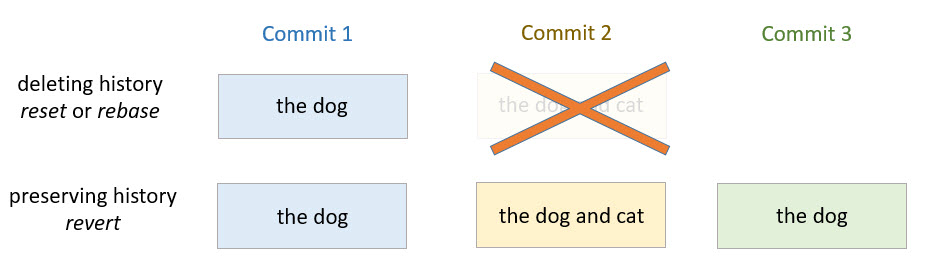

 

Preserving history is great because it is less risky, more honest, and will not mess up other people working in the repository. To use `revert` you will need to know the commit identifier number (called a [SHA](https://stackoverflow.com/questions/29106996/git-what-is-a-git-commit-id)) you want to alter. This is available from the RStudio/Git history:

 

 

Or, if you prefer the Git Shell, you can use: 

`git log --pretty=format:"%h %s" HEAD~3..HEAD`

(this example will return the last 3 commits)

 

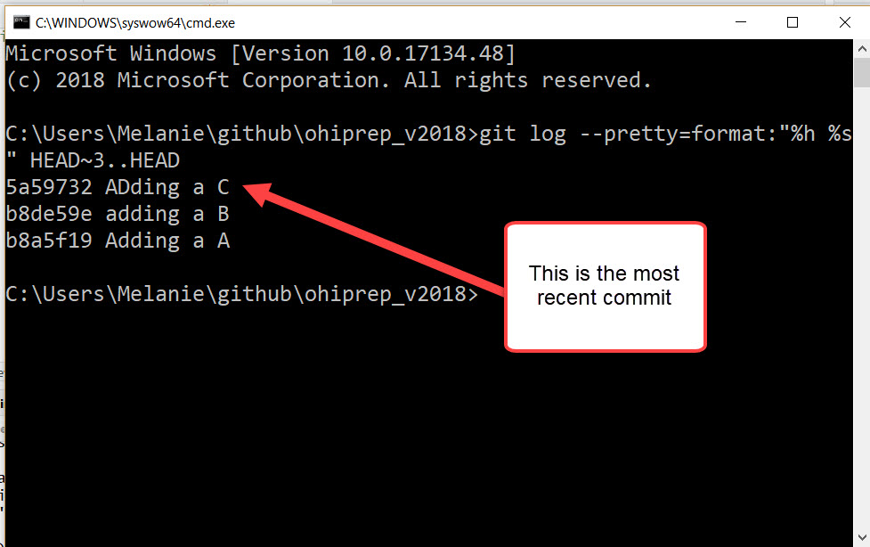

 
 

#### Delete an older commit while keeping subsequent commits

##### NOTE: This can cause merge issues, which will need to be fixed

The first step is to examine the commit history to identify the relevant commit(s): 

`git log --pretty=format:"%h %s" HEAD~6..HEAD`

 

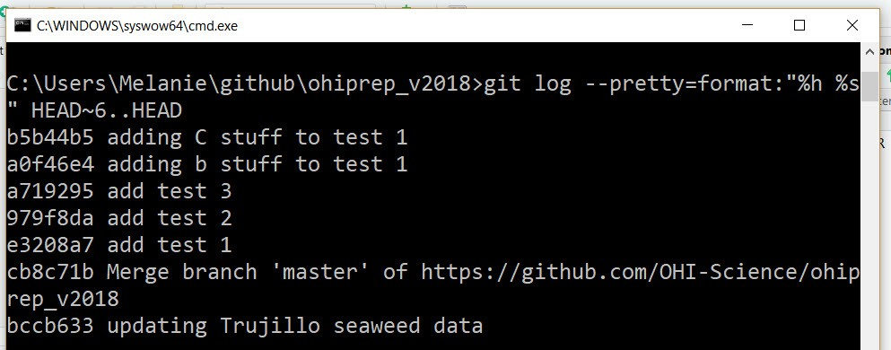

 

In this case, I wanted to delete commit `a0f46e4 adding b stuff to test 1`, 

so: `git revert a0f46e4`

 

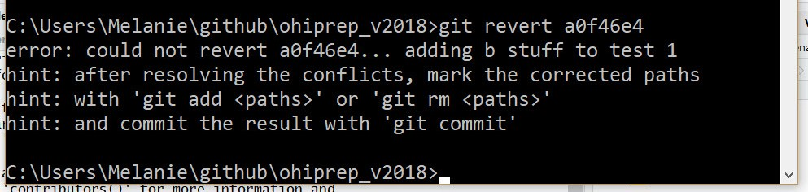

 

The error message indicates I have a merge conflict, but it helpfully hints at why this occurred! The files with conflicts will be moved to the Git Working Directory and identified with an orange U. The merge conflicts can be resolved, and the file/s can be saved, staged, and committed (see [here](http://ohi-science.org/data-science-training/collaborating.html#merge-conflicts) for help). Fear not: merge conflicts seem intimidating when starting out on Git, but they are actually quite easy to deal with.

 

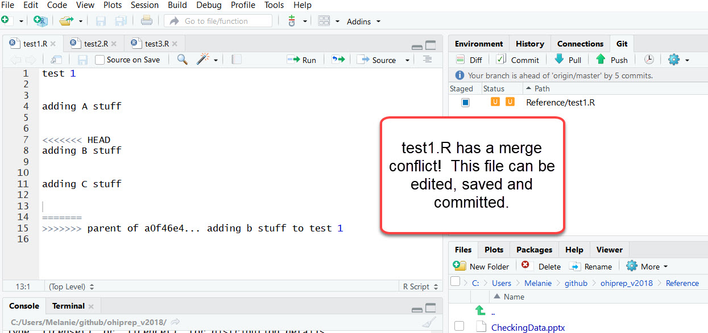

 

If there are no merge conflicts, you may be directed to the dreaded VIM window! When I did the following: `git revert 979f8da`, the VIM window popped up:

 

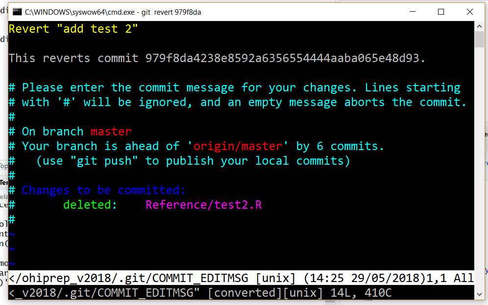

 
 
I recommend typing: `:q` as soon as possible to exit! Once you exit, your reverted files will be saved in a new commit with the message: "Revert 'add test 2'".  This commit message is usually good enough for me.

But, if you *really* want to edit the commit message (currently in yellow: Revert "add test 2") you can do this through the VIM interface (WARNING: This can be stressful).  First get into "insert" mode by typing an "i". Modify the yellow text in the VIM window. Exit insert mode with Ctrl+C.  Now enter `:q` (this should display in the bottom region of the VIM window) and return. 

 

#### Rollback to a previous state (i.e. delete multiple commits)

`git revert --no-commit 979f8da..HEAD`

`git commit`

This will rollback all the changes occurring *after* commit 979f8da.  The `--no-commit` is added to prevent having to deal with each commit.

 

## Summary

This was a quick look into how you can go back in time with Git and covers about 95% of the issues we encounter. 

The following diagram summarizes what I covered in this post and is a helpful reference for understanding how to move forwards and backwards in Git/GitHub. 

 

 

 

**Other Technical Blog Posts**

- [Cropping rasters down to size](http://ohi-science.org/news/cropping-rasters-down-to-size) 
- [How to build a successful Ocean Health Index technical team](http://ohi-science.org/news/how-to-build-successful-technical-team)
