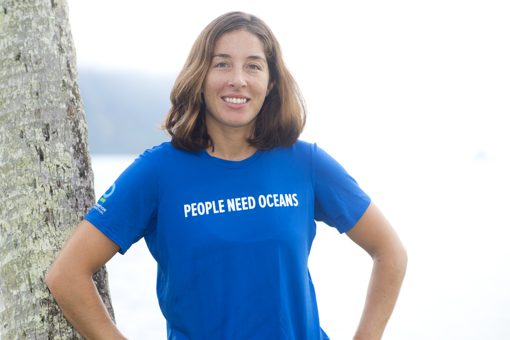

 
  
Dr. Eva Schemmel is the lead of our [Hawaiʻi OHI+ assessment](http://ohi-science.org/mhi/), which was released June 8, 2018.

## Work 

**Describe your role or involvement with OHI.**

I am the lead for the Hawaiʻi OHI+ assessment working on the coordination of working groups, analysis, and communication for the assessment.

**Give us a one-word description of how you work.**

Exploratory

**What are your essential apps, software, or tools?**

R, GitHub, ArcGIS, InDesign

**What is your personal story behind why you do what you do?**

I have always been drawn to the ocean and science. Since I was very little, I have known that I wanted to be a marine biologist. Today, instead of learning about how the ocean is changing, I am seeing it first hand. My favorite places are getting impacted. I am seeing more pollution, fish becoming less abundant, and the coral reef disappearing. This is what motivates me to work in ocean conservation.

**What aspect of your work are you most proud of?**

I am most proud of translating data into ocean targets that can be communicated to the public and using OHI to show how we are all connected to the ocean. For ocean conservation to work, it must be something that everyone values and can see the benefit from. It is our job as ocean conservationists to make sure everyone knows how they rely on the ocean and help them make deep, personal connections and relationships with the ocean. 

**How have you seen OHI make a positive impact?**

The across sector discussions on setting goal indicators and targets for the OHI were very valuable. They helped increase understanding across private sectors, non-profit groups, and state and federal management agencies. Hopefully, the full impact of the Hawaiʻi OHI is yet to come with increased ocean management and priority setting, leading to increased future OHI scores and ocean sustainability. 

**How do Hawaiian partners plan on using the OHI scores?**

Institutions are using the index to support their management and policy initiatives and the OHI scores are being used to communicate the combined status of our ocean sectors. Management agencies within each sector have incorporated their data along with their management and policy initiatives into the OHI to track progress towards achieving ocean sustainability targets. 

## Life

**Where are you originally from and where do you live now?**

I am from Vashon Island, Washington and grew up with a deep love for the ocean. I now live on Oʻahu, Hawaiʻi, a place that I feel is my home.

**What could you present about for 40-minutes with absolutely no preparation?**

Of course I could present on The Ocean Health Index. The other presentation that I would give would be on fish biology and the importance of understanding fish biology for fisheries management. 

**What are 5 things you can’t live without?**

The ocean (swimming, diving, fishing, and surfing), family, friends, good food, and quiet moments.

**How do you recharge?**

I visit the ocean to reset mentally, spiritually, and physically. Happily, I can visit the ocean almost everyday.  

**What is one of the most inspiring places you’ve been?**

I think that all places are inspiring once you take the time to connect and contemplate. However, I feel that I am most inspired right at home in Hawaiʻi. 

**What’s the most interesting thing you have read or watched this week?**

A [National Geographic article](https://news.nationalgeographic.com/2018/06/high-seas-fishing-subsidies-oceans-science/) about the profitability of high seas fishing. 

**What is the best meal you have ever cooked?**

I am not the best cook. For me simple is better. I think I was most proud of the salmon I smoked.

 

**More People of OHI Profiles**

- [Julie Lowndes](http://ohi-science.org/news/people-of-ohi-julie-lowndes): OHI Science Program Lead 
- [Erich Pacheco](http://ohi-science.org/news/people-of-ohi-erich-pacheco): OHI Director at Conservation International 
- [Erin O'Reilly](http://ohi-science.org/news/people-of-ohi-erin-oreilly): OHI Communications Coordinator 
- [Lagipoiva Cherelle Jackson](http://ohi-science.org/news/people-of-ohi-lagipoiva-cherelle-jackson): OHI Samoa Lead
