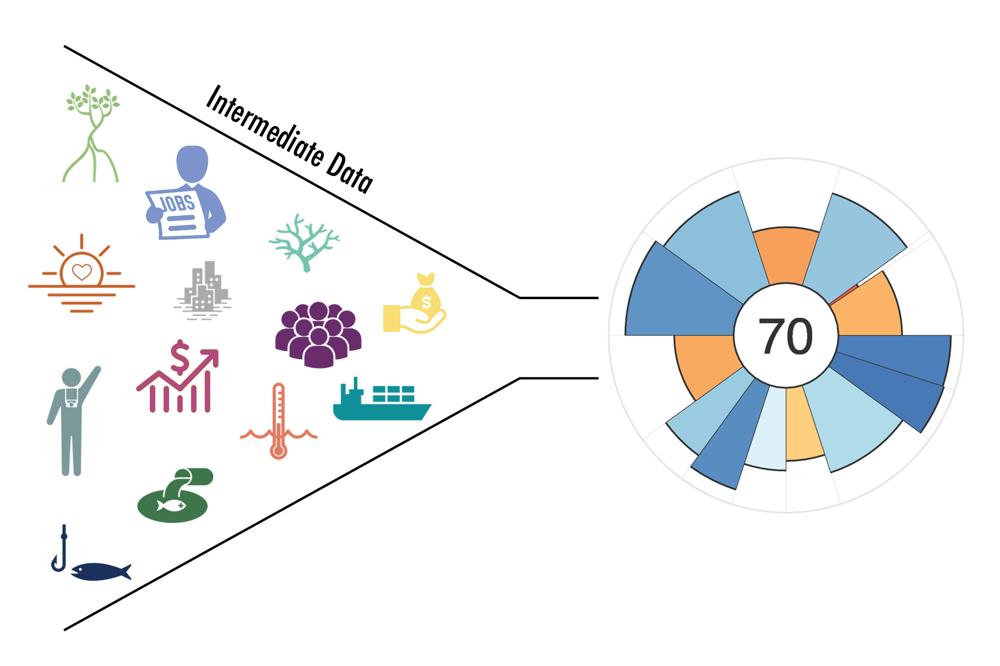
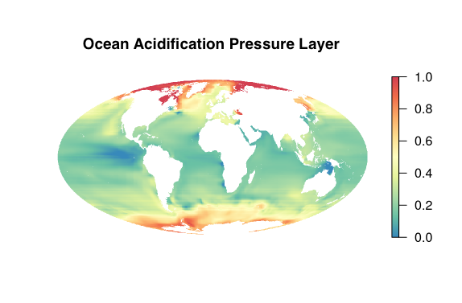

When you first explore the Ocean Health Index (OHI), the thing that usually sticks most is the final score, a number ranging from 0-100. While there are a multitude of ways these scores can catalyze discussion and stakeholder engagement, another question is often what else can OHI be used for?

There are actually many unseen uses for OHI far beyond the scores. These include the OHI workflow itself (next month’s blog but spoiler alert: (Lowndes et al. 2017)[https://www.nature.com/articles/s41559-017-0160]) and the “intermediate data” that emerge during our analyses. 

 

 

## Why are these intermediate data useful?

Intermediate data represent the data steps between raw data files and processed scores. According to a (New York Times 2014 article)[https://www.nytimes.com/2014/08/18/technology/for-big-data-scientists-hurdle-to-insights-is-janitor-work.html], “data scientists spend 50 to 80 percent of their time mired in the mundane labor of collecting and preparing data, before it can be explored for useful information.” 

Lucky for you, we have already spent a lot of time combing through global datasets, identifying the most representative data sources that include both temporal and spatial variability, and “wrangling” the data, which means cleaning and formatting, along with all the decisions that go into those. We have done this all in the open source language R and share our code on GitHub, so you can see exactly what we have done. 

Throughout this data wrangling process, there can be important data products that emerge, and if shared, could save others a lot of time by not having to start from scratch. More and more, we are bringing these intermediate steps of interest out from behind the scenes.

## Exploring our intermediate data

We like to compare intermediate data to our other love of cooking. Preparing data for analysis is like prepping ingredients for a meal. The way we prepare them makes them useful for more than a single project or dish. So if we have peeled and sliced 100 potatoes, you can see how we did it with our code (that’s the wrangling part) and you could also cook with them too (that’s using our data in your own project).

Data included as pressures on OHI goals are a good example of these intermediate data. (Ocean acidification)[http://www.oceanhealthindex.org/methodology/components/ocean-acidification] (OA) is a pressure that affects seven goals and subgoals in our global assessment. It is also a global issue that is relevant to more than just calculating OHI scores and is often featured in the news for its impacts on shellfish and coral reefs. 

When we download the OA data from (Feely et al. 2009)[https://darchive.mblwhoilibrary.org/bitstream/handle/1912/3180/22-4_feely.pdf?sequence=1&isAllowed=y], it is a huge raster file, meaning data is stored in a map like pixels in a photograph. The OA data are global maps at 1 degree cell resolution, meaning there are 113,000 data points per file. And we have monthly data from 1880-1889 and 1958-2100, which means over 207 million data points combined. It’s a lot of data!

The process of preparing these maps for OHI includes many steps. First, we calculate the annual mean for our years of interest (1958 to 2016 for our 2017 global assessment). Next, we rescale each annual raster layer from 0 to 1 based on a biological threshold (Ω ≦ 1) and the proportional change compared to a historical mean. Then, we interpolate the data to gap-fill for cells where there is no data and resample the rescaled raster layer to 1km² cell resolution. Finally, we mask the resampled data to select only those cells within the ocean. This entire process is documented, along with the code, (here)[https://cdn.rawgit.com/OHI-Science/ohiprep/62f96ee7/globalprep/prs_oa/v2017/create_oa_layer.html#summary]. 

 

 

At any of these processing steps, we have created valuable “intermediate data” that can be useful to other projects. The raw data can be (downloaded here)[http://ohi-science.org/ohi-global/layers#cc_acid] and then you can follow as much of our process as you would like. You can crop the global dataset to a smaller region, set a different biological threshold, resample to a different resolution, use our final data layer, and more. 

## Real world examples

There are multiple ways OHI data have been used in analyses by independent research groups.  

Sometimes, researchers use just a couple data layers. For a research derby, University of Washington PhD students used OHI climate pressure data – sea surface temperature, ultraviolet, sea level, and aragonite concentration – to investigate the spatial and temporal variability of these climate change pressures and how this variability scales up to variability in OHI.

Other times, researchers look at whole OHI goals. In a fisheries management paper, (Melnychuk et al. 2016)[http://www.pnas.org/content/early/2016/12/16/1609915114] compared the Fisheries Management Index they developed to the OHI Wild Capture Fisheries sub-goal under Food Provision. 

So, what question are you currently tackling and could any of our data help you in your analyses?

## Where does this data live?

Since open source data is a main theme for OHI, all of these (intermediate data)[http://ohi-science.org/ohi-global/layers_table.html] are available for anyone to use, and there are more coming. We even (document our process)[https://cdn.rawgit.com/OHI-Science/ohiprep/62f96ee7/globalprep/prs_oa/v2017/create_oa_layer.html#final_pressure_layer] for turning raw data into a finalized product so you can see the step-by-step modifications we make. So if you are in need of open source data layers, check out the ones we used in our assessment as a starting point. 

These global datasets can be used to answer a wide array of ocean related questions and they can also be cropped to the country-level to make them relevant to smaller scale analyses: see our (tutorial on cropping rasters)[http://ohi-science.org/news/cropping-rasters-down-to-size].

## How else is OHI useful?

Next up will be a more in-depth look at another way OHI is transferable to other projects. Julie will go into what the OHI Toolbox is and how it can help you. Stay tuned!

 

*Related posts*

- (GitHub: A beginner's guide to going back in time (aka fixing mistakes))[http://ohi-science.org/news/github-going-back-in-time]
- (Cropping rasters down to size)[http://ohi-science.org/news/cropping-rasters-down-to-size]
- (Resources for R and Data Science)[http://ohi-science.org/news/Resources-for-R-and-Data-Science]