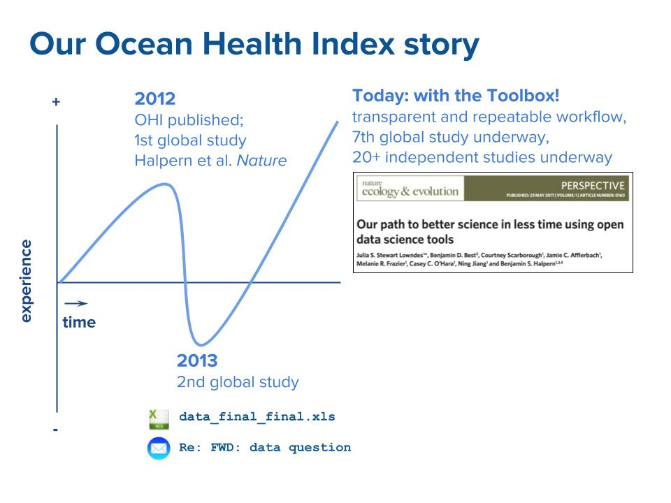
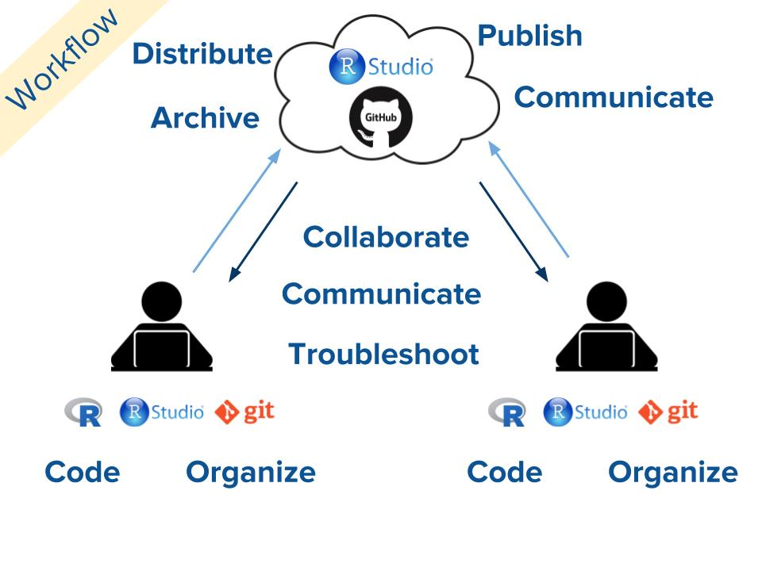

We get asked a lot whether the OHI Toolbox can be used for other projects besides the Ocean Health Index (OHI). And the answer is yes, absolutely. This is because the software and workflow we built the Toolbox with are not unique to OHI: we did not develop them, we are simply using them for our project. It’s like how we use  Gmail and Skype to effectively communicate within our team, but we did not develop these software programs. 

But the tools we use for the Toolbox are the same ones that software developers use to *build software*. They are like building blocks that can be assembled together and adopted for your project, which is how we built the OHI Toolbox.  

*Spoiler Alert*: there are four tools we use to build the OHI Toolbox: [R](https://cran.r-project.org/), [RStudio](https://www.rstudio.com/), [Git](https://git-scm.com/) and [GitHub](https://github.com/).

To make this a bit more concrete, here are four questions I answered about the OHI Toolbox in a recent webinar [slides here](https://docs.google.com/presentation/d/1WKzbvF-XQl3lGzEc44fp8azssod9BcY2wMaAO0ZhFmk/edit).

1. Why do we need the OHI Toolbox?
2. What is the OHI Toolbox?
3. How does the OHI Toolbox work?
4. How can the OHI Toolbox help you?

## Why do we need the OHI Toolbox?

When we first developed OHI, it was to meet a demand for transparent, data- and science-driven methods to assess the ocean benefits people care about. There was need for a standardized method that could be used in different geographies without constantly reinventing the wheel, yet flexible to represent the environmental, cultural, and management characteristics in these different geographies. 

So something in between a one-size-fits-all that are too rigid to accommodate these differences and having to develop bespoke methods in every location, which would be inefficient to say the least. The method also needed to be streamlined for repeated use, enabling managers to track changes through time and identify management interventions. 

Over three years and with thirty collaborators, we developed the Ocean Health Index and published our findings in *Nature*: [Halpern et al 2012](http://www.nature.com/nature/journal/v488/n7413/full/nature11397.html). We initially thought we were working in a reproducible way when we first developed OHI and documented all of our steps in a 130-page supplement document accompanying Halpern et al.. But, while our scientific methods were coded, well-documented, and reproducible, our data practices were not.

The motivation for building the Toolbox came from learning the hard way our approaches to data preparation, namely with files like `data_final_final.xls` and email chains like `Re: FWD: data question` were inadequate for efficiently reproducing our own work. We describe this struggle and our solutions to it in our publication in *Nature Ecology & Evolution*: [Our path to better science in less time using open data science tools](https://www.nature.com/articles/s41559-017-0160). 

This diagram shows our positive and negative experiences, and how we are much better off now, because of the Toolbox.

 

 

## What is the OHI Toolbox?

The Toolbox contains a suite of tools we use to conduct OHI assessments. These software and workflows are open, meaning that they are available for free online to download and learn how to use. 

Most importantly, they are developed by the people who know the ins and outs of the software industry best: software developers. These tools are developed by software developers for software developers. And even though we are a team of marine scientists, we can work like software developers: working efficiently and collaboratively with code and data.

The Toolbox is essentially GitHub repositories filled with R code. We built it and work with it using four tools: [R](https://cran.r-project.org/), [RStudio](https://www.rstudio.com/), [Git](https://git-scm.com/) and [GitHub](https://github.com/). Git and GitHub take care of the bookkeeping and version control and collaboration (goodbye files with names like _final_final_my_initials_and_date.xls!), while adding game-changing features like publishing and distributing data and code through websites. 

R and RStudio enable us to *code everything, from data import to preparation, modeling, visualization, publications, and websites*, allowing us to be really streamlined, transparent, and reproducible. I think of RStudio as an airport and R is an airplane that you are piloting. As I wrote in a [blog post](http://jules32.github.io/resources/RStudio_intro/) from a few years ago: 

> If R were an airplane, RStudio would be the airport, providing many, many supporting services that make it easier for you, the pilot, to take off and go to awesome places. Sure, you can fly an airplane without an airport, but having those runways and supporting infrastructure is a game-changer. 

RStudio not only provides a user interface for making coding more enjoyable and supported, they are also developing best practices for data science, and building the tools, R packages, and tutorials to enable those best practices. 

 

 

These tried-and-true tools are also used by the data folks at [AirBnB](https://medium.com/airbnb-engineering/using-r-packages-and-education-to-scale-data-science-at-airbnb-906faa58e12d) and [Google](http://blog.revolutionanalytics.com/2011/08/google-r-effective-ads.html). They are teams working with complex data that need the ability to effectively collaborate and communicate. Hey, that’s us too! So, although we are working with ocean science and management, we can leverage all of the tools and workflows other folks developed. 

## How does the OHI Toolbox work? 

On the technical side, the OHI Toolbox is essentially two GitHub repositories of R code and data that work together; there is no GUI interface. One repository is the `ohicore` R package of core functions to calculate OHI scores and is what makes an OHI assessment an OHI assessment. The second is a “tailored” repository that has a specific file structure to work with `ohicore`, and contains all the location-specific information including data preparation and models. 

The user works inside the tailored repository, keeping within the file structure but substituting local data and modifying or building from the R code to model ocean health with their data for their local area. They interact with the `ohicore` repository by installing the R package directly from GitHub. This package will calculate OHI scores by combining the goal models and data for goals, pressures, and resilience from the tailored repositories.

Accompanying `ohicore` and the repositories is the workflow that makes it all happen.
The workflow involves coding in R/RStudio, using Git to version control on your own computer, and developing good practices using GitHub to collaborate with your future self first and foremost. This same workflow lets you distribute and publish your work online for free, and also collaborate with others in the same way. We are able to use the same workflow to help troubleshoot, both between our own team and with other independent OHI groups. 

 

 

## How can the OHI Toolbox help you? 

First of all, you can use it as a blueprint for how to set up your own projects. The software and workflows behind the OHI Toolbox are not unique to OHI, or oceans! Within RStudio, some of the packages we use most often that may be useful for you include:

* `tidyverse` for most of the data processing cycle: 
    * `readr`, `readxl` for importing data
    * `dplyr`, `tidyr` for data wrangling (importing data, selecting and renaming columns, filtering rows, etc.)
    * `stringr` for working with non-numeric “string” information
    * `ggplot2` for visualization
* `sf`, along with `rgdal`, `raster`, and `sp` for spatial analysis
* `knitr`, `rmarkdown`, `bookdown`, and `blogdown` for making websites and online books
* `shiny`, `plotly`, and `ggviz` for making interactive graphics and dashboards
* `devtools`, `roxygen2`, and `packagedown` for building, installing, and communicating R packages

You can benefit from becoming a part of this open science community. I joined Twitter to learn R, and the welcoming online community of developers, users, teachers, and overall good people has been amazing, even life-changing. There are too many great groups to list, but I would suggest getting started by checking out: 

* the rstats hashtag <!-- If we do #rstats it thinks it's a title... any thoughts about how include without it doing that? -->
* @RStudio
* @rOpenSci
* @OHIscience
* @EcoDataSci
* @RLadiesGlobal
* @thecarpentries
* @MozillaScience

You can value, promote, and enable the culture of open science – even if you don’t code. This is huge. Let’s talk about why this stuff is important for science and management, give our teams the time and space to learn, fund trainings and continuing education… open science isn’t just for coders or OHI Toolbox users, it’s for all of us!

## In summary

So, when someone is “using the OHI Toolbox”, yes it means they are calculating OHI scores for ocean management in a repeatable, transparent way. But, importantly, it also means they are coding openly and collaboratively, efficiently and deliberately with data, practicing and promoting open science, and building an open community of practice. 
