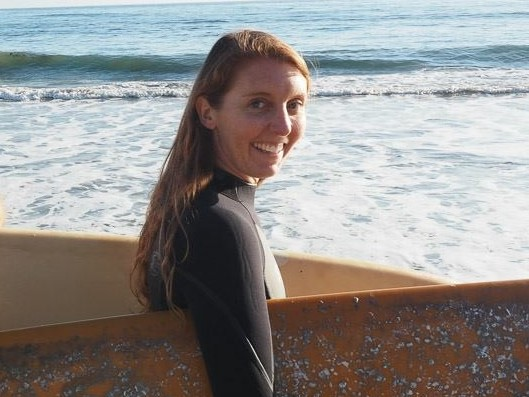

 
Courtney Scarborough is a Project Scientist and currently manages the [Northeast](http://www.ohi-northeast.org/) and [British Columbia](http://www.ohibc.org/team.html) Ocean Health Index assessments.

## Work 

**Describe your role or involvement with the Ocean Health Index (OHI).**

I have been working on the OHI since its inception in 2009/2010 and now manage our work to tailor the OHI framework to the unique natural and human ecosystems of the US Northeast and British Columbia.

**Give us a one-word description of how you work.**

Inquiry-based

**What are your essential apps, software, or tools?**

I rely heavily on Evernote for keeping all of my tasks organized, but really, for me Evernote is only really, really useful when combined with ‘[The Secret Weapon](https://thesecretweapon.org/wp-content/uploads/2018/02/The-Secret-Weapon-Manifesto.pdf)’ - this uses the philosophy of David Allen’s [Getting Things Done](https://www.amazon.com/Getting-Things-Done-Stress-Free-Productivity/dp/0142000280/ref=sr_1_1?ie=UTF8&qid=1318977355&sr=8-1) in combination with [Evernote](https://evernote.com/) software.

**What is your personal story behind why you do what you do?**

I always knew that I was going to be a marine scientist growing up. I have always loved the ocean, understanding how people interact with the ocean now and in the past, and stories about why places matter to people and shape who they are. I like to think about all of these things as heirlooms that people pass down through the generations. So it is pretty awesome to get to learn more about these things every day at work.

**What aspect of your work are you most proud of?**

I am proud to be a part of such an amazing team of researchers. I think the framework we have created and honed with the Ocean Health Index is a novel and utilitarian way to quantify ocean health, and it is unique among indicator efforts for its ability to think integratively about human-marine systems and set measurable targets.

**How have you seen OHI make a positive impact?**

I think the OHI makes everyone involved – from local people to scientists to managers – think critically about what parts of the ocean matter the most to the people in their community. I think it helps all involved realize how interconnected all aspects of the marine and human communities really are in their own backyards and how each part is equally important to making the system function. 

I think the fact that the OHI makes people think about what their targets are for the pieces of the system that matter the most to them is an essential, and hard, step in setting up effective management of these resources.

## Life

**Where are you originally from and where do you live now?**

I have spent my entire life getting to know coastal California. I grew up in San Juan Capistrano (home to the [oldest structure in California](https://en.wikipedia.org/wiki/Mission_San_Juan_Capistrano)) and now live in Santa Barbara (home to the [second oldest structure in California](https://en.wikipedia.org/wiki/Presidio_of_Santa_Barbara)).

**What could you present about for 40-minutes with absolutely no preparation?**

Of course I could go on forever about the OHI. But I think I could also talk on-and-on about the unique species, places, and history of the Channel Islands and Santa Barbara.

**What are 5 things you can’t live without?**

Family, friends, music, storytelling, and the ocean (and maybe champagne)

**What is one of the most inspiring places you’ve been?**

Devereux beach in Santa Barbara always seems to recharge me, remind me of the things that matter, and inspire me.

**What are some of your favorite hobbies when you’re not traveling or working?**

I have loved surfing since I was little, and really enjoy being in, on, or around the ocean in Southern California as much as possible.

**What’s the most interesting thing you have read or watched this week?**

I recently listened to one of the most amazing, unbelievable, and action-packed stories I have ever heard on This American Life about victorian era salmon flies, a flute player breaking into a British museum, and millions of dollars worth of stolen natural history treasures: [The Feather Heist](https://www.thisamericanlife.org/654/the-feather-heist).

**What is the best meal you have ever cooked?**

My family’s recipe for cooking abalone with ritz cracker breading has to be my favorite meal.

 

**More People of OHI Profiles**

- [Julie Lowndes](http://ohi-science.org/news/people-of-ohi-julie-lowndes): OHI Science Program Lead 
- [Melanie Frazier](http://ohi-science.org/news/people-of-ohi-melanie-frazier): OHI Project Analyst 
- [Erin O'Reilly](http://ohi-science.org/news/people-of-ohi-erin-oreilly): OHI Communications Coordinator
