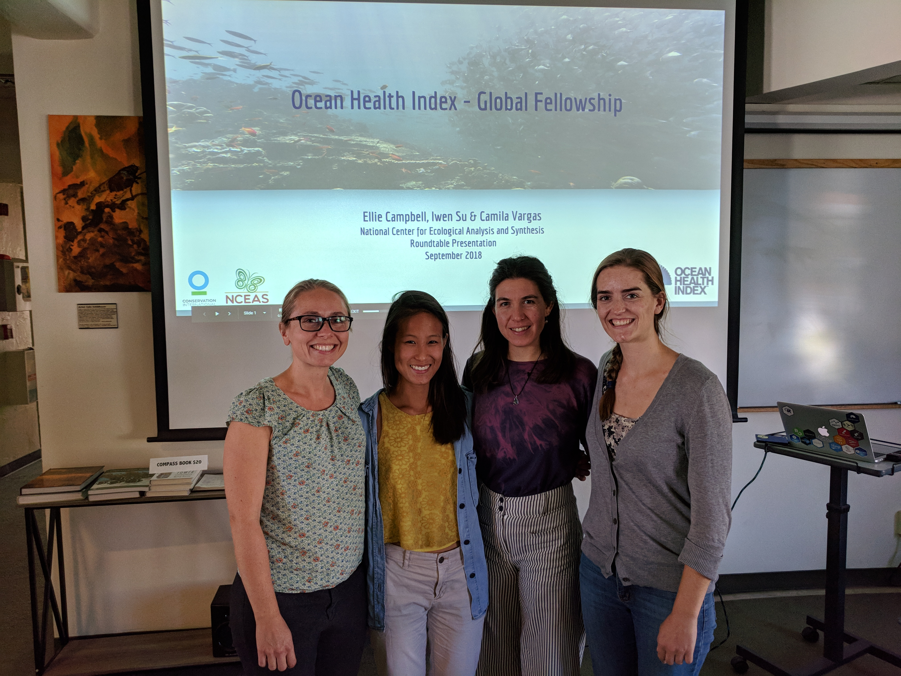

*This post is part of the NCEAS Portrait series and features the 2018 cohort of OHI Global Fellows.*

From detailing their methods in papers to publishing code on GitHub, scientists are always aiming to make their studies reproducible, that scientific tenet of having data and methods that other scientists can understand and reuse. NCEAS’ Ocean Health Index (OHI) initiative takes reproducibility to a new level by repeating a global assessment of ocean health annually and sharing all of the data and code that goes into it online for others to use and reference.
 
This year, OHI’s reproducibility and methodology were put to the test with the advent of its Global Fellows program, which is designed to train the next generation of ocean data scientists. The fellows’ culminating act is the preparation and calculation of the annual global assessment.
 
Since January, this year’s Global Fellows Ellie Campbell, Iwen Su, and Camila Vargas worked with the OHI research team on the seventh annual assessment. They prepared dozens of datasets, improved portions of the methodology, and even created their own website to document the process in their own words.
 
With their fellowship wrapping up, we sat down with them to ask a burning question: what was it actually like to reproduce a scientific assessment in a collaborative way?

 

 
<i>2018 OHI Global Fellows with program lead Julie Lowndes. From left to right: Julie Lowndes, Iwen Su, Camila Vargas, Ellie Campbell.</i>

 

## What does it mean to reproduce a scientific assessment collaboratively?
 
Iwen: The idea of reproducibility is to be able to improve the efficiency and speed of doing something from year to year. However, it still takes a lot of time, especially since we were learning how to conduct an OHI assessment for the first time. I got caught up in really making sure each step of the process was doing what it’s supposed to do. The methods we use can also change from year to year. We spent a lot of time making sure if we did make changes, they were grounded in good rationale.
 
Ellie: You end up collaborating a lot with people who have done the assessment before.
 
Camila: Open science tools allow this collaboration and reproducibility. I think the documentation of the process and the organization of information plays such an important role. This allows you to follow the same methods, or question your past methods and improve them, while still following the same logic that has been used in the past.
 
Iwen: When you are collaborating with a lot of people on one project, it forces you to communicate frequently about things like: is this the way we want to structure the documentation?
 
Ellie: And recording those conversations as issues in GitHub so you can refer back to them.
 
## Can you give a tangible example of something you have been working on to help illustrate this?
 
Camila: A lot of the questions about reproducibility come when the data we use is reported differently or new data becomes available. There are then three possible options: change our methods, adapt the new data to our old methods, or keep using the old data because it is more informative.
 
I have been working on the tourism and recreation portion of the OHI assessment, which includes travel warning data from the US Department of State that documents how dangerous it is to travel to each country. Previously, the data were a ranked list of countries deemed dangerous. This year they changed the data, and now they report every country on a scale of 1 to 4. Since we get these data yearly, it made sense to adapt our methods to accommodate this new way of reporting.
 
Iwen: I helped alter the data going into our mariculture calculations, which is composed of farmed species people consume for food. But when looking through the methods, I saw we excluded seaweed species under the assumption most of them are used for medicinal or cultural purposes. Yet, I had read a lot of papers on seaweed mariculture that show many countries do produce it for food.
 
In updating the mariculture data, I really appreciated how well the methods had been documented. Each year you say what’s been added and what’s changed. Without documentation of the methods, it would have taken so much longer to track down what was done last year and compare the two methods efficiently and accurately.
 
## What was valuable about working collaboratively on the assessment?      
 
Iwen: The OHI project is very interdisciplinary. It uses all sorts of data – not just ecological, but also economic, governance, and social. As a team with slightly different backgrounds, we all provide a different perspective and strengths, which helps speed things up.
 
Ellie: We can all work on things more within our expertise. Having people to help you troubleshoot is also super helpful. If you get stuck in a rut, it’s helpful to have a fresh pair of eyes.
 
Camila: I think in the broader picture, OHI has a lot going on in terms of data and methods. Working with the existing team was a good way to learn about the whole process. Collaboration made learning the methods, open source tools, and code easier and fun.
 
Ellie: It’s a lot more fun.
 
Iwen: There’s so much you can learn, and you can’t learn it all. We did a good job of sharing things we found, whether it was a neat data visualization, new R package, or article about fisheries. It enhances our training and learning.
 
Ellie: If each person spends the time to learn one thing, they can synthesize it and teach it to the group more quickly than if everyone learned it by themselves.  
What was the most important lesson you learned about scientific reproducibility or collaboration?
 
Camila: For me, it’s something Julie Lowndes, [OHI project scientist], repeats a lot: “what will my future self think?” It’s preparing your documentation and scripts today for your future self and others who will read them.
 
Iwen: We are constantly thinking about how to write data preparation documentation and scripts in a way that is helpful for us and others. It’s a constant reminder of my audience and thinking about the level of detail I need to provide for them to reproduce results. It’s interesting how there are ties to communication in the data science setting as well.
 
Ellie: Since performing the OHI assessment is not a one and done thing, it takes a lot of reflection and trying to anticipate your future self, future collaborators, and future datasets. You have to communicate all aspects in a concise way so people in the future can grasp the entirety of your process. It is also important to think about making your code flexible and adaptable so you can bring in new data sources as they evolve.
 
Iwen: One unique thing is, since it’s an open science collaborative, the potential for other teams to use the OHI methods is much greater. So you have to think about not only writing descriptions of what we are doing, but also writing the code in a way that people who are not necessarily data scientists can understand. When we write the code, we craft it as a story, where you can see what is happening without having to spend a lot of time studying the code.
 
Ellie: Which RMarkdown helps with, since you can integrate pieces of code with text, pictures, and URLs.
 
## Now that you’ve gone through this process, is reproducible science what you thought it would be?
 
Ellie: There’s more to it than I initially thought. I didn’t necessarily think reproducible science was being able to reproduce it every single year, which I think takes another level of procedure than I thought would be required.
 
Iwen: I first learned about reproducible science in high school, and to me it was making sure you communicate your methods and data enough so someone else could understand it. So I guess it’s the same as what I always thought, but the way it’s done through OHI just takes it to another level with its use of R, GitHub, and other data science tools. It makes everything so much more efficient.
 
Camila: However, following methods can require a bit more thinking and adaptation than just following a step-by-step recipe.
 
Ellie: I guess there is a slightly nuanced difference between reproducible science and reproducible data science, but they definitely share a lot of the same principles. Both involve data collection, but in data science, you’re gathering pre-existing data and synthesizing it as part of the methodology, rather than collecting new data as your starting point. The data collection is always a big variable and where you find a lot of divergences.

## Why do you think reproducible science matters to oceans and people?
 
Iwen: Worldwide, there are a lot of real management applications where it is very important to monitor how your animal or habitat of interest is doing over time.
 
Ellie: You want a consistent metric you can track across time so that you are really seeing the trend and not noise.
 
Camila: And to be able to compare and see changes, for better or worse, for a specific policy or management plan. I think being able to reproduce allows you to compare.
 
Ellie: Yes, which allows you to determine whether or not your policies or mediation actions are having the effect you want.
