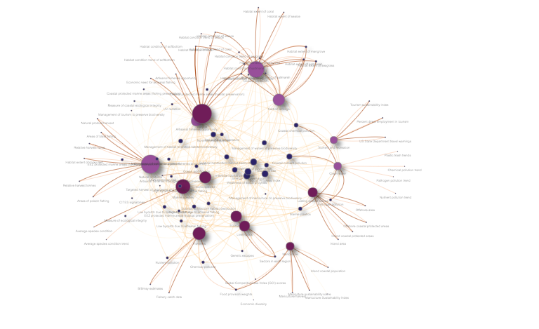
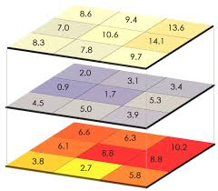
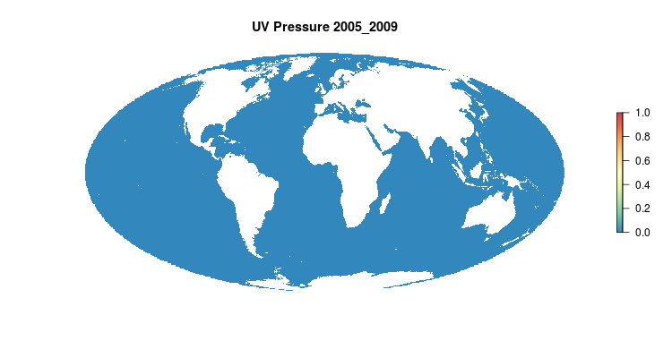
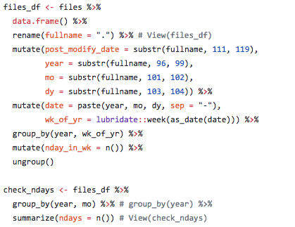
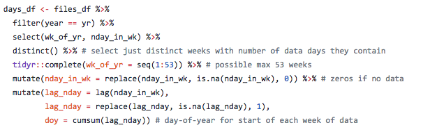
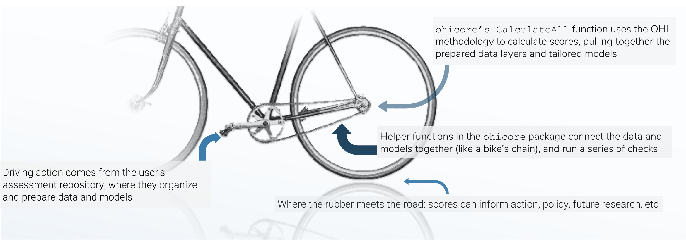
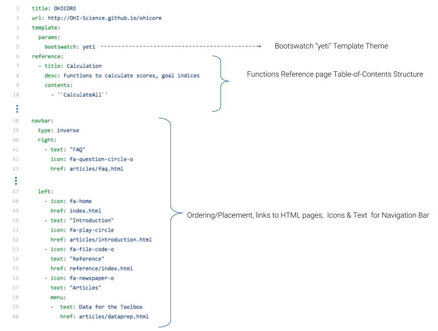
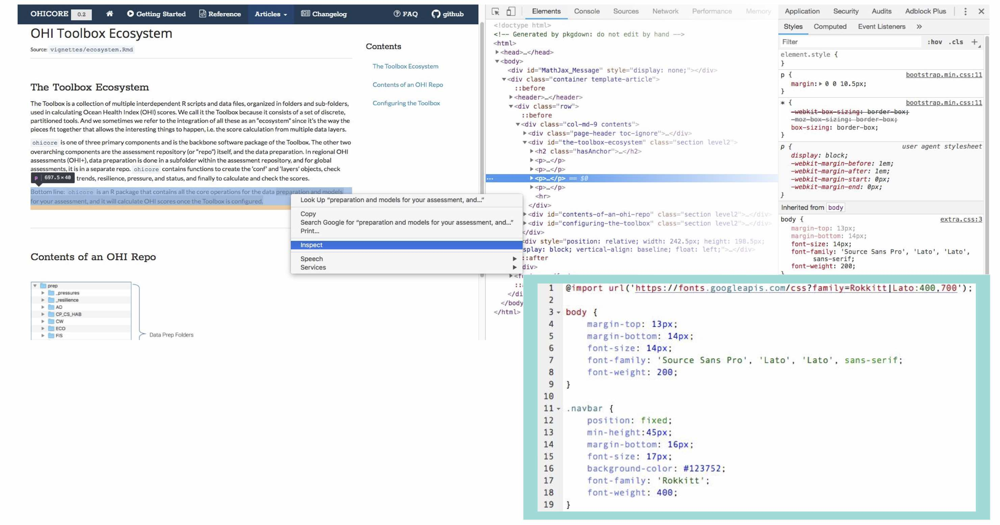

## Part 1: Under pressure 

There are twenty-two pressure data layers used in the global Ocean Health Index (OHI). Pressures are environmental or anthropogenic drivers that harm the ocean’s ability to provide benefits to people. A subset of these pressures are related to climate change. I prepared a number of these for the 2018 global assessment, including ultraviolet (UV) radiation and sea level rise. 

Many of the pressures are based on high resolution spatial data. The raw data  for the UV layer is a set of rasters -- essentially photographs, each with 32,400 pixels, and one for each day since 2004. Processing these raw data often incorporates computationally intensive temporal and spatial operations, so these processes can take a long time to run. Even though they collectively only account for one-quarter of a given goal, pressure layers can take a disproportionate amount of time to prepare. 

My contributions here were fairly subtle -- I did not overhaul any methods of calculation, but rather made small adjustments with the goal of decreasing the time that would be required to prepare the data the next go-round. 

 

 
<i>This network diagram shows the connections between the OHI goals or subgoals, and the data layers that are used to calculate the goal scores. Dark purple dots are data layers, lilac purple are goals, and the others are subgoals. Darker, bolder lines indicate calculations of status, while lighter lines indicate the calculation is of trend, pressure, or resilience dimensions.</i>

 

One of the pressure layers I worked on was UV radiation. Most people have probably heard of UV radiation in terms of wearing sunscreen and sunglasses to protect ourselves from their harmful rays. For OHI, the UV radiation pressure layer feeds into the Coastal Protection, Biodiversity, and Natural Products goals. It is an important pressure to include ecologically speaking because UV-A and UV-B wavelengths vibrate with energy high enough to damage living tissues. Most affected by harmful UV radiation are corals, algae, crustaceans, and fish larvae and eggs. The majority of  marine life affected is at the bottom of the food web, meaning effects ripple through entire marine ecosystems. UV varies spatially based on a variety of factors, which you can learn more about [here](https://earthobservatory.nasa.gov/Features/UVB/uvb_radiation3.php). 

The UV radiation data is downloaded from NASA as large spatial files, called raster files, where the globe is divided into grids and assigned values. NASA provides these data daily, which serves as a robust resource for our calculations. For our purposes, these data then need to be summarized by week through a process of overlaying data layers (see image below), calculating summary statistics at the pixel-level, and then summarizing spatially to get a final annual score per exclusive economic zone (EEZ). Since hundreds of millions of pixels are being analyzed to get this final score, I spent a lot of time making this process more efficient and reproducible. 

 

 
<i>An example of overlaying raster files, where grid cells are lined up so summary statistics can be performed across the layers.</i>

 

Two things I did for the UV data preparation were (1) code a routine written in R for downloading data from the [server using FTP](https://www.wired.com/2010/02/ftp_for_beginners/) and (2) generalize the procedure of stacking, or overlaying, daily data by week so any missing days of data are automatically gap filled, or assigned a value based on surrounding values. 

When downloading the data, first you specify the variable and spatial subset you want. This returns a list of URLs to individually click on to download the data. Since this is tedious and time consuming, I wrote a script in the same language as our other processes -- R -- that is able to download all the data in a single go. That script uses `httr::GET()` with an authenticate(username, password, type = "basic") argument to download all NetCDF files which can be read with `raster::raster()`,specifying the variable to read with the ‘varname’ argument. 

 

 
<i>GIF of the UV radiation pressure layer, from the 2018 global assessment. To quantify the impact of UV radiation on ocean-provided benefits, we take ‘Erythemal Daily Dose’ -- weighted UV irradiance (in W/m2) covering 290-400 nm spectral region at 1 degree resolution -- and calculate the number of anomalous weeks each year within each OHI region.</i>

 

One of the key steps in processing the UV data is aligning days within the weeks of the year, so January 1st 2005 matches up with January 1st, June 1st 2005 matches with June 1st, et cetera, of all the subsequent years. One problem was there were missing days of data at irregular intervals, so stacking them properly took an extra step. A full year would typically include 365 values, but if data are missing then there may be only, say, 305 values and you cannot depend on the data layers to properly align themselves with the correct day and week. The file naming convention of the raw data files is by date not by week of the year, but using the awesome R `lubridate` package we can extract the date and calculate week of the year (or day of the year) and also check how many or which dates are missing. 

Here is some sample code ([see full code on github](https://github.com/OHI-Science/ohiprep_v2018/blob/master/globalprep/prs_uv/v2018/uv_dataprep.Rmd) showing how date information was extracted from file names and used to create a dataframe for check for missing dates and aligning data for summarizing UV radiation impact. 

 

<left> 
</left>

 

This is the type of thing I did in calculating pressure layers for the 2018 OHI global assessment. 

> Through this process, one of the biggest things I learned is reproducible science means not only that someone else could reproduce our work, but that we can reuse our own methods as the temporal datasets underlying the global OHI scores are incrementally expanded. 

With a living index, we need to accommodate agencies updating previous years of data, and be able to fluidly correct mistakes and deal with things like data sets being retired and needing to replace them. The OHI, like the ocean, is far from static. Our code needs to be flexible in a way to accommodate this, as much as is reasonable and realistic. There are some changes you cannot predict, but others you can be prepared for. And there’s certainly an art to parsing which are worth accommodating. 

## Part 2: Demystifying ohicore

[`pkgdown`](https://pkgdown.r-lib.org/articles/pkgdown.html) is a R package to facilitate easy creation of websites for R packages hosted on GitHub. You might wonder what the point of having a website for your R package is when RStudio make is so easy to query functions and look for examples via the documentation you write into your packages. The advantage of a `pkgdown` website over these other mechanisms is people don’t have to either install the package from GitHub to search documentation, or dig through the raw code on GitHub. Rather, it is nicely presented, formatted, and accompanied with ‘vignette’ tutorials with more step-by-step examples explained in prose and illustrations of the functions’ usage. Thus, it increases transparency and visibility of the package you’ve created, and its usefulness to a broader audience, as well as your future self.

I created such a website for the core R package that we use for the OHI, `ohicore`, for the reasons outlined above -- to nicely present the function documentation -- and bring that together with some longer-form articles to “demystify” the way `ohicore` fits into the [OHI framework](http://ohi-science.org/toolbox-training/toolbox-ecosystem.html). This website was designed as a quick refresher on `ohicore` functions for future OHI fellows, scientists conducting regional ([OHI+](http://www.oceanhealthindex.org/ohi-plus)) assessments, and OHI team members. Before proceeding to the more nitty-gritty details of my process, let me step back and explain a bit what the `ohicore` is, what it does, and why it is so important to explain mechanisms inside that black box beyond the fact that OHI operates on principles of open science.

`ohicore` was developed by the OHI team to streamline and make consistent the process of calculating OHI scores across different assessments. `ohicore` works in conjunction with the data preparation and assessment repositories. While models and data can be tailored to specific regional assessments to leverage the best available data or to accommodate different management priorities, the `ohicore` remains consistent across all OHI assessments. 

 

 
<i>There are three main mechanisms in the OHI score calculation, and I think of the three pieces like the chain-and-gears mechanism of a bicycle: the data preparation is like the rear sprockets (adjustable), the assessment repository is like the front gears+pedals (models are adjustable within certain constraints, and driving action occurs here), and the chain is like the `ohicore` (connects it all, is engaged when the pedals turn).</i>

 

`ohicore` is integral in taking the prepared data and turning it into OHI scores, and before the creation of the pkgdown site, constituted a bit of a blind-spot in the score-calculation pipeline. Much has been written about the [philosophy behind open (data) science](http://ohi-science.org/news/importance-of-open-data-science-tools), and I find that stuff fascinating, but that is another rabbit hole for another day. Suffice it to say, we had identified this as an opportunity to decrease energy and time required for folks new to the project to comprehend the calculation of OHI scores. So, back to the matter at hand: how did I create said website? 

`pkgdown` makes is quite easy for you, assuming you’ve followed best-practices. ([This article](https://www.r-bloggers.com/building-a-website-with-pkgdown-a-short-guide/) and [this one](https://enpiar.com/2017/12/18/integrating-pkgdown-with-your-personal-website/) are great guides to get started. All that’s required is a README, `roxygen` documentation that -- since you are of course following best-practices -- you have already have written into your R functions, and a few additional files including a yml file that tell `pkgdown` how to organize things. Calling pkgdown::build_site() draws on `roxygen` and `devtools` (so first confirm those packages are installed), and voila you have an off-the-shelf `pkgdown` site. It’s never as straightforward as just that though, and it took a little tinkering, documentation revision, etc. to get to the final version.

 

 
<i>What’s in a _pkgdown.yml? The yml file contains information on how to structure the site, and additionally specifies a theme and links to the source code on GitHub.</i>

 

I was not particularly happy with the free Bootswatch themes available and wanted a look more similar to some of the other OHI products, with specific fonts and colors. To customize the appearance of a `pkgdown` site, one can add an extra.css file in a special `pkgdown` folder containing things specific to just the `pkgdown` site and not the R package itself. I am not a web developer, and didn’t really know what I was doing; the way I figured out how to make the adjustments I wanted was by right clicking and using the ‘inspect’ option on the browser window opened via pkgdown::preview_site(). The inspector pops open side-panes showing HTML and CSS behind the page, and one can interactively edit the CSS and observe what happens. For changes I liked, I copied and pasted their code into the extra.css file that tells `pkgdown` what parts of the base template to overwrite.

 

 
<i>Side-panes showing HTML and CSS behind the page, with excerpt of the pkgdown extra.css file showing some CSS overwriting web design elements.</i>

 

Hopefully, this site will make the `ohicore` more accessible, since it exists outside of the R code itself, and explains the linkages in a bit more in depth. And though I know there are a lot of people here who do get a kick out of looking at code, I think it is overall a bit easier on the eyes. 

## Part 3: Epilouge

I’d like to take the opportunity here to express my enthusiasm for the OHI Global Fellowship, and my gratitude for having had this opportunity. The Fellowship was not only a chance to hone programming skills and learn new data science tools, but the way it was structured, us Fellows had the opportunity to think deeply about the underlying theory, good enough vs. best practices, and dimensions of communication required for the analysis to be embraced by policymakers and planners and be practicably applied. These were all things the open, engaging, and innovative atmosphere at NCEAS helped foster, and our wonderful mentors adeptly facilitated -- Thank you!
