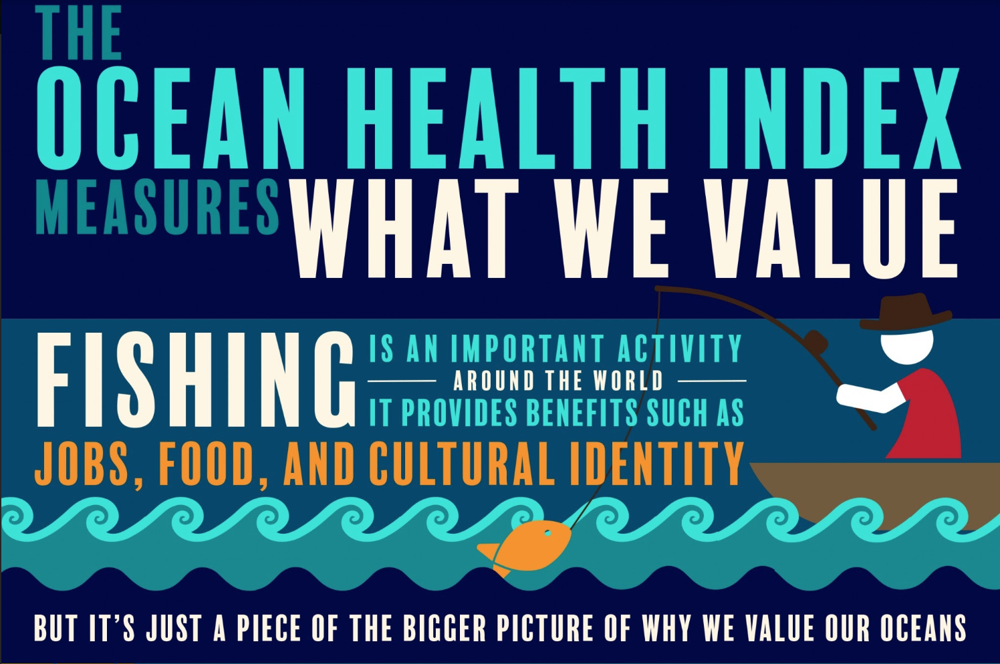
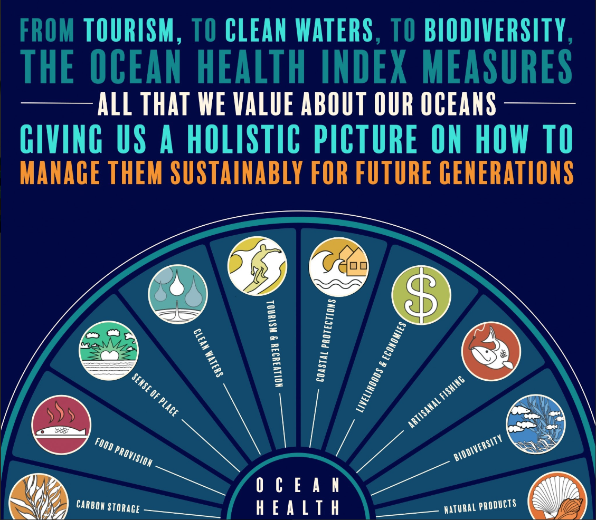

The analogies for environmental indicators are endless. They are like the blood pressure of health, the stock values of investments, the GDP of economies. Their abundance may be rivaled only by that of indicators themselves – nutrient concentrations in water, fish biomass yields, sea surface temperature, species populations… and the list of ways we measure the status of our natural assets goes on.

The Ocean Health Index (OHI) exists within this sea of indicators, but what exactly makes it stand out? It’s what I am calling its “goal-forward” approach. 

The starting point of an OHI assessment is defining a set of goals for ocean health, which means identifying the environmental, social, and economic benefits that healthy oceans provide people and that are important to the particular region being assessed. For example, the Livelihoods and Economies goal refers to how well oceans can support secure jobs and economies, and the Coastal Protection goal measures how well coastal habitats are able to protect communities from storm surge and flooding. 

“OHI starts from asking what you want to measure and then looks for the data, rather than starting from the data and seeing what it can tell you,” said Ben Halpern, lead scientist of the OHI and executive director of the National Center for Ecological Analysis and Synthesis (NCEAS).

 

 

Indicators with consistent data and methods enable scientists and managers to track changes over time. This allows them to know whether management decisions are having the intended effect and, similarly, helps the public understand whether individual or collective actions are connected to meaningful change. 

“The challenge is finding indicators that meaningfully give you that information,” said Halpern.

Because data collection can be one of the hardest parts of conducting any environmental assessment – it is time and cost intensive – scientists and managers often rely on existing and available data as their starting point. However, a problem with starting with what can we measure, rather than what we need to measure, is those data may not be able to tell you what you need to know or may give you an incomplete picture. 

For example, when Halpern and his collaborators first developed the OHI framework, they realized they needed to include a goal that many people thought was important but was often left out of environmental assessments, due in part to the lack of a clear way to measure it. That goal was a Sense of Place, which refers to the preservation of a coastal community’s cultural identity and is fundamental to people’s emotional connections to oceans. 

With its goal-forward approach, OHI positions scientists and managers to better determine the right data for understanding the current status of ocean benefits. For example, the number of marine-related jobs can inform the Livelihoods and Economies goal, or the extent and condition of mangroves can help indicate how well oceans are measuring up in Coastal Protection.

Moreover, the approach uniquely forces scientists and managers to define the target status they want to strive for – many indicators offer merely the latest trend without defining a desired state. Target setting makes clearer whether management actions are enabling progress toward a sustainable use of ocean benefits, what would be a perfect score, thus enhancing OHI’s usefulness to real-world decision-making. 

 

 

By being goal-forward, the OHI framework has other big advantages. Its human-centered focus helps scientists and managers connect indicators to what people actually care about for oceans, and the goal-setting process provides a valuable opportunity for a variety of ocean stakeholders to sit at the same table, a critical step to facilitating both consensus and the uptake of OHI into decision-making.

“We all have very personal, multifaceted connections to ocean systems, and the framework starts with those connections in a fundamental way. This makes it much easier for people to engage in the work,” said Heather Leslie, director of the Darling Marine Center at the University of Maine and one of the many collaborators who helped develop the OHI framework with Halpern at the beginning of the decade. 

For example, OHI scientists are currently working with stakeholders in the US Northeast to tailor the framework for the region as a way to help local managers define and structure indicators for meeting their own goals for healthy oceans as outlined in the Northeast Regional Ocean Plan, which they developed separately.  

“Once you have settled on consensus-based goals, the process of establishing indicators becomes somewhat easier,” said Mel Coté, who heads the Surface Water Branch of the regional office for the US Environmental Protection Agency and has been deeply involved in the Northeast’s ocean planning process. 

While getting consensus on goals and targets can be time and labor intensive on the front end, the process of pulling back to see the big picture and homing in on what people value can lead to not only more meaningful indicators but also greater efficiency, in terms of prioritizing effort and resources, in the long run. 

Of course, this doesn’t mean the ideal set of data to inform goal-forward indicators will magically appear. In fact, the approach often reveals data deficiencies or outright gaps. For example, commonly discovered deficiencies include data that don’t go far enough back in time or aren’t available for the entire region being assessed. 

But those exposed data gaps are actually gains in understanding about what information is necessary to answer the questions we care about more completely. So, while deficient data is a challenge faced by many an indicator, another advantage of OHI’s goal-forward approach is its ability to make data needs more transparent. 

“If you start with individual datasets, you are often unable to figure out where those gaps are, because you aren’t thinking about it in the same way,” explained Halpern.

And that doesn’t mean deficient data become useless. Rather, the goal-forward framework can help managers better figure out what they can do with the data they have to get as real a scenario as possible. Developing that almost-real scenario often involves combining different data streams or making proxy measurements that will provide a picture that is close enough to the ideal vision.

For example, when it came to figuring out how to quantify the seemingly unquantifiable Sense of Place goal, OHI’s developers ultimately tied together data that served as proxies for how people connect to oceans – via the local populations of iconic species and the sustainable management of special places, such as marine reserves, within the region. 

“Even though this way is imperfect, it ensures something fundamentally important is captured and quantified against all the other goals,” said Halpern. 

And by keeping goals front and center, Leslie says the OHI framework provides scientists and managers with an easier way to not only quantify our connections to the ocean, but also meet people where they are – their institutional contexts, worldviews, and all.

“You can see the importance of different perspectives and the critical value that data across the different goals have in terms of enabling us to manage our oceans in thoughtful and proactive way,” she said.

 

**Related Posts**

- [The OHI Toolbox is useful far beyond ocean management](http://ohi-science.org/news/what-is-the-ohi-toolbox) 
- [How to build a successful OHI technical team](http://ohi-science.org/news/how-to-build-successful-technical-team) 
- [Examples of OHI and management](http://ohi-science.org/news/ohi-and-management)
