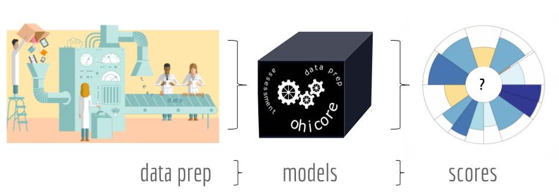
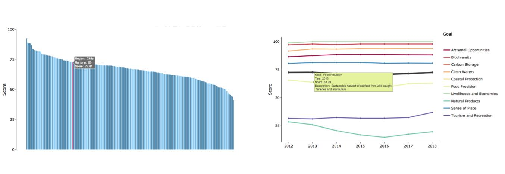
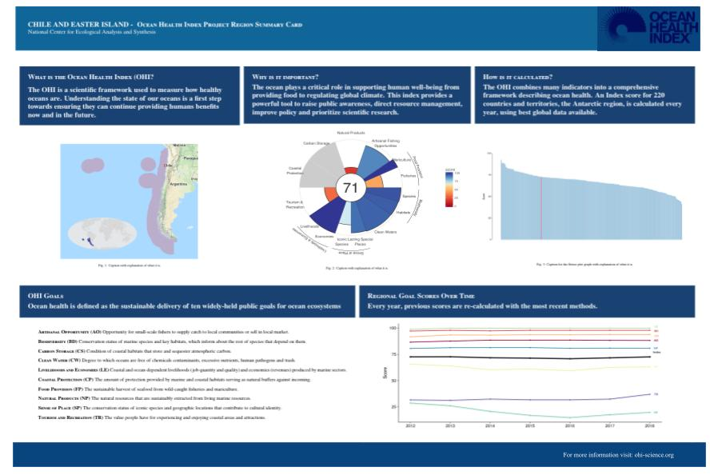

The Ocean Health index (OHI) is a framework that uses data science principles to measure how sustainably we are using ocean resources. This definition highlights two main points: data science principles and ocean resource management. As an OHI Global Fellow, we were trained on the data science tools and workflows OHI uses to conduct the annual global assessment. 

The OHI workflow is centered around three main data science principles: reproducibility, transparency, and comparability. OHI aims to be reproducible, or easily repeated year after year, and by other teams. Transparency allows anyone to see where our data come from, know what assumptions we made, and view our code. And finally comparability. An index needs to be comparable through time in order to track changes. 

So here we are, as the first cohort of OHI global fellows, testing the reproducibility, contributing to transparency, and learning how OHI ensures comparability. 

## Methods and Data: When should they be updated?

To see trends through time, you need to be as consistent in your methods as possible so the changes you see are due to real changes in the data and not just a change in methods. But since the foundation of OHI is the best available data, methods naturally need to change and adapt to emerging datasets.  

Throughout the fellowship I got to contribute updating the methods and using new data sources. With this, I experienced three different cases of updates: (1) adapt new data to our old methods, (2) change our methods, and (3) keep the old data and methods because they are more informative. 

#### 1. Adapting new data to our old methods

The OHI [Clean Waters goal](http://ohi-science.org/goals/#clean-waters) measures the degree to which oceans are free of contaminants such as chemicals, excessive nutrients, human pathogens, and trash. To assess human pathogens, OHI uses the percentage of coastal population without access to sanitation, with the assumption that less access to sanitation leads to more human pathogens. 

The data used in this case comes from the World Health Organization [(WHO-UNICEF, 2017)](https://washdata.org/data). They provide the percentage of the population in each country with access to sanitation facilities. To obtain the proportion of the population without access, we subtract 1-(proportion with access to sanitation) and then scale this number to what we define as coastal population: population density (people/km²) within 25 miles of the coast in each region.

In 2015, the WHO-UNICEF added more detail to the dataset by assigning categories to the type of sanitation accessible in each country. In the [2015 report](http://files.unicef.org/publications/files/Progress_on_Sanitation_and_Drinking_Water_2015_Update_.pdf), they define four sanitation categories: open defecation, unimproved sanitation facilities, shared sanitation facilities, and improved sanitation facilities. OHI was interested in improved sanitation facilities, which are defined as the percentage of the population in a country with at least adequate access to disposal facilities that can effectively prevent human, animal, and insect contact with excreta.

In 2017, these categories were updated to: open to defecation, unimproved, limited, basic, and safely managed. After checking the data of the latest report and comparing with the data used in the past, we identified that the category “basic” matches with what we have used previous years. But now there is a more detailed category of safely managed that could improve our measurement of pathogens along the coast. 

So, which data should we use? The one under the basic category because is consistent with what we have used before? Or the safely managed because it is a better proxy for measuring pathogens?

We discussed this as a team and decided to use the basic category for the 2018 assessment. It was what we had used in the past and there was data for more countries, making it more complete. However, we made a note in the documentation: “in the future, the data source will probably make the "safely managed" data more complete, and at that time, we might reconsider whether these data would be better to use.”

For me, this reflects how the OHI team works together. Every year, we question what the best science available is and what information is the most relevant for the current assessment. In this case, the initial question was how to handle new reporting methods. We decided to adapt the new data to our old methods, but in the future, the team will evaluate if the methods should be updated as well. 

#### 2. Changing our methods

The OHI [Tourism and Recreation goal](http://ohi-science.org/goals/#tourism-and-recreation) measures the value people receive experiencing and enjoying coastal areas and attractions. One of the components of this goal is assessing travel warning data from the U.S. Department of State that documents how dangerous it is to travel to each country. 

Previously, the data was a ranked list of countries that were dangerous. This year, the State Department changed the data, and now they report every country on a scale of 1 to 4. So now the scaling for how they ranked them is different and we have data for all countries instead of a few. 

Since OHI relies on this data yearly, we needed to find a way to adapt our methods to this new way of reporting. But how do we update the methods with this new information while still being as consistent as possible with what has been done in the past?

I reflected on this question, trying to provide possible answers. We tried different ways for calculating penalties based on the urgency of the warnings according to the new data. Previously, if the travel advisory warning was confined to a subregion within the country, we would modify the penalty to be less severe. However, this proved problematic with the new data. We decided to only use the countries overall score and no regional warnings. This assumes that the warning for a country takes the subregional information into account. This explanation was detailed in our data preparation script and 2018 methods. 

#### 3. Keeping the old, more informative data

When conducting the 2017 assessment, the team discussed possible updates for the blast fishing data, which is used to calculate fishing pressures. Last year, they made a note about it to be considered for the 2018 assessment. So this year we tried. We explored the new and up-to-date data and determined the correct methods for analyzing these data. 

But, when we looked at the results, we realized that the new data was less complete than the historically used data. The new data reported blast fishing for just a few countries, while the old data has a better representation of destructive fishing in all coral reefs regions around the world. So, we decided to keep the old data with the greater spatial extent. 

This shows how the team is constantly searching for the best available science and the most recent information to use for OHI’s annual assessment. Even if we don’t end up using the new data, we were still able to explore new options and decide which source is most representative of the goal we are measuring. 

These examples show in part the dynamism of the OHI global assessment. It is always evolving to improve and reflect the best science available. This is where data science principles play an important role. Every year the methods used for that year assessment are published and available online, increasing transparency. To ensure comparability, each year all past assessments are recalculated using the current assessment year methods. To be able to recalculate past year scores in a feasible time, methods must be easily reproduced.  

## Independent Project: Regional Summaries

In our last week working at NCEAS, we presented to the NCEAS community what we accomplished over the 9 month of fellowship. When putting up together the presentation we came up with the following diagram to represent the OHI workflow.

 

 
<i>Ocean Health Index workflow. Created by: Ellie Campbell, Iwen Su, and Camila Vargas.</i>

 

We soon realized that for our independent projects, each of us contributed to one of these steps. Iwen worked developed a [Global Dashboard](https://iwensu.shinyapps.io/global-dashboard/): a platform to explore the raw data that goes into the OHI (read more about Iwen’s project [here](http://ohi-science.org/news/fellowship-expanding-mariculture)). Ellie created a whole [pkgdown website for `ohicore`](http://ohi-science.org/ohicore/) with the aim of making the `ohicore` R package more transparent and user friendly (read more about Ellies project [here](http://ohi-science.org/news/fellowship-demystifying-pressures-ohicore)).

My independent project focused on improving the communication of OHI Global scores for the 220 coastal nations and territories we assess each year. The scores by region and goal are currently displayed [here](http://ohi-science.org/ohi-global/scores) in a flowerplot and table format. This website presents valuable information, but it is hard to visualize trend over time when data is presented in a table. 

My work was to think about and explore ways of improving our visualization of results. Through conversations with the team, I learned that countries like seeing how their country’s score compares to all other countries assessed and also how their scores are changing through time. To meet the needs of our users, I created interactive plots using [`plotly`](https://plot.ly/r/#basic-charts) to display a country’s rank and show scores through time for each region. 

`Plotly` is a visualization tool that can be used through RStudio. I chose to use this tool because it allows you to create interactive plots. Making results interactive has two major benefits. On the one hand it allows you to provide more information without cluttering the screen. With this feature you have the option to hover over the data points and see detailed information that not necessarily is displayed at the first glance. In my opinion, interactive plots make the data visualization clear and neat. I also think it engages users with what they are looking at and provides accurate information in a way that is more fun for them.

 

 
<i>This figure shows an example of the interactive plots created for one region (in this case Chile). On the left there is bar graph that highlights Chile’s ranking among the 220 OHI regions. In this plot you can hover over the bars and see the each region name, the overall regional score and their ranking. On the right you can see the example of scores through time for Chile for each goal. You can hover on each of the point and see the a short description of the goal you are looking at, the year and the score for that goal. Created by: Camila Vargas.</i>

 

I also designed Region Summary Cards, which like the name suggests, show the main results of each region on one page. I like to describe them as “key results in a nutshell.” Each card contains lots of different components, each with their own coding challenge. 

One of the challenges included mapping the exclusive economic zone (EEZ) of each region with a subset map indicating where it is located on the globe. This step allowed me to explore and play with spatial data, which proved to be both exciting and frustrating, especially when the maps were not plotting correctly. But in the end, there was the exciting feeling all over again when the maps you wanted are finally plotted the way you want them to be. And the process was a great opportunity to practice and work with maps and spatial data. 

At this point, we had all the plots and figures we wanted to present in the summary cards. But, how do we make the cards? Old me (or me before incorporating data science principles) thought that creating the regional cards should be done through a design software, or even in powerpoint. After all it’s like creating a slide! BUT… scores are calculated every year for 220 regions. This means this card have to be updated every year 220 times. Can you see where I’m going with this?

Incorporating the principle of reproducibility means writing the code of a project so that can be used over and over again. This makes it possible to even create a summary card for each region in the first place in a reasonable amount of time. 

We decided to use [LaTeX](https://www.latex-project.org/about/), a document preparation system that uses markup language, a computer language where elements and structure within a document are defined through tags. We decided to use this tool because it can used through RStudio and if coded properly, would allow us to reproduce the cards for each country with no major changes. And we want our work to be reproducible!

I had no previous knowledge using LaTeX. It was challenging to even understand what LaTeX is and how it works, so credits to Ellie for writing the initial code. Once the basic structure was there, I started playing around to figure out how include all the information and plots we wanted. A great resource for exploring LaTeX was using [OverLeaf](https://www.overleaf.com/), which is a LaTeX processor that allows you to see in real time how your document is going to be rendered.

Here is the preliminary design of the cards including the map showing the regions EEZ, flowerplot with the global assessment scores of the region, the ranking plot, and the plot with the scores of each goal though time. I also included some general information about the OHI and the definition of each goal. 

 

 
<i> Created by: Camila Vargas.</i>

 

This independant project was a great example of thinking about reproducibility. It was also an opportunity for me to practice and gain confidence with tools that I already was familiar with, such as R’s main plotting function `ggplot`. But it also allowed me to familiarize with so many others tools (such as LaTex) and packages (such as `ggmap`, `sf`, `plotly`, `cowplot`, etc.). Overall an amazing way to explore, play, and learn by doing. 

## The end of a chapter

Throughout this fellowship Ellie, Iwen, and I have been trained in data science best practices through calculating the 2018 OHI Global Assessment. With this, we have tested the reproducibility of OHI assessments and contributed to transparency of our data and results by improving documentation. But it was not just about data science. I learned the theory behind the index and the meaning of perseverance; teamwork and collaboration; passion for what you do; trying stuff until it works. 

Nine months went by quickly. If I go back to January, I would have never thought I would reach this far on all that I have learned and how confident I feel in the coding space. It is the end of a chapter that provided me with so many tools and experiences that I will carry with me into the future. 

I need to end this blog by thanking Iwen and Ellie for being the most amazing and supportive teammates. Julie and Mel for their great mentorship. And the OHI team for being an incredible example of teamwork and collaboration and passion for what you do.
