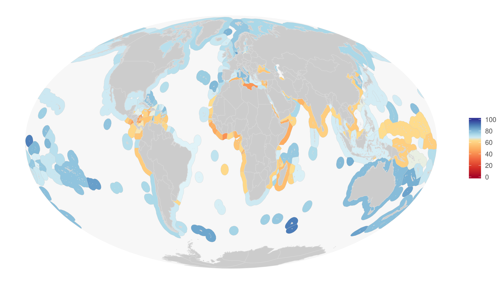
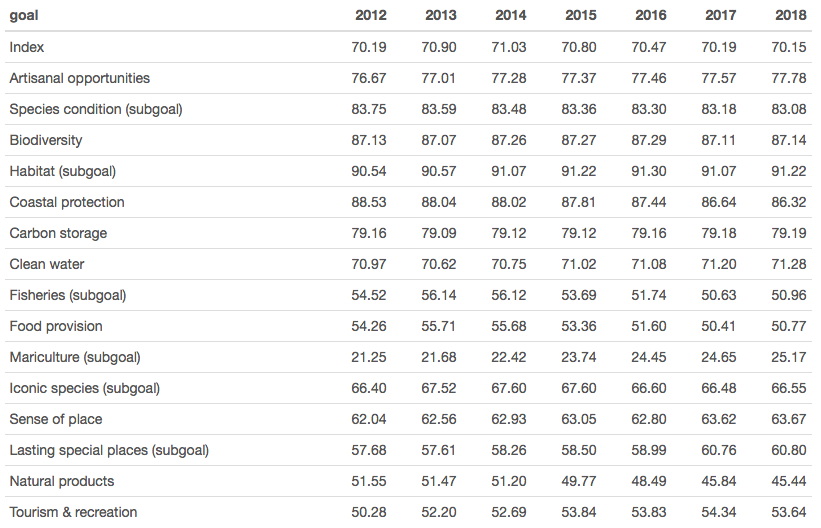

## Overview

Ocean Health Index scores provide invaluable, comprehensive, and quantitative assessments of progress towards healthy and sustainable oceans. 2018 marks the seventh year of annual global OHI assessments, with scores representing [ocean health for 220 coastal nations and territories](http://ohi-science.org/ohi-global/scores.html).

**The average 2018 Index score was 70 out of 100**. This score is unchanged from 2016-2017, but a one point decrease from 2012-2015. Average Index scores have not dramatically changed over seven years, which could be expected at a global scale. However, some individual goals and regions have had significant changes.

This year our global assessment was conducted by the inaugural cohort of [OHI Fellows](http://ohi-science.org/ohi-global/fellows.html). Through the Fellows program, the OHI team trained graduate students from the Bren School of Environmental Science & Management in OHI methods and open data science tools, enabling the team to test the ease of use of their workflow and training materials. Over the summer, the Fellows then led this year’s global assessment, successfully calculating global OHI scores for 2018 while learning important skills that are valuable to the OHI community and beyond.

For detailed description of our up-to-date data and methods, see the [Supplemental Information](https://raw.githack.com/OHI-Science/ohi-global/published/global_supplement/Supplement.html).

 

 
<i>Global map of 2018 OHI scores.</i>

 

## Summary of key findings

### Score Summary

Overall Index: 70 
Artisanal Opportunities: 78
Biodiversity: 87
	Habitat: 91
	Species: 83
Carbon Storage: 79
Clean Waters: 71
Coastal Protection: 86
Food Provision: 51
	Fisheries: 51
	Mariculture: 25
Livelihoods and Economies: 82
	Livelihoods: 77
	Economies: 88
Natural Products: 45
Sense of Place: 64
	Lasting Special Places: 61
	Iconic Species: 67
Tourism and Recreation: 54

Amongst the highest scoring in 2018, at 80 or above, were island nations, such as Aruba in the Caribbean and New Caledonia in the south Pacific, or uninhabited islands. Germany was the only one of these 17 high scorers with a population exceeding one million people. On the other end of the spectrum, 10 regions scored 50 or below, including seven African, one Central American, and two Middle Eastern nations. 

### Goal Trends

Trend values are slope estimates from a linear model of scores for each region/goal over the past 7 years. 111 regions are experiencing decreasing trends and 109 experiencing increasing trends. Number with increasing trends has risen by 27 since last year. Here are global scores over time:

 

 

 

### Data and Method Updates

#### Data Updates
- 8 of the 10 goals with additional years of data. The Carbon Storage and Livelihoods and Economies goals were not updated because these data sources are not updated and new data sources are unavailable  
- 14 of the 20 pressures updated with additional years of data
- 5 of the 14 resilience measures updated with additional years of data

#### Notable Method Updates
- Species condition: Now include only comprehensively assessed species (>90% of species assessed) because there is less regional bias in regard to the number of species with IUCN ratings; we have dramatically improved trend estimates using the change in IUCN status over time, which also allows us to estimate status for previous scenario years (previously, we used the same data for all scenario years); we now incorporate regional assessments for species. 
- Mariculture: Now include edible seaweeds in the mariculture model (previously, these were included in the Natural Products goal); Multiplied seaweed weights by 0.2 to adjust for their lower food quality relative to fish/shellfish; regions with human populations, but no mariculture now receive a zero score, rather than an NA.
- Fisheries: Given the recommendations in Afflerbach et al. (2018) we use the mean of stock status scores from the same region/year, rather than the median.
- Coastal protection: Excluded sea ice data for countries where ice floated in from other regions because this probably does not actually provide coastal protection. (Finland, Sweden, Estonia, Latvia, Lithuania, UK, Denmark, Germany, Iceland)
- Tourism and Recreation: Updated penalties for US Dept travel warnings. We no longer penalize level 2 warnings because the penalty seemed too large given the locations. Small adjustments to reference point.
