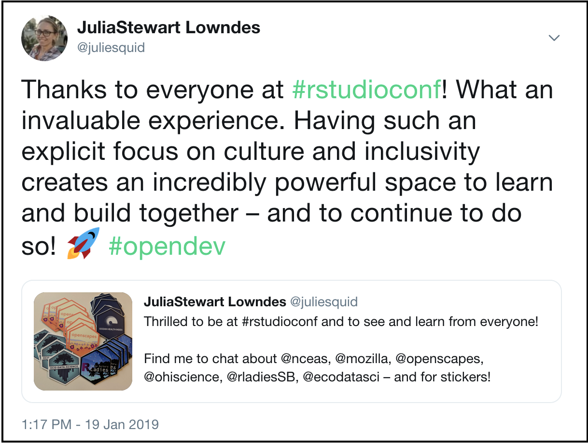
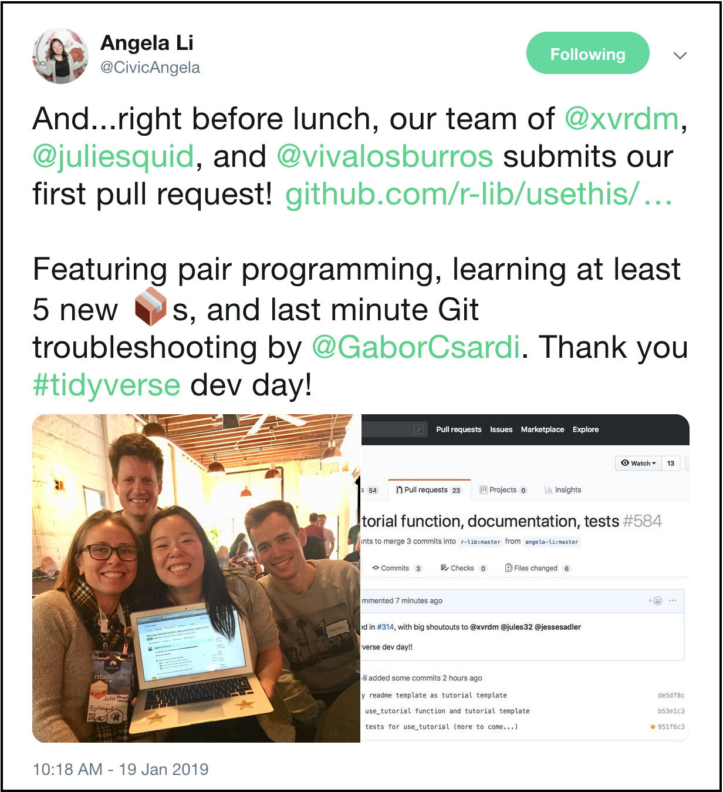
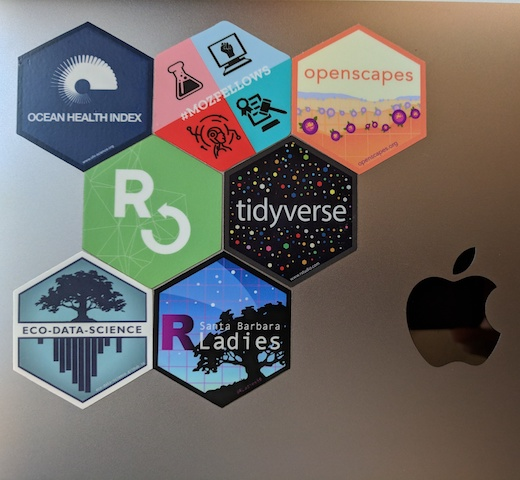

*I attended [RStudio::conf](https://www.rstudio.com/conference/) this year and there is so much to report from a conference that gathers 1700 attendees from industry and academia and disciplines of all kinds. The conference centered around innovations, motivations, and communities around the R programming language and there are [many excellent summary blogs](https://github.com/kbroman/RStudioConf2019Slides#followup-blog-posts). Here I will focus on how the conference felt, and how to think about replicating this feeling at conferences, workshops, meetings, and lab groups.*

  

 

**RStudio::conf 2019 was the best conference I’ve ever been to**. I learned about new R packages, motivations behind them and lessons from using them as individuals and teams. But I think the real reason it was the best conference was the positive tone and culture that helped me connect with many thoughtful people. And this positive tone was set deliberately from the beginning. 

## Opening remarks

[Hadley Wickham](https://twitter.com/hadleywickham/)’s opening remarks included the Code of Conduct and how to identify the numerous RStudio staff that are there to help if any problems occur. Codes of Conduct are meant to deliberately help people be included and empowered within communities, recognizing that safety and accessibility are critical parts of inclusion and empowerment. Hadley is Chief Scientist at RStudio, and by stating the Code of Conduct up front he put the RStudio community’s values clearly forward, and it had additional weight because it came from the RStudio leadership. 

Just afterwards, Hadley introduced the idea of the “Pac-Man rule” for informal conversations – this brings the Code of Conduct to the physical space by creating in-person interactions that are welcoming and inclusive. The idea is that when chatting, instead of standing in a closed circle with the person or people you are talking with, [leave space for another person to join](https://www.ericholscher.com/blog/2017/aug/2/pacman-rule-conferences/). It really worked at the conference: as I walked through the halls during coffee breaks I could approach anyone or group and have a positive, meaningful conversation. I do not think I have ever felt that at a conference before. Additionally, I was in numerous conversations where people joined the conversation saying “can I Pac-Man?” and they did and were no longer strangers since we shared this culture. 

  

## Reducing friction

[Jenny Bryan](https://twitter.com/jennybryan/) talks about “reducing friction” for analytical workflows as the motivation behind creating R packages from like `reprex`, `usethis` and `googlesheets`. And I would say that RStudio::conf was about reducing friction for people to feel included and confident to participate. With the Code of Conduct and Pac-Man, it was in person by asking a question or joining a conversation. Additionally, there were [Birds of a Feather events](https://community.rstudio.com/t/birds-of-a-feather-bof-at-rstudio-conf-2019l/19328) throughout the week to bring together smaller communities, like R users in finance, academic research, education, edtech, and data for good. There were also buttons to wear and stickers for laptops and water bottles to have visible demonstrations of communities and tools. And, there was a large showing from and a meetup of the [RLadies](https://rladies.org/) global community that promotes gender diversity in the R community. 

There is a positive online [#rstats](https://twitter.com/search?f=tweets&q=%23rstats&src=typd) community preceding the event and during the conference there were also ways to translate this welcoming feeling back online to include the #rstats community that could not attend, connect with each other across concurrent sessions, and strengthen relationships that could be continued after the conference was over. This was done through the [#rstudioconf](https://twitter.com/search?f=tweets&q=%23rstudioconf&src=typd) hashtag, presenters including Twitter handles, attendees live tweeting and retweeting each other, and by [Karl Broman](https://twitter.com/kwbroman) creating a [list of all presentation slides](https://github.com/kbroman/RStudioConf2019Slides). Further, the [Tidyverse Developer Day](https://github.com/tidyverse/dev-day-2019#tidyverse-developer-day-2019) on Saturday welcomed and helped people contribute to package development – and for many of us it was the first time making substantial contributions to open source projects. It was really empowering. 

  

 

## Enabling positive culture 

When I describe RStudio::conf I find myself using words like “welcoming”, “intentional”, “design”, “positive”, and “[Allison Horst’s art](https://twitter.com/search?q=%40allison_horst%20%23rstudioconf&src=typd)” alongside the awesome R tools that were presented (summarized in other blogs – see Karl's full [list of blog posts](https://github.com/kbroman/RStudioConf2019Slides#followup-blog-posts)). The whole conference reminded me of [Stef Butland](https://twitter.com/StefanieButland)’s rOpenSci post on the [value of welcome](https://ropensci.org/blog/2017/07/18/value-of-welcome/). All of this creates a culture where sharing ideas and being open for feedback is safe, and it fosters innovation and kindness. 

We have created a positive culture as a small lab team at the [Ocean Health Index](http://ohi-science.org) (OHI), and we welcome our [OHI fellows](http://ohi-science.org/ohi-global/fellows.html) to work this way with us as well. With [Openscapes](https://openscapes.org), I lead each Champions call modeled after the [Mozilla Open Leaders](https://foundation.mozilla.org/en/opportunity/mozilla-open-leaders/) program, which begins with a deliberate statement of our [Community Participation Guidelines](https://www.mozilla.org/en-US/about/governance/policies/participation/) (similar to a Code of Conduct). Just this past week, [we discussed lab culture](https://openscapes.github.io/series/index.html#agendas), and why it is important to build trust and be intentional instead of hoping for positive culture to be organic (something I learned in [Angela Bassa’s RStudio::conf talk](https://resources.rstudio.com/rstudio-conf-2019/data-science-as-a-team-sport)).

So looking forward, how can we replicate this RStudio::conf tone and culture at other events? Codes of Conduct and Pac-Man rules can do lot at conferences, especially when they come from leadership. They are also effective in courses, labs, departments, and events on campus. But we can also be leaders and start asking for and modeling the behavior we want to see within academia so it becomes more of the norm. I am definitely motivated to do my part.

 
  
Community stickers
