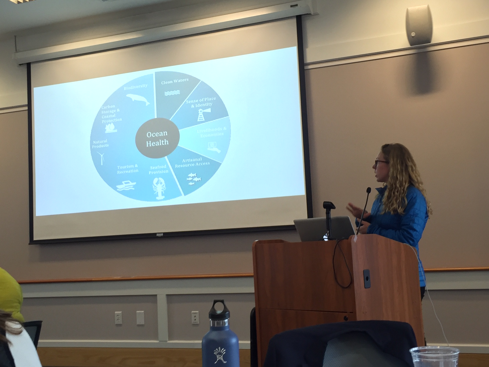
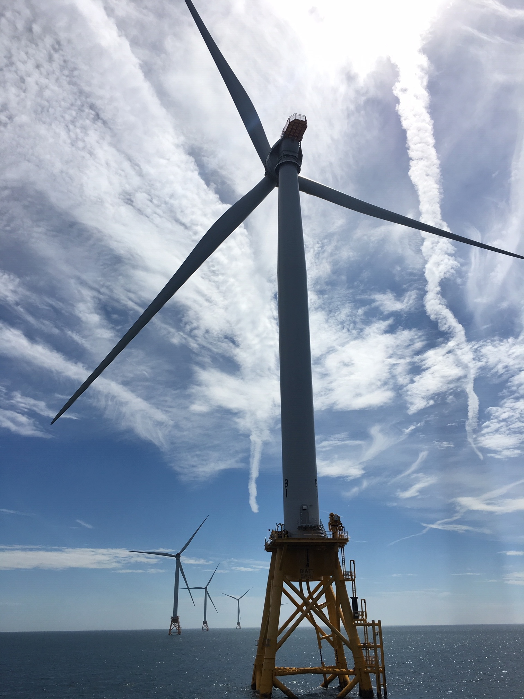

*A case study about transparency in the Ocean Health Index*

In a world of increasingly complex decision making, transparency has become paramount. This is no exception in science and, specifically, in science-based management of natural resources.

Transparency is at the core of the Ocean Health Index (OHI). As a scientific evaluation of ocean health designed to inform management decisions that affect not just oceans but also people, it comes with the responsibility of transparency. 

This is why we practice open science. And with each OHI assessment, we are learning more ways we can expand our efforts to uphold our responsibility, work openly, and build trust with our partners and the communities we aim to serve.  

Our team’s experience conducting a regional assessment for the United States Northeast is a case in point. 

The US Northeast assessment includes the New England coastline and offshore waters. This region was an exciting place to conduct an OHI assessment, for it is rich not just with ocean data, but also with people who are actively engaged in the ocean planning process.

Tangible evidence of our pursuit of transparency in this assessment is the OHI Northeast Dashboard, an interactive website that allows users to dig into the assessment’s results and access its data and code for free. With the dashboard, we tried to turn what could have been a “black box” into a valuable resource for ocean managers, researchers, and the public. 

But the Dashboard is just one output of an entire process of transparency and openness, a process that was as much about people as it was about data.

    

 

## Local People, Open Process 

In regional OHI assessments, which are intended to be useful for place-based decision making, listening to and accounting for local people and local values are critical to our open process.

One boon for the Northeast assessment was that the right people were already assembled in the room, so to speak. When the assessment began, ocean professionals from state and federal government agencies, tribes, industry, and NGOs had already been working on the [Northeast Ocean Plan](https://neoceanplanning.org/plan/), which lays out regional goals for developing data and best practices for ocean planning.  

The Ocean Plan also provided a gateway to key stakeholder groups – including marine and ocean industries, researchers, and conservation organizations – enabling the OHI team to extend its reach to include more people. And since the plan already articulated what people in the region felt was important for ocean health, it gave OHI a solid foundation from which to build a regional assessment.

The Northeast Ocean Plan also created a clear pathway to identifying what we call “goals” in the Ocean Health Index, which are the quantifiable benefits people receive from the ocean, such as biodiversity and coastal economies. These are the values we measure in the assessment, and for the results to be relevant, it is necessary that the goals reflect local people’s priorities. For example, among the priorities identified in the Northeast Ocean Plan were aquaculture and commercial and recreational fishing, which the OHI assessment translated into the food provision goal. 

Importantly, we brought the people involved in the Northeast Ocean Plan along with us for the whole ride – from start to finish. Through a series of remote, web-based focus groups and in-person meetings with local experts, we practiced open communication, engaging the group to get their input on how we built the assessment’s framework, where we could find the right data, and who else might we involve to ensure success. 

Through this listening process, we learned about the challenges and opportunities ocean health is facing in the region, which helped us construct a more effective assessment. This open process was especially important for us, as we did our work 3000 miles away in California!

## Local Data, Open Data

Establishing relationships with ocean managers in the Northeast was critical to our data collection process. Since the OHI relies on existing data, the hunt involved finding data that would provide the “best fit” for the eight goals we sought to measure, a process that would be nearly impossible without local input and local data. 

Fortunately, the Northeast Ocean Plan process led to the development of the Northeast Ocean Data Portal, which provides an extensive collection of datasets that support the priorities in the plan, therefore making them invaluable for the Ocean Health Index, too. We ended up using datasets from the Data Portal, along with other locally relevant data that was either publicly available or acquired directly from contacts at state or regional agencies and organizations.

All of these data, much of which came from disparate places, are now aggregated and coexist on the OHI Northeast Dashboard, available for free to anyone who wants to use them in their research or management decisions. This is our way of reciprocating and amplifying data transparency. 

For us, however, openness goes beyond the data and extends to methodology. Also available through the Dashboard is our code for calculating the OHI scores, which means anyone with data science knowledge could, in the future, use that code with updated data to conduct an updated assessment to track the region’s progress toward achieving its goals for ocean health. 

(If you’re from an ocean-related agency or organization in the US Northeast and are interested in taking on a regular OHI assessment for the region, [please contact us](mailto:info@ohi-science.org)!) 

Also importantly, practicing open science built flexibility and resilience into our analysis, and our experience in the Northeast elevated the benefits of this: you can be ready to adapt to emerging issues. 

Open science techniques – such as documenting code to narrate what we’re doing and why, and employing version control to manage changes – allowed us to keep step with the planning process in the region, as it sped up or slowed down, or as newer datasets became available. 

Moreover, several industries are either currently or have the potential to be expanding their footprints offshore in the Northeast, including offshore wind energy and aquaculture. The OHI provides a ready-made framework for a future research team to incorporate new ocean uses or activities into the assessment when the data do come online.  

    

 

## The Take Home

So, what does our experience in the Northeast mean for transparency in ocean science and management more broadly? Whether you’re part of a different regional Ocean Health Index effort or a different indicator process, here’s what we think:

- Conducting an open process, by listening and learning from local people who have gone through similar processes and/or are actively engaged in the processes you want to align with, builds trust and enables more relevant and useful results.
- Practicing open science not only supports transparency, but also builds flexibility and resilience into the scientific process.

We are certainly not the first to learn and share such lessons, but we feel our work serves as further evidence of what transparency in science can achieve for the benefit of people and oceans. We hope the OHI Northeast Dashboard can be a useful tool for current and future researchers and managers in their efforts to sustain ocean benefits and communities.

