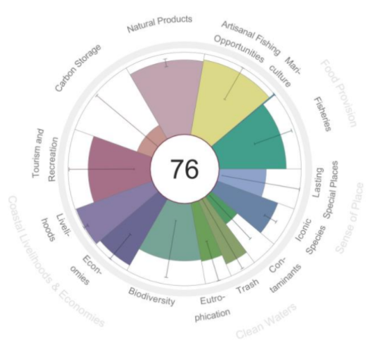

## A new open data tool for science and management

The new assessment tool, the Baltic Health Index (BHI) evaluates comprehensively the health status of the Baltic Sea and has been calculated by researchers at the Stockholm Resilience Centre, Stockholm University, in cooperation with scientists in California who have established the well-known global Ocean Health Index (OHI) framework. The Ocean Health Index provides comprehensive, and quantitative assessments of progress towards healthy and sustainable oceans.

The Index with all transparent calculations and original data is available as of today to view at https://baltic-ohi.shinyapps.io/dashboard/

“We are very excited to see this first transnational, regional application of the Ocean Health Index for the Baltic Sea. It is comprehensive in what it assesses, rigorous in its use of the best available data and scientific information, and transparent in how it was calculated, making the Baltic Health Index a greattool for informing management actions and policy decisions,” says Dr Ben Halpern, Director of the National Center for Ecological Analysis and Synthesis, based at University of California Santa Barbara, and lead scientist for the Ocean Health Index.

The group of researchers at the Stockholm Resilience Centre worked together with a large expert network around the Baltic to apply the Index to the Baltic Sea. The Index measures progress towards nine key societal ‘goals’ representing the benefits and services people expect a healthy Baltic Sea to provide. The goals such as eutrophication, contaminants, food provision, carbon storage, biodiversity, trash, tourism, artisanal fisheries, support of local economies, and protected areas, were chosen to reflect both the needs of humans and ocean sustainability from a Baltic Sea perspective. By calculating these goals together and scoring them from 0-100, the new BHI assessment provides a comprehensive picture of the state of the Baltic Sea and can be used by managers and communicated to a wide range of audiences (see table 1). A clear added value with the Index is that it provides a “likely future” state and therefore easily identifies regions or areas of concern.

“This is a truly operational tool, any small county around the Baltic can use and adjust this tool to the local context and follow their management measures all in one. We believe this will be a helpful addition to the existing assessments,” says Dr Thorsten Blenckner, lead researcher of the BHI assessment team at the Stockholm Resilience Centre. “The Index is designed to capture as much of the complexity of the Baltic Sea system as possible; all pressures and regulations in one Index value, both per goal and from small to larger scales. Addressing the interdependencies of all pressure and resilience components will help measure the success of sustainable management on a system level”.

### Emergent contaminants are a concern which is not yet monitored sufficiently 
Many new persistent, bio-accumulative and toxic Substances of Very High Concern which are not monitored across all regions of the Baltic Sea, lower the Contaminant score of the Index. The Index calculation for the Contaminant goal, contrary to previous assessments, weighs in the potential impact of not-yet monitored hazardous substances. The low score illustrates that a proper assessment cannot be done due to lack of knowledge on occurrence of emergent pollutants in the Baltic Sea. In addition, the known contaminants found in sediments still often exceed their respective thresholds and further add to the low score. 

“As much as waterproof materials, pharmaceuticals and smart phones improve our daily life, we see a wide deficiency of tracing new contaminants that result from our modern and comfortable lifestyle in large parts of the Baltic Sea,” says Dr Anna Sobek, researcher at Stockholm University and lead scientist for the goal on contaminants within the BHI network. “A first good step here is to set in place a regular monitoring scheme for emerging substances and their effects in the Baltic Sea.” Marine protected areas are still blank spots, lack management plans 

### Marine protected areas are still blank spots, lack management plans

Another striking result of the Index is that even if most countries around the Baltic have at least 10% of their marine areas declared as protected, many of these lack a full implementation of management plans or oversight schemes to prevent and regulate human activities and therefore the overall score is only 57 from 100 possible. “The designation of marine protected areas covering more than 10% of the Baltic Sea shows that protection of marine and coastal habitats is recognized to be important. But these have to be managed in a good way, including restrictions to harmful activities, in order to contribute to protect biodiversity and sustain coastal livelihoods and the blue economy,” says Dr Sofia Wikström, researcher at the Baltic Sea Centre, Stockholm University and lead scientist on protected areas within the BHI team.

### Further scores and results
The overall score for the Baltic Sea is 76. 

Table 1: Same as Figure 1, gives full calculation results for the whole Baltic Sea.
About the Baltic Health Index

Goal | Score
------ | ---------------
Artisanal Fishing Opportunity | 93
Biodiversity  | 70
Carbon Storage | 20
Clean Water |  60
   Clean Water: Contaminants | 42
   Clean Water: Eutrophication | 72
Trash | 84
Food Provision | 83
   Food Provision: Fisheries | 82
Livelihoods & Economies | 96
   Livelihoods | 99
   Economies | 93
Sense of Place |  68
   Iconic species | 79
   Lasting Special Places (protected areas) | 57
Tourism | 76

Figure 1: Index results for the goals of the Baltic Health Index. The overall value of 100 refers in part to management targets for example “good environmental status” by the EU Marine Strategy Framework Directive for 2020. It is important to note that the assumed reference value for a pristine Baltic Sea would be much higher than 100 !. All methods and calculations as well as original data are accessible at https://baltic-ohi.shinyapps.io/dashboard/

    

### About the Baltic Health Index

The aim of the Baltic Health Index (BHI) is to scientifically explore, compare and combine key elements from all dimensions of the ocean’s health — biological, physical, economic, and social as well as pressures and resilience. The BHI is an open-science tool and transparently equips managers and policymakers with meaningful vital signs that can help them to manage the Baltic Sea sustainably. The BHI responds continuously to new data, with the aim to release an updated version every year to facilitate tracking management progress. The added value to existing assessment tools is that it shows the interdependence or trade-offs between goals, it provides future management priorities and it can be applied very locally, too. 

Calculations for each subcomponent (goals) have been guided and overseen by a team of 12 leading Baltic Sea scientists from universities around the Baltic Sea. Data and existing assessments from HELCOM, ICES, EU and other sources has been used. The Baltic Sea has been subdivided in 42 units, each unit has been assessed with all 9 goals and for each unit, current state, trend, pressures, resilience and the likely future status have been calculated. Results are also scaled to Baltic Sea basins and countries.

All methods and calculations as well as original data are accessible at https://balticohi.shinyapps.io/dashboard/ 

### Stockholm Resilience Centre
The Stockholm Resilience Centre (SRC) is an international research centre on resilience and sustainability science. Since its launch in 2007, SRC has developed into a world-leading science centre for addressing the complex challenges facing humanity. The centre is a joint initiative between Stockholm University and the Beijer Institute of Ecological Economics at The Royal Swedish Academy Sciences.

### The Ocean Health Index

The Ocean Health Index is the first comprehensive global measurement of ocean health that includes people as part of the ocean ecosystem. It is the first ocean assessment tool that scientifically compares and combines key elements from all dimensions of the ocean’s health – biological, physical, economic and social--- so that leaders, managers and the public can promote an increasingly beneficial future for all ocean life, including humans. By integrating information from many different disciplines and sectors the Index represents a significant advance over conventional single-sector approaches to assessing ocean condition (https://ohi-science.org/)

