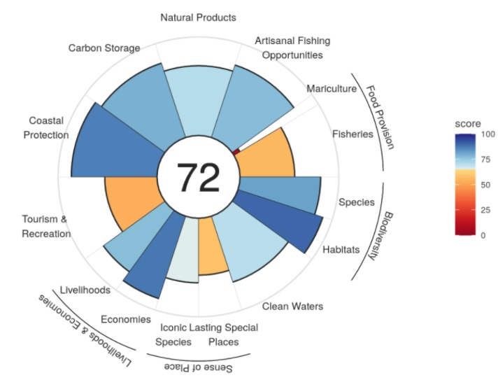
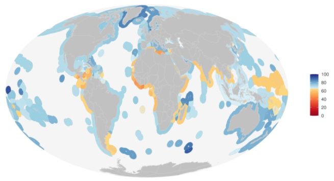
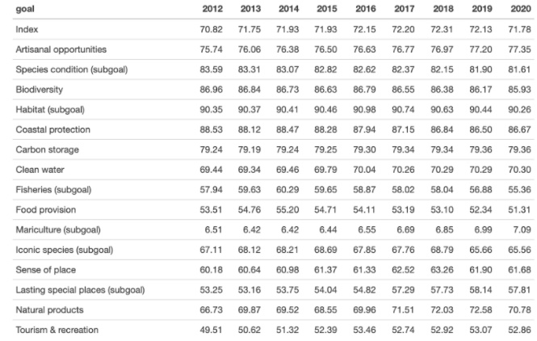

## 2020 Global Ocean Health Index scores now available!

We are proud to announce the 2020 Ocean Health Index scores ([available here](http://ohi-science.org/ohi-global/))!  

This year marks the ninth global Ocean Health Index (OHI, for short) assessment measuring the sustainable delivery of 10 benefits, or goals, that people want and need from the ocean. The 2020 assessment was led by Gage Clawson, a former OHI Fellow, and Melanie Frazier. And, once again, a talented crew of Global Fellows was instrumental to calculating the scores: Sara Orofino, Maddie Berger, and Laura Ingulsrud.  

We are excited about our continuing collaboration with Esri to report Ocean Health Index scores on the [Living Atlas](https://www.arcgis.com/home/item.html?id=1f305abdc47a45bf867783c7419db6d0).

The 2020 data include the addition of a new year of data (2020), calculated using the most recent data available from agencies and other sources. Given our commitment to using the best available science, we also updated previous years’ scores (2012-2019) using updated models and data when available.  As always, the data and scripts underlying these results are publicly available (Data preparation: https://github.com/OHI-Science/ohiprep_v2020; Score calculation: https://github.com/OHI-Science/ohi-global/releases)

### Overview of results

The overall global index score was 72 (Figure 1), which is similar to  previous years. The regions with the highest scores tend to be uninhabited, or low human population, islands, although Germany, Greenland, United Arab Emirates, and Norway also have relatively high scores (Figure 2). Regions with low scores tend to be in Africa, Latin America and the Caribbean, and Asia. 

 
*Figure 1. Flower plot describing the average 2020 global Ocean Health scores (eez area weighted average of region scores) for the overall Index (center value) and goals/subgoals (petals).*
 

    

 
 

*Figure 2. 2020 Ocean Health Index scores for 220 regions.*
 

    

 
 

Although overall index scores have hovered around 70 since 2012, a deeper dive into the index reveals some interesting trends and patterns.

Scores for many regions are reasonably good and global scores have overall increased since 2012 for some goals, such as: artisanal opportunities goal, tourism and recreation, sense of place, and natural products. However, we observed some worrisome patterns for fisheries, iconic species, and species condition, all of which had the lowest reported scores since the start of the Index in 2012 (Table 1).

 

*Table 1. Ocean Health Index, global scores (eez area weighted average of region scores) for the Index and goals/subgoals for all years.*

 

    

 
 

Given the importance of marine fisheries as a source of food, the apparent decline in scores is alarming. From 2012, fisheries scores decreased for 138 of the 220 countries we assessed, and decreasing trends predominate in the southern hemisphere. Regions with the largest decreases include Chile, the Falkland Islands, and South Korea. This result is due to a decrease in stock status scores, and should further be explored to better understand which stocks are driving this result.

Marine aquaculture also provides large quantities of food; however, this is an underutilized resource with only a handful of countries reaching their potential. Countries that appear to be reaching (likely the low end of) their potential include: Netherlands, South Korea, Norway, Taiwan, Spain, Slovenia, Finland, Bulgaria, Singapore, and China. And several countries have had marked increases in recent production, including: Germany, Ecuador, Malta and Turkey. This goal will be interesting to watch in coming years as mariculture production continues to increase, and the sustainability of mariculture practices become better understood.  

Improvements to artisanal opportunities and tourism and recreation goals are likely due to improving global economic conditions since 2012. Despite general global trends, this pattern does not hold for all countries. In particular, scores have decreased for many countries in Central America and Micronesia. The consequences of the coronavirus pandemic are not captured in this year’s scores, and it will be interesting to see how next year’s scores respond to this global challenge.

Global scores for the lasting special places subgoal (a component of the sense of place goal), steadily improved from 2012 to 2019 because many countries established coastal and marine protected areas. In fact, one of the most common ways countries have improved their Index scores is through the establishment of protected areas. This suggests that global efforts to promote the establishment of marine protected areas have been successful. 

