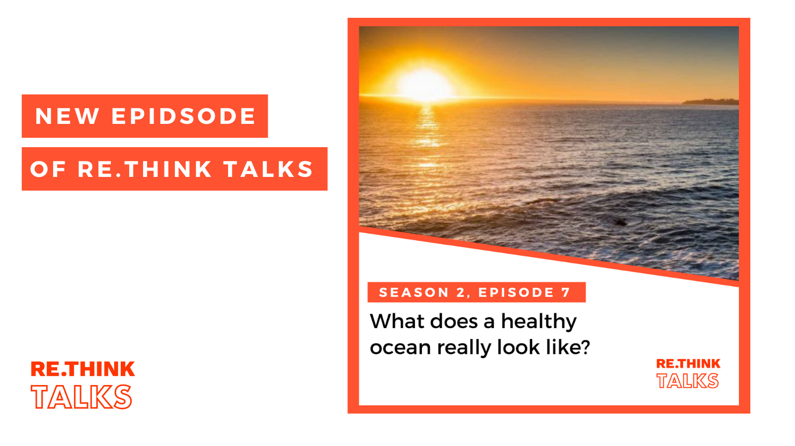

## What does a healthy ocean really look like

Susa Niiranen, in a [Rethink Talks podcast](https://rethink.earth/what-does-a-healthy-ocean-really-look-like/), explores what a healthy ocean really looks like and how the Ocean Health Index offers a comprehensive assessment of the social, economic, and environmental condition of the ocean.  

Joining the discussion is Ben Halpern the creator of the Ocean Health Index and Thorsten Blenckner a researcher at the Stockholm Resilience Centre who with his team has developed a spin-off called the Baltic Health Index (BHI).  Together they discuss what it takes to restore our ocean to good health and how the Ocean Health Index can help us to reach our goals. 

    

#### Rethink Talks
Rethink Talks is Stockholm Resilience Centre’s podcast series on resilience thinking and global change. It spotlights conversations between experts on a range of topics that highlight how resilience thinking and biosphere stewardship add value to current debates.

#### Stockholm Resilience Centre
The Stockholm Resilience Centre (SRC) is an international research centre on resilience and sustainability science. Since its launch in 2007, SRC has developed into a world-leading science centre for addressing the complex challenges facing humanity. The centre is a joint initiative between Stockholm University and the Beijer Institute of Ecological Economics at The Royal Swedish Academy Sciences.

#### The Ocean Health Index
The Ocean Health Index (NCEAS, UC Santa Barbara) is an assessment tool that scientifically compares and combines key elements from all dimensions of the ocean’s health – biological, physical, economic and social--- so that leaders, managers and the public can promote an increasingly beneficial future for all ocean life, including humans. By integrating information from many different disciplines and sectors the Index represents a significant advance over conventional single-sector approaches to assessing ocean condition (https://ohi-science.org/).

