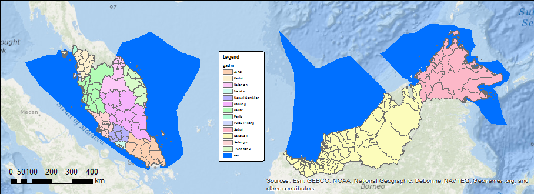
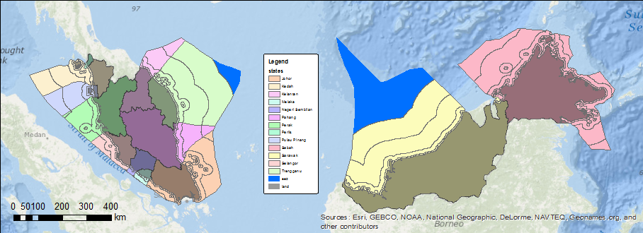

# Create Regions
**_tips on creating reporting units_**

The first step in a custom Ocean Health Index analysis is creating the reporting units for which you will summarize. For a country level analysis, this is most likely to be the states or provinces, i.e. the first administrative level below country.

Here we provide a little recipe for creating these in ArcGIS using the following data:
* **GADM** - the Global Administrative Areas <a href="http://gadm.org" target="_blank">gadm.org</a> contain the geography up to 5 political levels for all countries globally. 
* **EEZ** - the Exclusive Economic Zones <a href="http://marineregions.org" target="_blank">marineregions.org</a> describe the 200 nautical mile (nm) extent of all countries.
* **EEZ and land** - with inclusion of the land and EEZ <a href="http://marineregions.org" target="_blank">marineregions.org</a>, we can fill in any gaps between GADM and the EEZ.

## Issues

There are several technical issues in generating regions which need need to: 1) not overlap with one another; and 2) cover the entire extent of the country without gaps. Here is the raw data displayed for our example country of Malaysia.

The EEZ is in blue and the GADM is color coded by state. Notice finer subdivisions are included in the GADM. Now we just need to extend these subdivisions offshore to generate state-level waters. The typical <a href="http://resources.arcgis.com/en/help/main/10.2/index.html#//000800000019000000" target="_blank">buffer</a> function in GIS, however, does not handle distinct overlapping regions.

As you can see from this simple buffer result, the buffers extend into each other. We solve for this overlap issue by generating <a href="http://resources.arcgis.com/en/help/main/10.2/index.html#//00080000001m000000" target="_blank">Thiessen polygons</a> from the points on the outer edge of the land, which then gets intersected with the dissolved buffer. This is akin to the <a href="http://marineregions.org/eezmethodology.php" target="_blank">method</a> used to originally create the EEZ boundaries. The result in this case with multiple buffers (at 3, 12, 50 and 100 nm) is unique and non-overlapping by state.

Other issues become apparent if we zoom in. There is a clear mismatch in the land described by GADM versus assumed by the EEZ. We presume that the EEZ is authoritative and therefore need to correct for the land.

By extending the GADM provinces out with these Thiessen polygons to the full extent of the EEZ and intersecting with the missing EEZ land, hitherto missing land can be attributed to a state.

Some manual editing may be required beyond this recipe, since certain islands are not likely to be intersected by states and should instead by assigned wholly to one state. If the given country spans the international dateline (-180&deg; W or 180&deg; E), then a more complex analysis using geodetic distance should first be applied to the points (eg using [geographiclib](http://code.env.duke.edu/projects/mget/ticket/549)) and probably a <a href="http://resources.arcgis.com/en/help/main/10.2/index.html#//003r0000003r000000" target="_blank">Plate Carr&eacute;e</a> or other dateline spanning projection should be used. Finally, if the country's EEZ is extensive than this method could be replaced with a raster method ("raster is faster, but vector is corrector") using [Polygon to Raster](http://resources.arcgis.com/en/help/main/10.2/index.html#//001200000030000000) and [Euclidean Allocation](http://resources.arcgis.com/en/help/main/10.2/index.html#//009z0000001m000000) (alternate recipe forthcoming).

## Script Recipe

Here's a script which you can modify based on your local paths and desired buffer distances: <a href="http://gist.github.com/bbest/7650602" target="_blank">http://gist.github.com/bbest/7650602</a>. It is recommended that each line be run sequentially in the [Python window of ArcMap](http://resources.arcgis.com/en/help/main/10.2/index.html#/What_is_the_Python_window/002100000017000000/) which will render the geographic outputs so you can visually inspect the process.

## Future Work
* Fold this script into a function as part of the ohi-arcgis and ohi-opengis modules.
* Create a global base layer extending the finest GADM subdivision and desktop functions to operate on this layer, which will greatly reduce the processing time (by removing the Create Thiessen Polygons step).
* Create a web service for extraction of any country and subdivision buffer offshore or inshore.
* Create a custom <a href="http://resources.arcgis.com/en/help/main/10.2/index.html#//003r0000001n000000" target="_blank">Albers Equal Area</a> projection assigning the parallels to 1/6th of the EEZ extent to minimize distortion (a la <a href="http://code.env.duke.edu/projects/mget/attachment/ticket/231/project_optimal_albers.py" target="_blank">project_optimal_albers.py</a>).
* generate <a href="https://github.com/mbostock/topojson" target="_blank">TopoJSON</a> for display in the OHI Toolbox mapping interface which minimizes the storage size by removal of redundant vertices of polygon shared borders. (Bonus: <a href="http://blog.thematicmapping.org/2013/06/converting-shapefiles-to-topojson.html" target="_blank">Github rendering</a>. <a href="http://bost.ocks.org/mike/map/" target="_blank">How</a>: <a href="https://github.com/mbostock/topojson/wiki/Command-Line-Reference" target="_blank">topojson cmd</a> or <a href="http://www.mapshaper.org" target="_blank">MapShaper.org</a> )