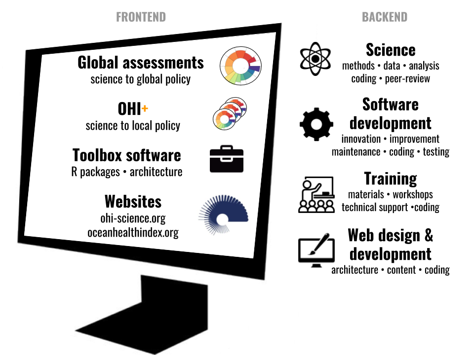

## How we work 

The Ocean Health Index (OHI) is a scientific method and tool for channeling the best available scientific information into marine policy. 
First published in 2012 in the scientific journal *Nature*, the OHI is now used in governmental-management-academic collaborations around the world.  

Our team develops methods and tools for measuring and monitoring ocean health. This includes conceptual frameworks, computational code, data products, and training materials. We believe stongly in open science, using open-source tools such as R and share our work on GitHub as much as possible. These tools are constantly being used, evaluated, improved and updated.  

 

[Learn more about how we work in a one-hour webinar hosted by the EBM Tools Network.](https://www.openchannels.org/webinars/2017/using-ocean-health-index-integrated-tool-implementing-ebm-and-coastal-management)

## [Global assessments](http://ohi-science.org/ohi-global/) 

We assess oceans globally every year by synthesizing freely available public data and scoring 220 coastal nations and territories.   

Learn more about the methods, access our code, and explore scores on our [Global](http://ohi-science.org/ohi-global/) page.  





## [OHI Process](/projects/ohi-process) 

OHI assessments require an iterative process that can be divided into four phases: Learn, Plan, Conduct, and Inform.  

Learn more about the OHI process and how to lead your own independent 'OHI+' assessment on the [OHI Process](/projects/ohi-process) page.  

## [OHI Assessments](/projects/ohi-assessments) 

In addition to assessing oceans globally every year, we support independent groups that incorporate their own data into the OHI framework to assess and manage their own regions. There are many groups leading their own independent OHI+ assessments, including governments of Mexico and Indonesia, and scientists in Sweden who are assessing eight countries bordering the Baltic Sea.  

See ongoing assessments on the [OHI Assessments](/projects/ohi-assessments) page.  



