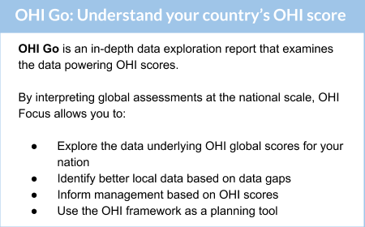
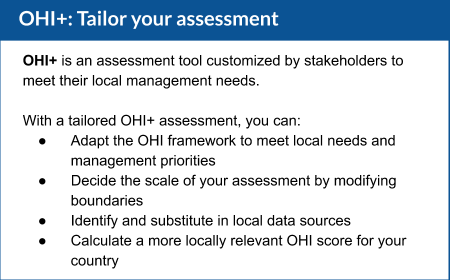

<!--- https://www.w3schools.com/howto/howto_css_images_side_by_side.asp --->
<!---/* Three image containers (use 25% for four, and 50% for two, etc) */ --->

# Discover OHI opportunities for your country

How can you use the Ocean Health Index (OHI) to advise marine management in your own coastal waters? While global OHI scores offer a snapshot of ocean health, diving into the underlying data and models at the national level help identify new opportunities that provide a far more revealing portrait — and spur action. 

We have developed several options that allow you to further explore and tailor the OHI framework to encompass your country’s values. Building off over seven years of data and scientific development through global assessments, these options help advise action by capturing local characteristics and management priorities. 

 

<!---

--->

### OHI+: Tailor your assessment  

**OHI+** is an assessment tool customized by stakeholders to meet their local management needs.

With a tailored OHI+ assessment, you can:

- Adapt the OHI framework to meet local needs and management priorities
- Decide the scale of your assessment by modifying boundaries
- Identify and substitute in local data sources 
- Calculate a more locally relevant OHI score for your country

See the [OHI+ page](https://ohi-science.org/projects/ohi-plus) for more details. 

### OHI Go: Understand your country’s OHI score

**OHI Go** is an in-depth data exploration report that examines the data powering OHI scores. 

By interpreting global assessments at the national scale, OHI Focus allows you to:

- Explore the data underlying OHI global scores for your nation
- Identify better local data based on data gaps
- Inform management based on OHI scores
- Use the OHI framework as a planning tool 

See the [OHI Go page](https://ohi-science.org/projects/ohi-go) for more details. 

<!---
Nov 4, 2019: tried to save locally to fix the footer problem, no help. So just switching to text. 
https://docs.google.com/drawings/d/15E8JKeEiSBMlRDZtzq_uyS973NAqnMV9Yws6jc8hNz4/edit
https://docs.google.com/drawings/d/1PWfrVzPYtsLSmG9d5YnjPEMFeXN1Tf2d9i-zeSILxC8/edit

  

    
  

  

    
  

  
  

--->

  

----

